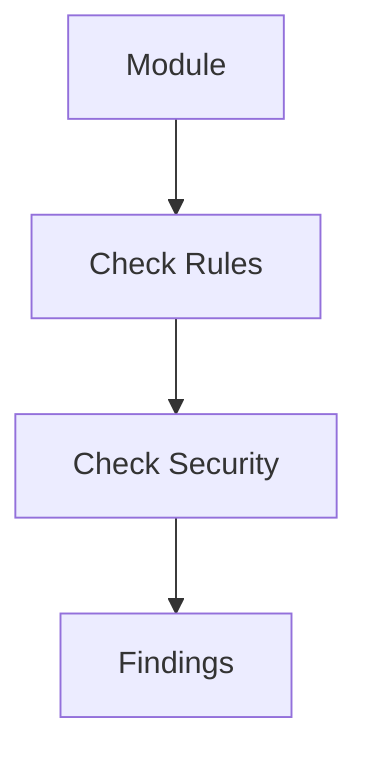

# Validation Plugin

## Purpose

Registers custom validation rules through the MAM Plugin API that enforce
business rules, security policies and structural conventions.

## Inputs

| Name | Type | Required | Description |
|------|------|----------|-------------|
| module | string | Yes | Module name to validate |
| rules | list | No | Rules to apply |

## Outputs

| Name | Type | Description |
|------|------|-------------|
| findings | list | Validation findings |
| valid | boolean | Whether the module passed |

## Capabilities

### check-rules

Apply the declared validation rules.

### check-security

Scan for security issues.

## Rules

- Every module needs a description.
- Never allow hardcoded secrets.

## Workflow



## Python

```python
def validate_module(module: str = "custom-section") -> dict:
    """Return validation findings for a module."""
    return {"module": module, "valid": True, "findings": []}
```

The plugin hooks into the validation lifecycle: before validation and after
validation. Each rule returns findings with a severity level.

## Tests

### Input

```yaml
module: custom-section
```

### Expected

```yaml
valid: true
```

```python
def test_validate_module():
    result = validate_module()
    assert result["valid"] is True
```

## Examples

Validate a module and confirm the findings are empty.

```text
validate_module("custom-section")
# returns {"module": "custom-section", "valid": true, "findings": []}
```

## References

- MAM Plugin API documentation
- MAM validation specification