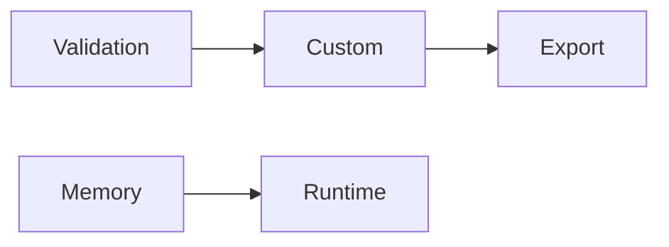

# Plugins

## Purpose

Entry system that composes the plugin examples into a single extension set:
custom sections, exporters, memory backends, runtimes and validation rules.

## Modules

- Custom Section
- Export Plugin
- Memory Plugin
- Runtime Plugin
- Validation Plugin

## Capabilities

### orchestrate

Run the composed plugins in dependency order.

## Rules

- All plugins operate within the declared scope.
- Each plugin exposes only its declared capabilities.

## Workflow



## Tests

### Input

```yaml
scope: plugins
```

### Expected

```yaml
system: valid
```

## References

- MAM Plugin API documentation
- MAM documentation