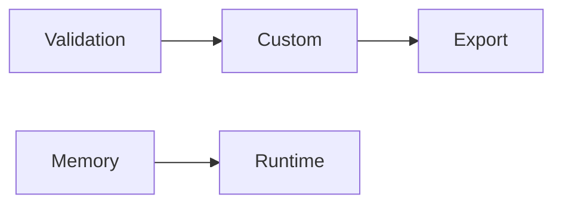

---
# MAM Metadata
id: system
name: Plugins
version: 2.0.0
type: system

author: MAM Examples

description: >
  Composes the plugin extension examples into one executable system.

license: MIT

runtime:
  language: typescript
  version: ">=5.0"

tags:
  - system
  - plugins

dependencies:
  - name: custom-section
    version: ">=1.0.0"
  - name: export-plugin
    version: ">=1.0.0"
  - name: memory-plugin
    version: ">=1.0.0"
  - name: runtime-plugin
    version: ">=1.0.0"
  - name: validation-plugin
    version: ">=1.0.0"

capabilities:
  - orchestrate

permissions:
  filesystem:
    - read
---

# Plugins

## Purpose

Entry system that composes the plugin examples into a single extension set:
custom sections, exporters, memory backends, runtimes and validation rules.

## Inputs

| Name | Type | Required | Description |
|------|------|----------|-------------|
| mode | string | No | `demo` runs the composition; `validate` checks wiring |
| payload | object | No | Optional input forwarded to the first module |

## Outputs

| Name | Type | Description |
|------|------|-------------|
| status | string | `ok` when the composition is wired |
| modules | list | Composed module ids in dependency order |
| capabilities | list | Union of the composed modules' capabilities |

## Modules

- Custom Section
- Export Plugin
- Memory Plugin
- Runtime Plugin
- Validation Plugin

## Capabilities

### orchestrate

Run the composed plugins in dependency order.

## Rules

- All plugins operate within the declared scope.
- Each plugin exposes only its declared capabilities.

## Workflow


```mermaid
flowchart LR
    Validation --> Custom
    Custom --> Export
    Memory --> Runtime
```

## Python

```python
MODULES = ["custom-section", "export-plugin", "memory-plugin", "runtime-plugin", "validation-plugin"]
CAPABILITIES = ["orchestrate"]
EDGES = [("custom-section", "export-plugin"), ("export-plugin", "memory-plugin"), ("memory-plugin", "runtime-plugin"), ("runtime-plugin", "validation-plugin")]


def run_system(mode="demo", payload=None):
    """Validate the composition and report what the system wires together."""
    if mode not in ("demo", "validate"):
        raise ValueError(f"unknown mode: {mode}")
    if len(set(MODULES)) != len(MODULES):
        return {"status": "error", "reason": "duplicate modules", "modules": MODULES}
    known = set(MODULES)
    dangling = [edge for edge in EDGES if edge[0] not in known or edge[1] not in known]
    if dangling:
        return {"status": "error", "reason": "dangling edge", "modules": MODULES}
    return {
        "status": "ok",
        "mode": mode,
        "modules": MODULES,
        "capabilities": CAPABILITIES,
        "edges": EDGES,
        "payload": payload,
    }
```

## Tests

### Input

```yaml
scope: plugins
```

### Expected

```yaml
system: valid
```

```python
def test_system_composition():
    result = run_system("demo")
    assert result["status"] == "ok"
    assert result["modules"] == MODULES
    assert result["capabilities"] == CAPABILITIES
```

## Examples

```python
result = run_system("demo", {"target": "example.com"})
print(result["status"], len(result["modules"]))
```

## References

- MAM Plugin API documentation
- MAM documentation
