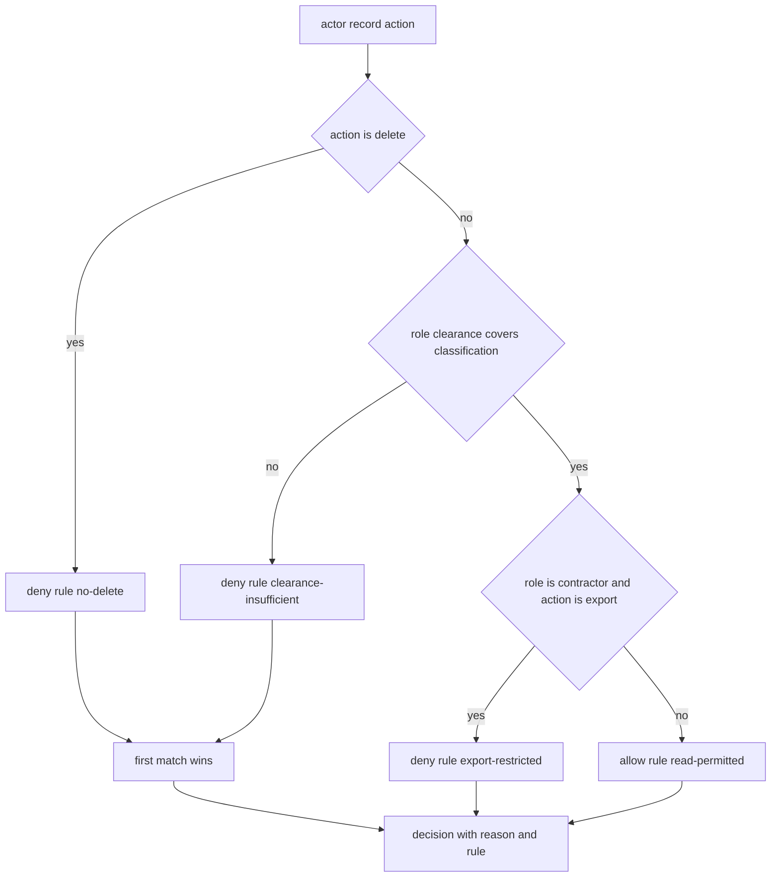

# Data Access Policy

## Purpose

A `policy` module runs *before* the thing it governs. It answers one question —
may this actor touch this record? — and it must answer with a reason, because a
deny a human cannot explain is a deny a human will route around.

This policy is a small RBAC plus classification lattice. Records are labelled
`public`, `internal`, `confidential` or `restricted`; actors hold roles with a
clearance level. The evaluator walks an ordered rule list, the first match
wins, and every rule that matched is reported so the decision can be explained
and audited. The default at the end of the list is deny, so adding a new data
class without adding a rule is safe.

## Inputs

| Name | Type | Required | Description |
|------|------|----------|-------------|
| actor | object | Yes | Mapping with `id` and `role` |
| record | object | Yes | Mapping with `id` and `classification` |
| action | string | Yes | One of read, write, delete, export |
| region | string | No | Two letter region code of the request |

## Outputs

| Name | Type | Description |
|------|------|-------------|
| allowed | boolean | True only when the rule list produced an allow |
| decision | string | allow or deny |
| reason | string | Human readable explanation of the verdict |
| matched_rule | string | Identifier of the deciding rule |
| evaluated | list | Every rule identifier that was tried, in order |

## Capabilities

### evaluate

Decide allow or deny for an actor, a record and an action, returning the
verdict with the rule that produced it.

### explain

Return the full ordered trace of a decision, including the rules that did not
match, for audit output.

### redact

Produce a copy of a record with fields above the actor's clearance masked.

## Rules

- The rule list is ordered and the first match decides; later rules are not
  evaluated for the verdict.
- `delete` is always denied for every role.
- `export` is denied for the `contractor` role regardless of classification.
- A role may only read a record whose classification rank is at or below the
  role clearance rank.
- The terminal rule is `default-deny`; no request may pass without a rule.
- Every verdict must carry a non-empty reason and the identifier of the rule
  that produced it.
- Redaction never mutates the caller's record; it returns a copy.

## Workflow



## Python

```python
from typing import Any, Dict, List, Optional, Tuple

CLASSIFICATIONS = ("public", "internal", "confidential", "restricted")
CLASSIFICATION_RANK = {name: index for index, name in enumerate(CLASSIFICATIONS)}

ROLE_CLEARANCE = {
    "intern": 0,
    "support": 1,
    "analyst": 2,
    "engineer": 3,
    "auditor": 3,
    "contractor": 1,
}

ALLOWED_ACTIONS = ("read", "write", "delete", "export")

MASK = "[redacted]"


def _rule_delete_denied(actor: Dict[str, Any], record: Dict[str, Any], action: str) -> Optional[str]:
    if action == "delete":
        return "destructive deletes are never permitted by policy"
    return None


def _rule_export_restricted(actor: Dict[str, Any], record: Dict[str, Any], action: str) -> Optional[str]:
    if actor.get("role") == "contractor" and action == "export":
        return "contractors may not export records"
    return None


def _rule_clearance(actor: Dict[str, Any], record: Dict[str, Any], action: str) -> Optional[str]:
    role = actor.get("role")
    classification = record.get("classification")
    if role not in ROLE_CLEARANCE:
        return f"unknown role {role!r} has no clearance"
    if classification not in CLASSIFICATION_RANK:
        return f"unknown classification {classification!r} is not governed"
    if CLASSIFICATION_RANK[classification] > ROLE_CLEARANCE[role]:
        return f"{role} clearance {ROLE_CLEARANCE[role]} is below {classification}"
    return None


def _rule_default_allow(actor: Dict[str, Any], record: Dict[str, Any], action: str) -> Optional[str]:
    return f"{actor.get('role')} may {action} {record.get('classification')} records"


RULES: List[Tuple[str, Any]] = [
    ("no-delete", _rule_delete_denied),
    ("export-restricted", _rule_export_restricted),
    ("clearance-insufficient", _rule_clearance),
    ("default-allow", _rule_default_allow),
]

DENY_RULES = ("no-delete", "export-restricted", "clearance-insufficient")


def evaluate(actor: Dict[str, Any], record: Dict[str, Any], action: str,
             region: Optional[str] = None) -> Dict[str, Any]:
    if action not in ALLOWED_ACTIONS:
        return {"allowed": False, "decision": "deny",
                "reason": f"action {action!r} is not a governed action",
                "matched_rule": "unknown-action", "evaluated": []}
    evaluated: List[str] = []
    for name, rule in RULES:
        reason = rule(actor, record, action)
        evaluated.append(name)
        if reason is None:
            continue
        allowed = name not in DENY_RULES
        return {"allowed": allowed, "decision": "allow" if allowed else "deny",
                "reason": reason, "matched_rule": name, "evaluated": evaluated}
    return {"allowed": False, "decision": "deny", "reason": "no rule matched",
            "matched_rule": "default-deny", "evaluated": evaluated}


def explain(actor: Dict[str, Any], record: Dict[str, Any], action: str) -> Dict[str, Any]:
    verdict = evaluate(actor, record, action)
    return {
        "actor": actor.get("id"),
        "role": actor.get("role"),
        "record": record.get("id"),
        "action": action,
        "decision": verdict["decision"],
        "matched_rule": verdict["matched_rule"],
        "reason": verdict["reason"],
        "evaluated": verdict["evaluated"],
    }


def redact(actor: Dict[str, Any], record: Dict[str, Any]) -> Dict[str, Any]:
    """Mask every field whose own classification outranks the actor."""
    clearance = ROLE_CLEARANCE.get(actor.get("role"), -1)
    masked = dict(record)
    for key, value in record.items():
        label = value.get("classification") if isinstance(value, dict) else None
        if label not in CLASSIFICATION_RANK:
            continue
        if CLASSIFICATION_RANK[label] > clearance:
            masked[key] = MASK
    return masked
```

## Tests

### Input

```yaml
actor:
  id: u-77
  role: support
record:
  id: r-12
  classification: confidential
action: read
```

### Expected

```yaml
allowed: false
decision: deny
matched_rule: clearance-insufficient
```

```python
def test_allows_within_clearance():
    verdict = evaluate({"id": "u-1", "role": "engineer"},
                       {"id": "r-1", "classification": "confidential"}, "read")
    assert verdict["allowed"] is True
    assert verdict["decision"] == "allow"
    assert verdict["matched_rule"] == "default-allow"
    assert verdict["reason"]


def test_denies_above_clearance():
    verdict = evaluate({"id": "u-2", "role": "support"},
                       {"id": "r-2", "classification": "confidential"}, "read")
    assert verdict["allowed"] is False
    assert verdict["matched_rule"] == "clearance-insufficient"
    assert "below confidential" in verdict["reason"]


def test_delete_is_always_denied():
    for role in ROLE_CLEARANCE:
        verdict = evaluate({"id": "u", "role": role},
                           {"id": "r", "classification": "public"}, "delete")
        assert verdict["decision"] == "deny"
        assert verdict["matched_rule"] == "no-delete"


def test_contractors_cannot_export():
    verdict = evaluate({"id": "u-3", "role": "contractor"},
                       {"id": "r-3", "classification": "public"}, "export")
    assert verdict["allowed"] is False
    assert verdict["matched_rule"] == "export-restricted"


def test_unknown_role_denies():
    verdict = evaluate({"id": "u-4", "role": "wizard"},
                       {"id": "r-4", "classification": "public"}, "read")
    assert verdict["allowed"] is False
    assert "unknown role" in verdict["reason"]


def test_unknown_action_denies():
    verdict = evaluate({"id": "u-5", "role": "intern"},
                       {"id": "r-5", "classification": "public"}, "teleport")
    assert verdict["allowed"] is False
    assert verdict["matched_rule"] == "unknown-action"


def test_first_match_wins_and_records_trace():
    verdict = evaluate({"id": "u-6", "role": "intern"},
                       {"id": "r-6", "classification": "restricted"}, "delete")
    assert verdict["evaluated"] == ["no-delete"]
    assert verdict["matched_rule"] == "no-delete"


def test_explain_reports_the_whole_evaluation():
    trace = explain({"id": "u-7", "role": "analyst"},
                    {"id": "r-7", "classification": "internal"}, "write")
    assert trace["decision"] == "allow"
    assert trace["evaluated"][-1] == "default-allow"
    assert trace["record"] == "r-7"


def test_redact_masks_above_clearance_without_mutating():
    actor = {"id": "u-8", "role": "intern"}
    record = {"id": "r-8", "name": "Ada",
              "ssn": {"classification": "restricted", "value": "000-00-0000"},
              "team": {"classification": "public", "value": "support"}}
    masked = redact(actor, record)
    assert masked["ssn"] == "[redacted]"
    assert masked["team"] == {"classification": "public", "value": "support"}
    assert masked["name"] == "Ada"
    assert record["ssn"]["value"] == "000-00-0000"
```

## Examples

```python
REQUESTS = [
    ({"id": "u-1", "role": "intern"}, {"id": "r-1", "classification": "public"}, "read"),
    ({"id": "u-2", "role": "support"}, {"id": "r-2", "classification": "restricted"}, "read"),
    ({"id": "u-3", "role": "engineer"}, {"id": "r-3", "classification": "internal"}, "write"),
    ({"id": "u-4", "role": "engineer"}, {"id": "r-4", "classification": "public"}, "delete"),
    ({"id": "u-5", "role": "contractor"}, {"id": "r-5", "classification": "public"}, "export"),
]

for actor, record, action in REQUESTS:
    verdict = evaluate(actor, record, action)
    print(f"{actor['role']:>10} {action:>6} {record['classification']:>12} -> "
          f"{verdict['decision']} via {verdict['matched_rule']}")

print(explain({"id": "u-2", "role": "support"}, {"id": "r-2", "classification": "restricted"}, "read"))
```

## References

- [MAM Specification](../../plan-doc/full-mam.md)
- [Policy templates](../../templates/policy/)
- [Rate-Limited HTTP Fetcher](../tool/tool.mam)
