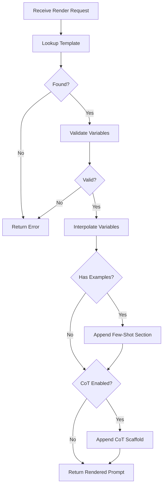

---
# MAM Metadata
id: prompt-engine
name: Prompt Module
version: 2.0.0
type: module

author: MAM Team
description: >
  Structured prompt template engine with variable interpolation,
  few-shot examples, and chain-of-thought support.

license: MIT

runtime:
  language: python
  version: ">=3.12"

tags:
  - prompt
  - templates
  - llm
  - ai

dependencies:
  - name: mam-context
    version: ">=1.0.0"

capabilities:
  - register
  - render
  - interpolate
  - list_templates

permissions:
  filesystem:
    - read
---

# Prompt Module

## Purpose

Manages reusable prompt templates with variable interpolation, few-shot example injection, and chain-of-thought scaffolding. Produces finalized prompt strings ready for LLM consumption.

## Inputs

| Name | Type | Required | Description |
|------|------|----------|-------------|
| template_id | string | Yes | Template identifier to render |
| variables | dict | No | Key-value pairs for template interpolation |
| examples | list | No | Few-shot example dicts with input/output pairs |
| chain_of_thought | bool | No | Append CoT reasoning scaffold (default: false) |

## Outputs

| Name | Type | Description |
|------|------|-------------|
| rendered | string | The fully rendered prompt string |
| token_estimate | int | Rough word-based token estimate |
| template_id | string | The template that was rendered |

## Capabilities

### register

Register a prompt template for later rendering.

### interpolate

Substitute `{{variable}}` placeholders with provided values.

### render

Render a template with variables, examples, and optional CoT scaffolding.

### list_templates

List all registered template identifiers.

## Rules

- Template variables use `{{variable_name}}` syntax
- Missing required variables must raise a clear error
- Few-shot examples are injected in order under an "Examples:" section
- Chain-of-thought scaffold appends a step-by-step reasoning block
- Maximum 20 few-shot examples per render call
- Template IDs must be registered before use

## Workflow



## Python

```python
import re
from typing import Any, Dict, List, Optional
from dataclasses import dataclass, field

@dataclass
class PromptTemplate:
    template_id: str
    system: str = ""
    user: str = ""
    variables: List[str] = field(default_factory=list)
    required_variables: List[str] = field(default_factory=list)

class PromptEngine:
    CO_TAIL = """Let me think through this step by step.

Step 1:"""

    def __init__(self):
        self._templates: Dict[str, PromptTemplate] = {}

    def register(self, template: PromptTemplate):
        self._templates[template.template_id] = template

    def _interpolate(self, text: str, variables: Dict[str, Any]) -> str:
        def replacer(match):
            key = match.group(1).strip()
            if key in variables:
                return str(variables[key])
            return match.group(0)
        return re.sub(r'\{\{(\s*\w+\s*)\}\}', replacer, text)

    def render(self, template_id: str, variables: Dict[str, Any] = None,
               examples: List[Dict[str, str]] = None,
               chain_of_thought: bool = False) -> Dict:
        """Render a prompt template with variables and optional examples."""
        template = self._templates.get(template_id)
        if not template:
            raise ValueError(f"Unknown template: '{template_id}'")

        variables = variables or {}

        missing = [v for v in template.required_variables if v not in variables]
        if missing:
            raise ValueError(f"Missing required variables: {missing}")

        system = self._interpolate(template.system, variables)
        user = self._interpolate(template.user, variables)

        if examples and len(examples) <= 20:
            example_block = "\n\nExamples:\n"
            for i, ex in enumerate(examples, 1):
                example_block += f"\nInput: {ex.get('input', '')}\nOutput: {ex.get('output', '')}\n"
            user += example_block

        if chain_of_thought:
            user += f"\n\n{self.CO_TAIL}"

        full_prompt = f"{system}\n\n---\n\n{user}" if system else user
        token_estimate = len(full_prompt.split())

        return {
            "rendered": full_prompt,
            "token_estimate": token_estimate,
            "template_id": template_id,
        }

    def list_templates(self) -> List[str]:
        return list(self._templates.keys())
```

## Tests

### Test: Interpolation

Input:

```yaml
template_id: t
variables:
  name: Alice
```

Expected:

```yaml
rendered: "Hello, Alice!"
```

```python
def test_interpolation():
    engine = PromptEngine()
    engine.register(PromptTemplate(
        template_id="t", user="Hello, {{name}}!", required_variables=["name"],
    ))
    result = engine.render("t", {"name": "Alice"})
    assert "Hello, Alice!" in result["rendered"]

def test_missing_variable():
    engine = PromptEngine()
    engine.register(PromptTemplate(
        template_id="t", user="{{x}}", required_variables=["x"],
    ))
    try:
        engine.render("t", {})
        assert False, "Should have raised ValueError"
    except ValueError as e:
        assert "Missing required variables" in str(e)

def test_unknown_template():
    engine = PromptEngine()
    try:
        engine.render("nope")
        assert False
    except ValueError as e:
        assert "Unknown template" in str(e)

def test_few_shot_examples():
    engine = PromptEngine()
    engine.register(PromptTemplate(template_id="t", user="Classify: {{text}}"))
    result = engine.render("t", {"text": "hello"}, examples=[{"input": "hi", "output": "greeting"}])
    assert "Examples:" in result["rendered"]

def test_cot():
    engine = PromptEngine()
    engine.register(PromptTemplate(template_id="t", user="Solve: {{problem}}"))
    result = engine.render("t", {"problem": "2+2"}, chain_of_thought=True)
    assert "Step 1:" in result["rendered"]
```

## Examples

### Basic Usage

```python
engine = PromptEngine()

engine.register(PromptTemplate(
    template_id="summarize",
    system="You are a concise summarizer.",
    user="Summarize the following in {{length}} sentences:\n\n{{text}}",
    required_variables=["text", "length"],
))

result = engine.render(
    "summarize",
    variables={"text": "MAM transforms Markdown into executable modules.", "length": "1"},
    chain_of_thought=True,
)
print(result["rendered"])
print(f"~{result['token_estimate']} tokens")
```

### Expected Flow

```text
Request → Lookup → Validate → Interpolate → Examples → CoT → Rendered Prompt
```

## References

- MAM Prompt Examples
- Chain-of-thought prompting
