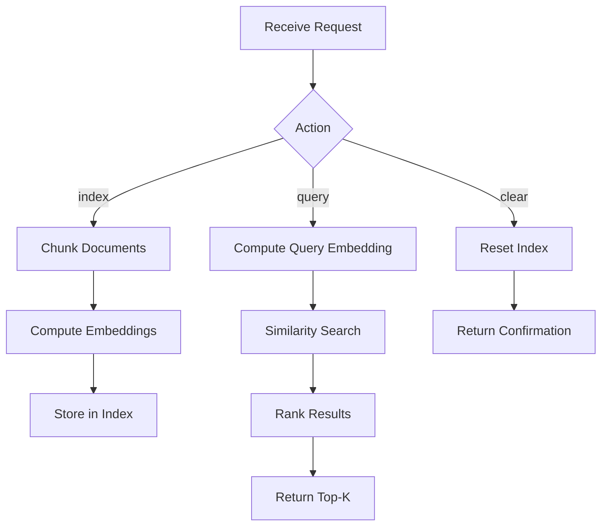

---
# MAM Metadata
id: rag-module
name: RAG Module
version: 1.0.0
type: module

author: MAM Team
description: >
  Retrieval-Augmented Generation module with document chunking, embedding,
  and similarity search.

license: MIT

runtime:
  language: python
  version: ">=3.12"

tags:
  - rag
  - retrieval-augmented-generation
  - embeddings
  - ai

dependencies:
  - name: mam-knowledge
    version: ">=1.0.0"

capabilities:
  - index
  - query
  - chunk
  - clear

permissions:
  filesystem:
    - read
  memory:
    - local
---

# RAG Module

## Purpose

Implements a Retrieval-Augmented Generation pipeline: chunk documents into overlapping segments, compute simple TF-IDF embeddings, store them in a vector index, and retrieve the most relevant chunks for a given query.

## Inputs

| Name | Type | Required | Description |
|------|------|----------|-------------|
| action | string | Yes | "index", "query", or "clear" |
| documents | list | No | List of document strings (required for index) |
| query | string | No | Search query (required for query) |
| top_k | int | No | Number of results to return (default: 3) |
| chunk_size | int | No | Tokens per chunk (default: 200) |
| overlap | int | No | Overlap between chunks (default: 50) |

## Outputs

| Name | Type | Description |
|------|------|-------------|
| chunks | list | Retrieved chunks with scores |
| total_indexed | int | Total chunks in index |
| query | string | The original query |

## Capabilities

### index

Chunk and embed documents into the retrieval index.

### query

Retrieve the top-k chunks most similar to a query.

### chunk

Split a document into overlapping token chunks.

### clear

Reset the index.

## Rules

- Documents must be non-empty strings
- Chunk size must be >= 10 and <= 2000
- Overlap must be < chunk_size
- Similarity scores range from 0.0 (no match) to 1.0 (exact match)
- Index is cleared explicitly; no auto-pruning

## Workflow



## Python

```python
import math
import re
from collections import Counter
from typing import List, Dict, Tuple

def tokenize(text: str) -> List[str]:
    """Simple whitespace + punctuation tokenizer."""
    return re.findall(r'\b\w+\b', text.lower())

def chunk_text(text: str, chunk_size: int = 200, overlap: int = 50) -> List[str]:
    """Split text into overlapping token chunks."""
    tokens = tokenize(text)
    if len(tokens) <= chunk_size:
        return [text]
    chunks = []
    for i in range(0, len(tokens), chunk_size - overlap):
        chunk_tokens = tokens[i:i + chunk_size]
        if chunk_tokens:
            chunks.append(" ".join(chunk_tokens))
    return chunks

def tfidf_vector(tokens: List[str], vocab: Dict[str, int]) -> Dict[int, float]:
    """Compute a simple TF-IDF-like vector."""
    counts = Counter(tokens)
    total = len(tokens) if tokens else 1
    vector = {}
    for word, idx in vocab.items():
        tf = counts.get(word, 0) / total
        if tf > 0:
            vector[idx] = tf
    return vector

def cosine_similarity(a: Dict[int, float], b: Dict[int, float]) -> float:
    """Compute cosine similarity between two sparse vectors."""
    common = set(a.keys()) & set(b.keys())
    dot = sum(a[k] * b[k] for k in common)
    norm_a = math.sqrt(sum(v * v for v in a.values())) or 1
    norm_b = math.sqrt(sum(v * v for v in b.values())) or 1
    return dot / (norm_a * norm_b)

class RAGIndex:
    def __init__(self):
        self.chunks: List[Dict] = []
        self.vocab: Dict[str, int] = {}
        self.vectors: List[Dict[int, float]] = []

    def _build_vocab(self, documents: List[str]):
        word_doc_freq: Dict[str, int] = Counter()
        for doc in documents:
            for word in set(tokenize(doc)):
                word_doc_freq[word] += 1
        self.vocab = {w: i for i, (w, _) in enumerate(word_doc_freq.most_common(5000))}

    def index(self, documents: List[str], chunk_size: int = 200,
              overlap: int = 50) -> int:
        """Index documents into the RAG store. Returns total chunks."""
        self._build_vocab(documents)

        for doc_id, doc in enumerate(documents):
            for chunk_id, chunk in enumerate(chunk_text(doc, chunk_size, overlap)):
                tokens = tokenize(chunk)
                vec = tfidf_vector(tokens, self.vocab)
                self.chunks.append({"doc_id": doc_id, "chunk_id": chunk_id, "text": chunk})
                self.vectors.append(vec)

        return len(self.chunks)

    def query(self, query_text: str, top_k: int = 3) -> List[Dict]:
        """Retrieve top-k chunks most similar to the query."""
        tokens = tokenize(query_text)
        q_vec = tfidf_vector(tokens, self.vocab)

        scored = []
        for i, chunk_vec in enumerate(self.vectors):
            score = cosine_similarity(q_vec, chunk_vec)
            scored.append({**self.chunks[i], "score": round(score, 4)})

        scored.sort(key=lambda x: x["score"], reverse=True)
        return scored[:top_k]

    def clear(self):
        """Clear the index."""
        self.chunks.clear()
        self.vectors.clear()
        self.vocab.clear()
```

## Tests

### Test: Index and Query

Input:

```yaml
action: index
documents:
  - "alpha beta gamma"
  - "delta epsilon zeta"
```

Expected:

```yaml
chunks: match
```

```python
def test_chunk_text():
    text = "word " * 100
    chunks = chunk_text(text, chunk_size=20, overlap=5)
    assert len(chunks) > 1
    assert all(len(c) > 0 for c in chunks)

def test_tokenize():
    tokens = tokenize("Hello, World!")
    assert tokens == ["hello", "world"]

def test_cosine_similarity():
    a = {0: 1.0, 1: 2.0}
    b = {0: 1.0, 1: 2.0}
    assert abs(cosine_similarity(a, b) - 1.0) < 1e-6

def test_index_and_query():
    idx = RAGIndex()
    idx.index(["alpha beta gamma", "delta epsilon zeta"], chunk_size=5, overlap=1)
    results = idx.query("alpha")
    assert len(results) > 0
    assert results[0]["score"] > 0

def test_clear():
    idx = RAGIndex()
    idx.index(["test document"], chunk_size=5, overlap=1)
    idx.clear()
    assert len(idx.chunks) == 0
```

## Examples

### Basic Usage

```python
index = RAGIndex()

docs = [
    "MAM is a specification-first project that transforms Markdown into a universal IR for AI.",
    "The parser reads Markdown and produces a structured AST that agents can reason about.",
    "Plugins extend MAM with custom section types, validators, and runtime contexts.",
]

total = index.index(docs, chunk_size=50, overlap=10)
print(f"Indexed {total} chunks")

results = index.query("How does the parser work?", top_k=2)
for r in results:
    print(f"  [{r['score']}] {r['text'][:80]}...")
```

### Expected Flow

```text
Index → Chunk → Embed → Store → Query → Rank → Top-K
```

## References

- MAM RAG Examples
- TF-IDF and cosine similarity
