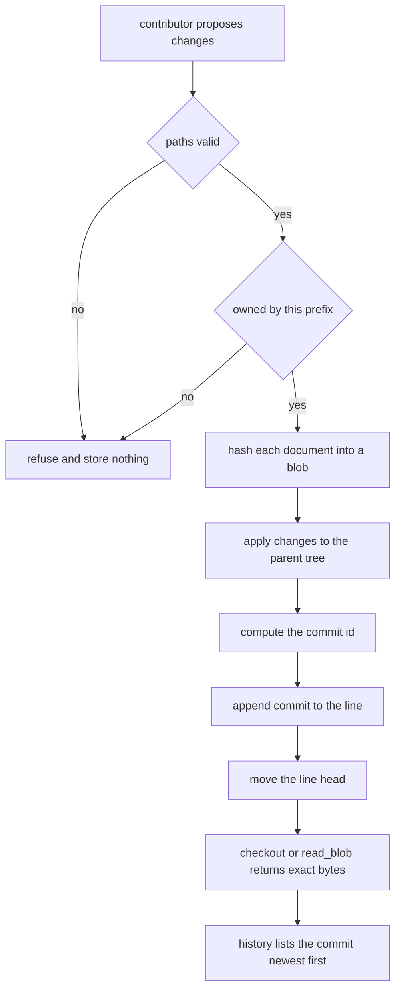

# Document Store Repository

## Purpose

A repository is not a folder, it is a history. This one stores documents by
content address: a document is named by the SHA-256 of its own bytes, so an
unchanged document is stored once no matter how many commits mention it, and a
corrupted blob cannot masquerade as a good one.

On top of the blob store sit commits, which are immutable snapshots naming
their parent, and two long-lived lines: `trunk`, which only ever moves
forward, and short-lived feature lines that fork from trunk and merge back.
The whole model is pure data in memory, which keeps the rules below testable.

## Inputs

| Name | Type | Required | Description |
|------|------|----------|-------------|
| message | string | Yes | One-line summary of a commit, must be non-empty |
| changes | object | Yes | Map of path to new document content, at least one entry |
| branch | string | No | Line the commit is appended to, defaults to `trunk` |
| blob_id | string | Yes | Content address returned by a previous write |
| ref | string | No | Line name or commit id to materialise |

## Outputs

| Name | Type | Description |
|------|------|-------------|
| commit_id | string | Content address of the commit, reproducible from its inputs |
| snapshot | object | Map of path to the document content at a ref |
| history | list | Commit records, newest first, each with `id`, `parent` and `message` |

## Capabilities

### commit

Append a snapshot to a line, refusing commits that change nothing.

### read_blob

Return the exact bytes a content address names, or refuse if it names nothing.

### checkout

Materialise the document set at a line name or at a specific commit.

## Contents

| Path | Role |
|------|------|
| `charter/why.md` | Why the document store exists |
| `charter/scope.md` | What is explicitly out of scope |
| `policy/retention.md` | How long each class of document is kept |
| `policy/owners.md` | Which team owns which path prefix |

Every stored document is UTF-8 text. Binary payloads are not accepted in this
version, and neither are paths that escape the prefix or begin with a dot.

## Layout

- Documents are addressed by `path`, and `path` is the only human-facing name.
- Content is addressed by `blob_id`, which is the SHA-256 of the content alone.
- A commit stores the full path-to-`blob_id` tree plus its parent, so history is
  never reconstructed by replaying diffs.
- A checkout flattens that tree into `path -> content`, which is what a reader
  actually wants.
- There is no separate staging area: `changes` is the whole proposal.

## Versioning Strategy

- `trunk` is the default line and accepts commits only from a merge or a fix.
- A feature line forks from a commit on `trunk` and merges back by committing
  the union of the two trees onto `trunk`.
- Commit ids are content addresses, not wall-clock ids: the same parent, tree,
  message and author always produce the same id, which makes them verifiable
  and makes rebases verifiable too.
- Nothing is ever deleted from a line. Superseding a document means committing
  new content under the same path.
- There is no tag, release or sub-module concept in this version.

## Contribution Rules

- A commit must change at least one document; empty commits are refused.
- A commit message is required and must be a single non-empty line.
- A contribution may not edit a document owned by another prefix; the
  contribution is refused with the owning prefix named.
- Contributions arrive as a `changes` map, never as a mutated working tree, so
  a rejected contribution cannot leave the repository half-written.
- A contribution that would restore an older tree of a path is a revert and is
  written like any other change, with a message that says so.

## Integrity

- `blob_id` and `commit_id` are SHA-256 hex digests, lowercase, 64 characters.
- Reading an unknown `blob_id` is a `KeyError`, never an empty document.
- A blob's content can never be replaced; the address is the identity.
- The repository keeps every blob it has ever been given, so any historical
  checkout stays reproducible.

## Rules

- `trunk` always exists; a commit on a missing line is a `KeyError`.
- `changes` is applied in sorted path order so the resulting tree never depends
  on dictionary iteration order.
- Commits are immutable once written; a commit record is never stored twice.
- A checkout of a commit id ignores which line it was on, because the commit
  carries its tree.
- Paths are normalised and must be relative, forward-slashed, and free of `.`
  and `..` segments.
- Ownership is checked before the tree is written, so a refused contribution
  changes nothing.

## Workflow



## Python

```python
import hashlib
import json
import re
from typing import Any, Dict, List, Optional

TRUNK = "trunk"
OWNERS = {
    "charter/": "office-of-the-chief",
    "policy/": "governance",
}
PATH_PATTERN = re.compile(r"^[a-z][a-z0-9_-]*(/[a-z0-9][a-z0-9._-]*)*$")
RESERVED = (".", "..")


class ContributionRefused(Exception):
    """Raised when a proposed change cannot be accepted as it stands."""


def _sha256(payload: str) -> str:
    return hashlib.sha256(payload.encode("utf-8")).hexdigest()


def blob_id(content: str) -> str:
    if not isinstance(content, str):
        raise ContributionRefused("documents are UTF-8 text in this version")
    return _sha256(content)


def commit_id(parent: Optional[str], message: str, tree: Dict[str, str], author: str) -> str:
    canonical = json.dumps(
        {"parent": parent, "message": message, "tree": tree, "author": author},
        separators=(",", ":"),
        sort_keys=True,
    )
    return _sha256(canonical)


def check_paths(paths: List[str]) -> None:
    for path in paths:
        if path in RESERVED or path.startswith("/") or not PATH_PATTERN.match(path):
            raise ContributionRefused(f"path {path!r} is not a valid document path")


def check_ownership(paths: List[str]) -> None:
    for path in sorted(paths):
        for prefix, owner in OWNERS.items():
            if path.startswith(prefix):
                raise ContributionRefused(
                    f"{path} is owned by {owner}; contributions from another prefix are refused"
                )


class Repository:
    def __init__(self, name: str) -> None:
        self.name = name
        self.blobs: Dict[str, str] = {}
        self.commits: Dict[str, Dict[str, Any]] = {}
        self.branches: Dict[str, Optional[str]] = {TRUNK: None}

    def put_blob(self, content: str) -> str:
        address = blob_id(content)
        self.blobs.setdefault(address, content)
        return address

    def read_blob(self, address: str) -> str:
        if address not in self.blobs:
            raise KeyError(f"no blob {address!r} in {self.name}")
        return self.blobs[address]

    def tree_of(self, ref: Optional[str]) -> Dict[str, str]:
        return dict(self.commits[ref]["tree"]) if ref else {}

    def commit(
        self,
        message: str,
        changes: Dict[str, str],
        branch: str = TRUNK,
        author: str = "mam-team",
    ) -> str:
        if not isinstance(message, str) or not message.strip():
            raise ContributionRefused("a commit message is required")
        if "\n" in message:
            raise ContributionRefused("a commit message is a single line")
        if not changes:
            raise ContributionRefused("a commit must change at least one document")
        if branch not in self.branches:
            raise KeyError(f"no line named {branch!r} in {self.name}")
        check_paths(sorted(changes))
        check_ownership(sorted(changes))
        parent = self.branches[branch]
        tree = self.tree_of(parent)
        for path in sorted(changes):
            tree[path] = self.put_blob(changes[path])
        address = commit_id(parent, message.strip(), tree, author)
        if address not in self.commits:
            self.commits[address] = {
                "id": address,
                "parent": parent,
                "message": message.strip(),
                "tree": tree,
                "author": author,
            }
        self.branches[branch] = address
        return address

    def fork(self, line: str, base: str = TRUNK) -> None:
        if line in self.branches:
            raise ContributionRefused(f"line {line!r} already exists")
        if base not in self.branches:
            raise KeyError(f"no line named {base!r} in {self.name}")
        self.branches[line] = self.branches[base]

    def checkout(self, ref: str) -> Dict[str, str]:
        head = self.branches.get(ref, ref)
        if head is None or head not in self.commits:
            raise KeyError(f"nothing to check out at {ref!r}")
        return {path: self.read_blob(addr) for path, addr in self.commits[head]["tree"].items()}

    def history(self, line: str = TRUNK) -> List[Dict[str, Any]]:
        if line not in self.branches:
            raise KeyError(f"no line named {line!r} in {self.name}")
        records: List[Dict[str, Any]] = []
        head = self.branches[line]
        while head is not None:
            record = self.commits[head]
            records.append({k: record[k] for k in ("id", "parent", "message", "author")})
            head = record["parent"]
        return records


def seed() -> Repository:
    """The store the charter starts from, with one feature line already cut."""
    repo = Repository("charter")
    repo.commit(
        "Seed the design notes",
        {
            "design/keys.md": "Keys are content addresses.\n",
            "design/queue.md": "Queues are first in, first out.\n",
        },
    )
    repo.fork("design/retention")
    return repo
```

## Tests

### Input

```yaml
message: Add the retention policy
changes:
  policy/retention.md: "Keep design notes for one year.\n"
```

### Expected

```yaml
accepted: true
commit_id_length: 64
trunk_documents: 3
```

```python
def _repo():
    repo = Repository("t")
    repo.commit("first", {"design/keys.md": "keys\n"})
    return repo


def test_commit_returns_a_content_address():
    repo = _repo()
    address = repo.commit("second", {"design/queue.md": "queue\n"})
    assert len(address) == 64
    assert address == address.lower()
    assert address in repo.commits


def test_commit_is_deterministic():
    left = Repository("t")
    right = Repository("t")
    left.commit("first", {"design/keys.md": "keys\n"})
    right.commit("first", {"design/keys.md": "keys\n"})
    assert left.commit("second", {"design/queue.md": "q\n"}) == right.commit("second", {"design/queue.md": "q\n"})


def test_identical_history_is_reproducible():
    left, right = _repo(), _repo()
    assert left.commit("second", {"design/queue.md": "queue\n"}) == right.commit("second", {"design/queue.md": "queue\n"})
    assert sorted(left.commits) == sorted(right.commits)
    assert left.checkout(TRUNK) == right.checkout(TRUNK)


def test_commit_id_is_a_pure_function_of_its_inputs():
    tree = {"design/keys.md": "0" * 64}
    assert commit_id(None, "msg", tree, "mam-team") == commit_id(None, "msg", tree, "mam-team")
    assert commit_id(None, "msg", tree, "mam-team") != commit_id(None, "other", tree, "mam-team")
    assert commit_id(None, "msg", tree, "mam-team") != commit_id("f" * 64, "msg", tree, "mam-team")
    assert commit_id(None, "msg", tree, "mam-team") != commit_id(None, "msg", tree, "someone-else")


def test_commit_refuses_an_empty_change():
    repo = _repo()
    for message, changes in (("noop", {}), ("", {"design/queue.md": "q\n"}), ("two\nlines", {"design/queue.md": "q\n"})):
        try:
            repo.commit(message, changes)
        except ContributionRefused:
            continue
        raise AssertionError(f"expected refusal for {message!r}")


def test_commit_refuses_invalid_paths():
    repo = _repo()
    for path in ("/abs.md", "../escape.md", ".", "Design/Keys.md"):
        try:
            repo.commit("bad", {path: "x\n"})
        except ContributionRefused:
            continue
        raise AssertionError(f"expected refusal for path {path!r}")


def test_commit_refuses_foreign_ownership():
    repo = Repository("t")
    try:
        repo.commit("charter edit", {"charter/why.md": "x\n"})
    except ContributionRefused as exc:
        assert "office-of-the-chief" in str(exc)
    else:
        raise AssertionError("expected an ownership refusal")
    assert repo.branches[TRUNK] is None


def test_commit_on_a_missing_line_raises_key_error():
    repo = _repo()
    try:
        repo.commit("x", {"design/queue.md": "q\n"}, branch="nope")
    except KeyError:
        return
    raise AssertionError("expected KeyError")


def test_read_blob_returns_exact_content():
    repo = _repo()
    address = repo.put_blob("exact bytes\n")
    assert repo.read_blob(address) == "exact bytes\n"
    assert address == blob_id("exact bytes\n")


def test_read_blob_is_content_addressed():
    repo = _repo()
    address = repo.put_blob("same\n")
    assert repo.put_blob("same\n") == address
    assert len(repo.blobs) == len(set(repo.blobs))


def test_read_unknown_blob_raises_key_error():
    try:
        _repo().read_blob("0" * 64)
    except KeyError:
        return
    raise AssertionError("expected KeyError")


def test_checkout_returns_the_snapshot():
    repo = _repo()
    first = repo.checkout(TRUNK)
    repo.commit("second", {"design/queue.md": "queue\n"})
    assert set(first) == {"design/keys.md"}
    assert set(repo.checkout(TRUNK)) == {"design/keys.md", "design/queue.md"}


def test_checkout_of_an_old_commit_is_stable():
    repo = _repo()
    old = repo.branches[TRUNK]
    repo.commit("second", {"design/queue.md": "queue\n"})
    assert "design/queue.md" not in repo.checkout(old)
    assert "design/queue.md" in repo.checkout(TRUNK)


def test_checkout_unknown_ref_raises_key_error():
    try:
        _repo().checkout("no-such-line")
    except KeyError:
        return
    raise AssertionError("expected KeyError")


def test_fork_creates_an_independent_line():
    repo = _repo()
    repo.fork("feature/retention")
    base = repo.branches[TRUNK]
    repo.commit("on trunk", {"design/queue.md": "trunk edit\n"})
    assert repo.branches[TRUNK] != base
    assert repo.branches["feature/retention"] == base
    assert set(repo.checkout("feature/retention")) == {"design/keys.md"}


def test_fork_refuses_a_duplicate_line():
    repo = _repo()
    repo.fork("feature/retention")
    try:
        repo.fork("feature/retention")
    except ContributionRefused:
        return
    raise AssertionError("expected ContributionRefused")


def test_history_is_newest_first():
    repo = _repo()
    repo.commit("second", {"design/queue.md": "queue\n"})
    repo.commit("third", {"design/queue.md": "queue again\n"})
    history = repo.history()
    assert [h["message"] for h in history] == ["third", "second", "first"]
    assert history[0]["parent"] == history[1]["id"]


def test_seed_builds_a_working_store():
    repo = seed()
    snapshot = repo.checkout(TRUNK)
    assert set(snapshot) == {"design/keys.md", "design/queue.md"}
    assert snapshot["design/keys.md"] == "Keys are content addresses.\n"
    assert repo.branches["design/retention"] == repo.branches[TRUNK]
    assert len(repo.history()) == 1
```

## Examples

```python
CHANGES = {
    "design/retention.md": "Keep design notes for one year.\n",
    "design/keys.md": "Keys are content addresses.\n",
}


def main():
    repo = seed()
    print("documents at trunk:", sorted(repo.checkout(TRUNK)))

    try:
        repo.commit("Edit someone else's charter", {"charter/why.md": "why\n"})
    except ContributionRefused as exc:
        print("refused:", exc)
    print("trunk head unchanged:", repo.history()[0]["message"])

    head = repo.commit("Add the retention notes", CHANGES)
    snapshot = repo.checkout("trunk")
    print("documents now:", sorted(snapshot))
    print("blobs stored:", len(repo.blobs), "for", len(snapshot), "paths")
    print("history:", [h["message"] for h in repo.history()])

    repo.fork("feature/retention")
    repo.commit("Draft on the feature line", {"design/queue.md": "Draft.\n"}, branch="feature/retention")
    print("trunk is behind:", "Draft." not in repo.checkout(TRUNK)["design/queue.md"])
    print("feature line head:", repo.history("feature/retention")[0]["message"])


main()
# documents at trunk: ['design/keys.md', 'design/queue.md']
# refused: charter/why.md is owned by office-of-the-chief; contributions from another prefix are refused
# trunk head unchanged: Seed the design notes
# documents now: ['design/keys.md', 'design/queue.md', 'design/retention.md']
# blobs stored: 3 for 3 paths
# history: ['Add the retention notes', 'Seed the design notes']
# trunk is behind: True
# feature line head: Draft on the feature line
```

## References

- [MAM Specification](../../plan-doc/full-mam.md)
- [Repository templates](../../templates/repository/)
- [Package templates](../../templates/package/)
