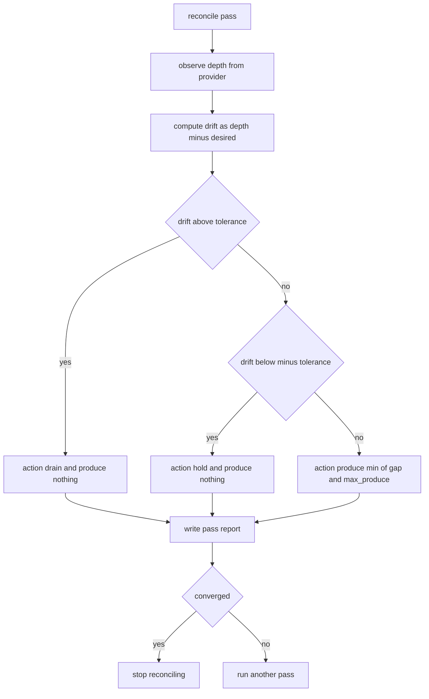

# Managed Queue

## Purpose

A `resource` is state that the runtime does not own. The bytes live in a
broker, a bucket or a cluster; the module's job is to describe what that state
*should* be and to keep nudging reality towards it. This one manages a work
queue held at a desired depth: if the queue is short the reconciler produces
work up to the target, if it is long it stops producing and records the surplus,
and every pass writes a report describing what changed and why.

The provider is a protocol with two operations, `observe` and `produce`, and
the example ships a deterministic in-process fake. The reconciler is a pure
function of observed state, so the same observation always yields the same
plan — which is what makes convergence testable. The resource never deletes
messages: a queue that is over target is reported, not truncated, because the
broker owns retention.

## Inputs

| Name | Type | Required | Description |
|------|------|----------|-------------|
| provider | object | Yes | Object exposing `observe` and `produce` |
| name | string | Yes | Resource name used in reports |
| desired_depth | number | Yes | Target number of queued messages |
| max_produce | number | No | Cap on messages produced per pass, defaults to 10 |
| tolerance | number | No | Depth difference treated as converged, defaults to 1 |

## Outputs

| Name | Type | Description |
|------|------|-------------|
| name | string | The resource name |
| depth | number | Messages currently queued according to the provider |
| desired_depth | number | The configured target |
| action | string | produce, hold or drain |
| produced | number | Messages produced during this pass |
| converged | boolean | True when the queue is within tolerance of the target |
| passes | number | How many reconcile passes have run |

## Capabilities

### observe

Read the current state of the resource from its provider.

### plan

Compute the reconcile plan that would move observed state to desired state.

### reconcile

Run one pass of observe, plan and apply, returning the pass report.

### drift

Return the signed difference between current depth and desired depth.

## Rules

- The reconciler never deletes messages; an over-target queue is reported as
  `drain` and left to the provider's retention policy.
- A pass produces at most `max_produce` messages regardless of how far behind
  the queue is, so reconciliation is gradual rather than a burst.
- A queue within `tolerance` of the target is converged and the action is
  `hold` with nothing produced.
- The provider is the only source of truth for depth; the reconciler never
  caches it between passes.
- A provider that raises propagates the exception; the reconciler does not
  swallow failures and report success.
- A pass is the only unit of change: an observer polling concurrently must be
  able to run `observe` between passes and never see a half-applied pass.
- `desired_depth` must be a non-negative integer.

## Workflow



## Python

```python
from typing import Any, Dict, List, Optional

PRODUCE = "produce"
HOLD = "hold"
DRAIN = "drain"

DEFAULT_MAX_PRODUCE = 10
DEFAULT_TOLERANCE = 1


class QueueProvider:
    """Protocol a real broker adapter must satisfy."""

    def observe(self) -> Dict[str, Any]:
        raise NotImplementedError

    def produce(self, messages: List[Dict[str, Any]]) -> int:
        raise NotImplementedError


class InProcessQueue(QueueProvider):
    """Deterministic in-process stand-in for a broker."""

    def __init__(self, depth: int = 0) -> None:
        if depth < 0:
            raise ValueError("depth must be non-negative")
        self.depth = depth
        self.produced: List[Dict[str, Any]] = []
        self.drained: List[Dict[str, Any]] = []
        self.observations = 0

    def observe(self) -> Dict[str, Any]:
        self.observations += 1
        return {"depth": self.depth, "produced_total": len(self.produced),
                "drained_total": len(self.drained)}

    def produce(self, messages: List[Dict[str, Any]]) -> int:
        self.produced.extend(messages)
        self.depth += len(messages)
        return len(messages)

    def drain(self, count: int) -> int:
        count = min(count, self.depth)
        self.drained.extend([{"drained": True}] * count)
        self.depth -= count
        return count


class ManagedQueue:
    """Keeps an external queue at a desired depth, one pass at a time."""

    def __init__(self, provider: QueueProvider, name: str, desired_depth: int,
                 max_produce: int = DEFAULT_MAX_PRODUCE,
                 tolerance: int = DEFAULT_TOLERANCE) -> None:
        if not isinstance(desired_depth, int) or desired_depth < 0:
            raise ValueError("desired_depth must be a non-negative integer")
        if max_produce < 1:
            raise ValueError("max_produce must be at least 1")
        if tolerance < 0:
            raise ValueError("tolerance must be non-negative")
        self.provider = provider
        self.name = name
        self.desired_depth = desired_depth
        self.max_produce = max_produce
        self.tolerance = tolerance
        self.passes = 0
        self.messages: List[Dict[str, Any]] = []

    def observe(self) -> Dict[str, Any]:
        return self.provider.observe()

    def drift(self, observed: Dict[str, Any]) -> int:
        return int(observed["depth"]) - self.desired_depth

    def plan(self, observed: Dict[str, Any]) -> Dict[str, Any]:
        delta = self.drift(observed)
        if delta > self.tolerance:
            return {"action": DRAIN, "produce_count": 0, "delta": delta}
        if delta < -self.tolerance:
            return {"action": PRODUCE,
                    "produce_count": min(-delta, self.max_produce),
                    "delta": delta}
        return {"action": HOLD, "produce_count": 0, "delta": delta}

    def _next_messages(self, count: int) -> List[Dict[str, Any]]:
        batch = []
        for _ in range(count):
            batch.append({"queue": self.name, "seq": len(self.messages) + 1})
            self.messages.append(batch[-1])
        return batch

    def reconcile(self) -> Dict[str, Any]:
        observed = self.observe()
        step = self.plan(observed)
        produced = 0
        if step["produce_count"] > 0:
            produced = self.provider.produce(self._next_messages(step["produce_count"]))
        after = self.observe()
        self.passes += 1
        delta_after = int(after["depth"]) - self.desired_depth
        return {
            "name": self.name,
            "pass": self.passes,
            "depth": int(after["depth"]),
            "desired_depth": self.desired_depth,
            "action": step["action"],
            "produced": produced,
            "delta_before": step["delta"],
            "delta_after": delta_after,
            "converged": abs(delta_after) <= self.tolerance,
        }

    def reconcile_until_converged(self, max_passes: int = 20) -> List[Dict[str, Any]]:
        reports = []
        for _ in range(max_passes):
            report = self.reconcile()
            reports.append(report)
            if report["converged"]:
                break
        return reports


def drain_to_depth(provider: InProcessQueue, target: int) -> int:
    """Drain a queue the reconciler deliberately does not touch."""
    if provider.depth <= target:
        return 0
    return provider.drain(provider.depth - target)
```

## Tests

### Input

```yaml
name: jobs
desired_depth: 5
initial_depth: 0
max_produce: 2
```

### Expected

```yaml
converged_after: 3
final_depth: 5
```

```python
def make_queue(depth=0, desired=5, **kwargs):
    return ManagedQueue(InProcessQueue(depth), "jobs", desired, **kwargs)


def test_produces_until_converged():
    queue = make_queue(0, 5, max_produce=2, tolerance=0)
    reports = queue.reconcile_until_converged()
    assert queue.passes == 3
    assert reports[-1]["converged"] is True
    assert reports[-1]["depth"] == 5
    assert reports[-1]["delta_after"] == 0


def test_holds_when_within_tolerance():
    queue = make_queue(5, 5)
    report = queue.reconcile()
    assert report["action"] == HOLD
    assert report["produced"] == 0
    assert report["converged"] is True


def test_reports_drain_without_deleting():
    provider = InProcessQueue(20)
    queue = ManagedQueue(provider, "jobs", 5)
    report = queue.reconcile()
    assert report["action"] == DRAIN
    assert report["produced"] == 0
    assert provider.depth == 20
    assert provider.drained == []


def test_drift_is_signed():
    queue = make_queue(3, 5)
    assert queue.drift({"depth": 3}) == -2
    assert queue.drift({"depth": 9}) == 4


def test_production_is_capped_per_pass():
    queue = make_queue(0, 100, max_produce=10)
    report = queue.reconcile()
    assert report["produced"] == 10
    assert report["converged"] is False


def test_provider_is_the_only_source_of_truth():
    provider = InProcessQueue(2)
    queue = ManagedQueue(provider, "jobs", 2)
    queue.reconcile()
    provider.depth = 99
    report = queue.reconcile()
    assert report["depth"] == 99


def test_provider_failure_propagates():
    class BrokenProvider(QueueProvider):
        def observe(self):
            raise ConnectionError("broker unreachable")

        def produce(self, messages):
            return 0

    queue = ManagedQueue(BrokenProvider(), "jobs", 1)
    try:
        queue.reconcile()
    except ConnectionError:
        return
    raise AssertionError("expected ConnectionError")


def test_invalid_configuration_is_rejected():
    for args in ((-1,), ("5",)):
        try:
            ManagedQueue(InProcessQueue(), "jobs", *args)
        except ValueError:
            continue
        raise AssertionError(f"expected ValueError for {args}")
```

## Examples

```python
provider = InProcessQueue(depth=1)
queue = ManagedQueue(provider, "jobs", desired_depth=6, max_produce=4, tolerance=0)

print("before:", queue.observe())

for report in queue.reconcile_until_converged():
    print(f"pass {report['pass']}: depth={report['depth']} action={report['action']} "
          f"produced={report['produced']} converged={report['converged']}")

print("after:", queue.observe())

crowded = ManagedQueue(InProcessQueue(depth=12), "jobs", desired_depth=6, tolerance=0)
print("over target:", crowded.reconcile())
print("still over target:", crowded.observe())
print("drained by the provider owner:", drain_to_depth(crowded.provider, 6))
```

## References

- [MAM Specification](../../plan-doc/full-mam.md)
- [Resource templates](../../templates/resource/)
- [Circuit Breaker](../component/component.mam)
