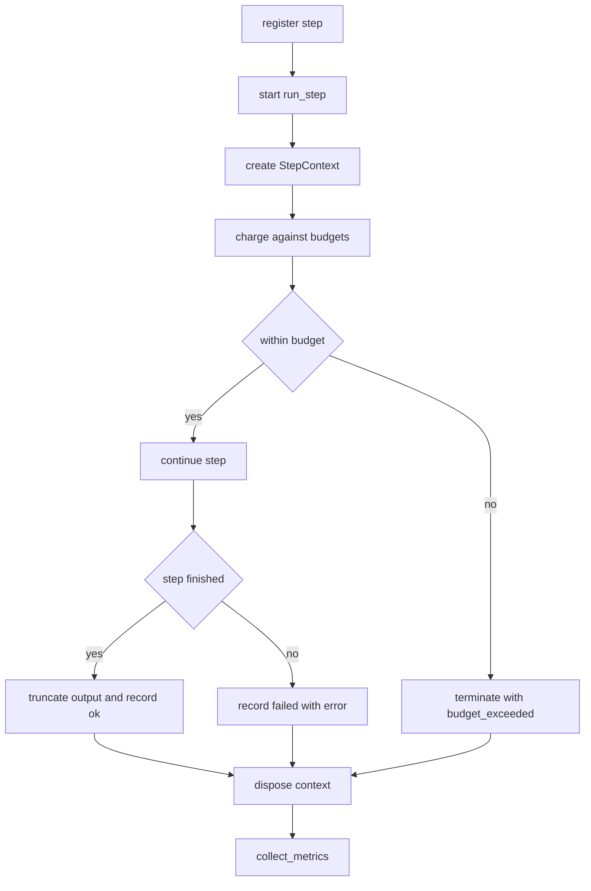

# Sandboxed Step Runner

## Purpose

A runtime executes things it does not fully trust. This one runs a single
workflow step inside a budget it cannot exceed and reports what the step did,
how much it cost, and which phase of its lifecycle it reached. Steps are
ordinary Python callables, but the runtime only ever sees them through the
`StepContext` it hands in, so a step has no ambient authority beyond its
budget.

The three costs a step can incur are units of compute, bytes of output, and
wall-clock milliseconds. Any of them, or a raised exception, terminates the step
and produces a `StepResult` with a status rather than a traceback.

## Inputs

| Name | Type | Required | Description |
|------|------|----------|-------------|
| name | string | Yes | Identifier of the step, unique within a run |
| fn | callable | Yes | The step body, called as `fn(ctx)` |
| timeout_ms | integer | Yes | Wall-clock budget in milliseconds |
| max_output_bytes | integer | Yes | Ceiling on the bytes the step may emit |
| max_compute_units | integer | Yes | Ceiling on the compute units the step may spend |
| payload | object | No | Input handed to the step through the context |

## Outputs

| Name | Type | Description |
|------|------|-------------|
| result | object | `name`, `status`, `value`, `spent`, `error` |
| metrics | object | `compute_units`, `output_bytes`, `elapsed_ms` per step |
| verdict | string | One of `ok`, `budget_exceeded`, `failed` |

## Capabilities

### run_step

Execute one step inside its budgets and return a `StepResult` instead of
letting an exception escape.

### enforce_budget

Charge a cost against a budget and raise as soon as the budget is gone.

### collect_metrics

Return the measured cost of every step that has been executed so far.

## Execution Model

- A step is a single synchronous call; there is no shared interpreter state
  between steps and no step may return a live reference into the runtime.
- The runtime hands the step a `StepContext`. Anything the step wants to record
  as a result goes through `ctx.emit`; anything it wants to keep beyond the step
  is copied, not aliased.
- Steps execute in submission order. The runner is single-threaded and provides
  no concurrency in this version.
- A step that is killed by a budget is not retried by the runtime; retry policy
  belongs to the workflow, not to the engine.

## Resource Limits

| Limit | Default | Enforcement |
|-------|---------|-------------|
| timeout_ms | 5000 | Charged by the runtime against elapsed time at each charge point |
| max_output_bytes | 65536 | Raised by `ctx.emit` when accumulated output passes the ceiling |
| max_compute_units | 10000 | Raised by `ctx.spend` when the step spends past its ceiling |

Exceeding any limit is not an error the step can catch: the runner catches
`BudgetExceeded` and records `budget_exceeded`.

## Lifecycle

1. `created` — the step is registered with a name and a budget.
2. `starting` — a context is built and the payload is frozen.
3. `running` — the body executes; every cost is charged here.
4. `finished` — either a value is produced or a terminal status is recorded.
5. `disposed` — the context is dropped, output is truncated to what fits, and
   the step cannot be run again.

## Rules

- Every step name is unique within a runner; registering twice raises.
- A disposed step cannot be run; running it again raises.
- Output over the ceiling is truncated, not dropped, and the truncation is
  recorded in the result.
- A failing step never aborts the runner; the runner is left usable.
- Metrics are cumulative and are readable after every step.
- The runtime itself performs no I/O; persistence is the caller's business.

## Workflow



## Python

```python
import time
from typing import Any, Callable, Dict, List, Optional


class BudgetExceeded(Exception):
    """Raised inside a step the moment one of its budgets is gone."""


class StepAlreadyRegistered(Exception):
    """Raised when a runner is asked to register a name it already holds."""


class StepDisposed(Exception):
    """Raised when a disposed step is run a second time."""


class StepContext:
    """The only channel a step has to the outside world."""

    def __init__(self, payload: Any, budget: "Budget") -> None:
        self.payload = payload
        self._budget = budget
        self._chunks: List[str] = []

    def spend(self, units: int) -> None:
        self._budget.charge_compute(units)

    def emit(self, text: str) -> None:
        self._budget.charge_output(len(text.encode("utf-8")))
        self._chunks.append(text)

    @property
    def output(self) -> str:
        return "".join(self._chunks)


class Budget:
    def __init__(self, timeout_ms: int, max_output_bytes: int, max_compute_units: int) -> None:
        if min(timeout_ms, max_output_bytes, max_compute_units) <= 0:
            raise ValueError("every budget must be strictly positive")
        self.timeout_ms = timeout_ms
        self.max_output_bytes = max_output_bytes
        self.max_compute_units = max_compute_units
        self.compute_units = 0
        self.output_bytes = 0
        self.started_at: Optional[float] = None
        self.elapsed_ms = 0

    def charge_compute(self, units: int) -> None:
        self.compute_units += units
        self._check_time()
        if self.compute_units > self.max_compute_units:
            raise BudgetExceeded(
                f"compute budget exhausted: {self.compute_units} > {self.max_compute_units}"
            )

    def charge_output(self, nbytes: int) -> None:
        self.output_bytes += nbytes
        if self.output_bytes > self.max_output_bytes:
            raise BudgetExceeded(
                f"output budget exhausted: {self.output_bytes} > {self.max_output_bytes}"
            )

    def _check_time(self) -> None:
        if self.started_at is None:
            return
        self.elapsed_ms = int((time.perf_counter() - self.started_at) * 1000)
        if self.elapsed_ms > self.timeout_ms:
            raise BudgetExceeded(f"time budget exhausted: {self.elapsed_ms}ms > {self.timeout_ms}ms")

    def settle(self) -> None:
        """Stop the clock at the end of a step without ever raising."""
        if self.started_at is None:
            return
        self.elapsed_ms = int((time.perf_counter() - self.started_at) * 1000)

    def spent(self) -> Dict[str, int]:
        return {
            "compute_units": self.compute_units,
            "output_bytes": self.output_bytes,
            "elapsed_ms": self.elapsed_ms,
        }


class StepResult:
    def __init__(
        self,
        name: str,
        status: str,
        value: Any = None,
        output: str = "",
        error: Optional[str] = None,
        truncated: bool = False,
        spent: Optional[Dict[str, int]] = None,
    ) -> None:
        self.name = name
        self.status = status
        self.value = value
        self.output = output
        self.error = error
        self.truncated = truncated
        self.spent = spent or {}

    def as_dict(self) -> Dict[str, Any]:
        return {
            "name": self.name,
            "status": self.status,
            "value": self.value,
            "output": self.output,
            "error": self.error,
            "truncated": self.truncated,
            "spent": self.spent,
        }


class StepRunner:
    def __init__(self) -> None:
        self._registered: Dict[str, Callable[[StepContext], Any]] = {}
        self._disposed: set = set()
        self._metrics: List[Dict[str, Any]] = []

    def register(
        self,
        name: str,
        fn: Callable[[StepContext], Any],
        timeout_ms: int = 5000,
        max_output_bytes: int = 65536,
        max_compute_units: int = 10000,
    ) -> None:
        if name in self._registered:
            raise StepAlreadyRegistered(f"step {name!r} is already registered")
        if not callable(fn):
            raise TypeError("fn must be callable")
        self._registered[name] = fn

    def run_step(
        self,
        name: str,
        payload: Any = None,
        timeout_ms: int = 5000,
        max_output_bytes: int = 65536,
        max_compute_units: int = 10000,
    ) -> StepResult:
        if name not in self._registered:
            raise KeyError(f"no step named {name!r}")
        if name in self._disposed:
            raise StepDisposed(f"step {name!r} has been disposed")
        budget = Budget(timeout_ms, max_output_bytes, max_compute_units)
        budget.started_at = time.perf_counter()
        ctx = StepContext(payload, budget)
        value: Any = None
        try:
            value = self._registered[name](ctx)
        except BudgetExceeded as exc:
            status, error = "budget_exceeded", str(exc)
        except Exception as exc:  # a failing step never breaks the runner
            status, error = "failed", f"{type(exc).__name__}: {exc}"
        else:
            status, error = "ok", None
        budget.settle()
        text = ctx.output
        truncated = False
        if len(text.encode("utf-8")) > max_output_bytes:
            text = text.encode("utf-8")[:max_output_bytes].decode("utf-8", "ignore")
            truncated = True
        self._disposed.add(name)
        result = StepResult(
            name=name,
            status=status,
            value=value,
            output=text,
            error=error,
            truncated=truncated,
            spent=budget.spent(),
        )
        self._metrics.append({"name": name, "status": status, **budget.spent()})
        return result

    def collect_metrics(self) -> List[Dict[str, Any]]:
        return [dict(entry) for entry in self._metrics]

    def dispose(self) -> None:
        self._disposed.update(self._registered)
        self._registered.clear()
```

## Tests

### Input

```yaml
name: normalize
payload: ["  A ", "b  ", "  c"]
max_compute_units: 50
```

### Expected

```yaml
status: ok
value: ["a", "b", "c"]
compute_units: 3
```

```python
def test_run_step_returns_value_and_status():
    runner = StepRunner()
    runner.register("normalize", lambda ctx: [item.strip().lower() for item in ctx.payload])
    result = runner.run_step("normalize", payload=["  A ", "b  ", "  c"])
    assert result.status == "ok"
    assert result.value == ["a", "b", "c"]
    assert result.error is None


def test_run_step_records_compute_and_output():
    def chatty(ctx):
        for item in ctx.payload:
            ctx.spend(1)
            ctx.emit(str(item))
        return len(ctx.payload)

    runner = StepRunner()
    runner.register("chatty", chatty)
    result = runner.run_step("chatty", payload=["a", "bb", "ccc"], max_compute_units=50)
    assert result.status == "ok"
    assert result.value == 3
    assert result.output == "abbccc"
    assert result.spent["compute_units"] == 3
    assert result.spent["output_bytes"] == 6


def test_compute_budget_is_enforced():
    def greedy(ctx):
        for _ in range(100):
            ctx.spend(10)
        return "unreachable"

    runner = StepRunner()
    runner.register("greedy", greedy)
    result = runner.run_step("greedy", max_compute_units=50)
    assert result.status == "budget_exceeded"
    assert "compute budget exhausted" in result.error
    assert result.value is None


def test_output_budget_is_enforced():
    def noisy(ctx):
        ctx.emit("x" * 100)
        return "unreachable"

    runner = StepRunner()
    runner.register("noisy", noisy)
    result = runner.run_step("noisy", max_output_bytes=10)
    assert result.status == "budget_exceeded"
    assert "output budget exhausted" in result.error


def test_failing_step_is_reported_not_raised():
    def broken(ctx):
        raise ZeroDivisionError("boom")

    runner = StepRunner()
    runner.register("broken", broken)
    result = runner.run_step("broken")
    assert result.status == "failed"
    assert result.error == "ZeroDivisionError: boom"


def test_duplicate_registration_is_rejected():
    runner = StepRunner()
    runner.register("a", lambda ctx: 1)
    try:
        runner.register("a", lambda ctx: 2)
    except StepAlreadyRegistered:
        return
    raise AssertionError("expected StepAlreadyRegistered")


def test_step_runs_only_once():
    runner = StepRunner()
    runner.register("once", lambda ctx: 1)
    assert runner.run_step("once").status == "ok"
    try:
        runner.run_step("once")
    except StepDisposed:
        return
    raise AssertionError("expected StepDisposed")


def test_unknown_step_raises_key_error():
    try:
        StepRunner().run_step("nope")
    except KeyError:
        return
    raise AssertionError("expected KeyError")


def test_collect_metrics_is_cumulative_and_copied():
    runner = StepRunner()
    runner.register("a", lambda ctx: 1)
    runner.register("b", lambda ctx: 2)
    runner.run_step("a")
    runner.run_step("b")
    metrics = runner.collect_metrics()
    assert [m["name"] for m in metrics] == ["a", "b"]
    assert all(m["status"] == "ok" for m in metrics)
    metrics.clear()
    assert len(runner.collect_metrics()) == 2


def test_budgets_must_be_positive():
    try:
        Budget(0, 10, 10)
    except ValueError:
        return
    raise AssertionError("expected ValueError for a non-positive budget")
```

## Examples

```python
import time


class BudgetExceeded(Exception):
    pass


class StepContext:
    def __init__(self, payload, budget):
        self.payload = payload
        self._budget = budget
        self._chunks = []

    def spend(self, units):
        self._budget.charge_compute(units)

    def emit(self, text):
        self._budget.charge_output(len(text.encode("utf-8")))
        self._chunks.append(text)

    @property
    def output(self):
        return "".join(self._chunks)


def extract(ctx):
    ctx.spend(2)
    for line in ctx.payload:
        ctx.emit(line)
    return {"lines": len(ctx.payload)}


def transform(ctx):
    ctx.spend(1)
    return ctx.output.upper()


def load(ctx):
    # a step that runs away is stopped by its budget, not by a traceback
    for _ in range(1000):
        ctx.spend(1)
    return "never reached"


def main():
    runner = StepRunner()
    runner.register("extract", extract)
    runner.register("transform", transform)
    runner.register("load", load)

    first = runner.run_step("extract", payload=["alpha", "beta", "gamma"])
    second = runner.run_step("transform", payload=first.output)
    third = runner.run_step("load", payload=second.value, max_compute_units=10)

    for result in (first, second, third):
        print(f"{result.name} -> {result.status} {result.spent} {result.error}")

    print("metrics rows:", [f"{m['name']}={m['status']}" for m in runner.collect_metrics()])


main()
# extract -> ok {'compute_units': 2, 'output_bytes': 14, 'elapsed_ms': 0} None
# transform -> ok {'compute_units': 1, 'output_bytes': 0, 'elapsed_ms': 0} None
# load -> budget_exceeded {'compute_units': 11, 'output_bytes': 0, 'elapsed_ms': 0} compute budget exhausted: 11 > 10
# metrics rows: ['extract=ok', 'transform=ok', 'load=budget_exceeded']
```

## References

- [MAM Specification](../../plan-doc/full-mam.md)
- [Runtime templates](../../templates/runtime/)
- [Workflow templates](../../templates/workflow/)
