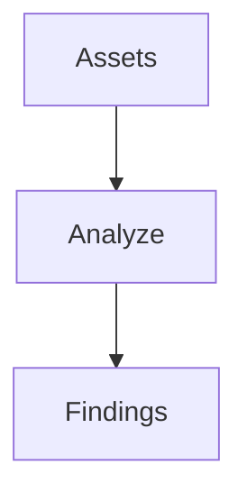

# Analyzer

## Purpose

Consumes discovered assets and produces findings ranked by severity.

## Inputs

| Name | Type | Required | Description |
|------|------|----------|-------------|
| assets | list | Yes | Assets from the recon stage |

## Outputs

| Name | Type | Description |
|------|------|-------------|
| findings | list | Ranked findings |

## Capabilities

### analyze

Assess assets and produce ranked findings.

## Rules

- Preserve evidence for every finding.
- Validate results before reporting.

## Workflow



## Python

```python
def analyze(assets: list) -> list:
    """Assess assets and return ranked findings."""
    return [{"asset": a.get("asset"), "severity": "medium"} for a in assets]
```

## Tests

### Input

```yaml
assets:
  - asset: example.com
```

### Expected

```yaml
findings: present
```

## References

- MAM documentation
