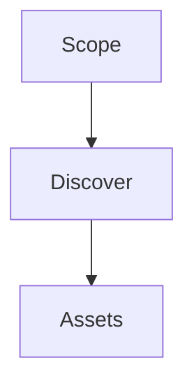

# Recon

## Purpose

Discovers publicly authorized assets within a declared scope and returns a
structured asset list for downstream analysis.

## Inputs

| Name | Type | Required | Description |
|------|------|----------|-------------|
| scope | string | Yes | Authorized scope (for example a domain) |
| depth | int | No | Discovery depth (default: 1) |

## Outputs

| Name | Type | Description |
|------|------|-------------|
| assets | list | Discovered assets |

## Capabilities

### discover

Enumerate assets within the authorized scope.

## Rules

- Operate only against authorized targets.
- Never perform destructive actions.

## Workflow



## Python

```python
def discover(scope: str, depth: int = 1) -> list:
    """Return discovered assets for a scope."""
    return [{"asset": scope, "depth": depth}]
```

## Tests

### Input

```yaml
scope: example.com
```

### Expected

```yaml
assets: present
```

## References

- MAM documentation
