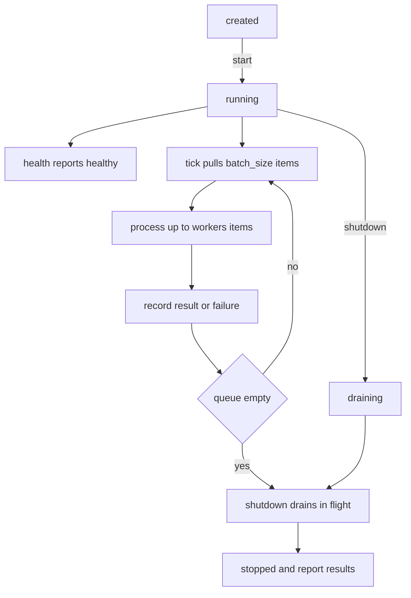

# Worker Health Service

## Purpose

A `service` is the one module type that owns time. It does not return an answer,
it runs: it holds a loop, exposes a health endpoint, and must be able to stop
cleanly when the platform asks it to. This one drains a queue with a bounded
pool of workers, reports its lifecycle state through `health()`, and finishes
in-flight work on shutdown instead of dropping it.

For testability the loop is driven by an injected tick function rather than
`time.sleep`, and concurrency is modelled with an explicit worker count rather
than real threads. That keeps the service honest about its state machine —
`created`, `running`, `draining`, `stopped` — while remaining deterministic. A
real deployment swaps the tick for a timer and the worker count for a thread
pool; the contract does not change.

## Inputs

| Name | Type | Required | Description |
|------|------|----------|-------------|
| queue | list | Yes | Work items the service consumes, consumed in order |
| handler | object | Yes | Callable turning one item into a result record |
| workers | number | No | Maximum items processed per tick, defaults to 4 |
| batch_size | number | No | Items pulled from the queue per tick, defaults to 8 |
| max_ticks | number | No | Safety bound on loop iterations, defaults to 1000 |

## Outputs

| Name | Type | Description |
|------|------|-------------|
| state | string | One of created, running, draining, stopped |
| healthy | boolean | True when the service is running and the error rate is acceptable |
| processed | number | Items successfully handled since start |
| failed | number | Items whose handler raised |
| remaining | number | Items still queued |
| results | list | Per-item outcome records in completion order |

## Capabilities

### start

Move the service into the running state and reset the counters.

### process

Run one bounded tick of the worker loop, returning the results of that tick.

### health

Report the current lifecycle state and a healthy flag for a health endpoint.

### shutdown

Drain the in-flight batch, mark the service stopped and return the final
results.

## Rules

- The service must refuse to process before `start` and after `shutdown`.
- Each tick handles at most `batch_size` items and at most `workers` items may
  be in flight.
- A handler exception is recorded as a failed result and never stops the loop.
- `health()` reports healthy only in the running state with no failed items.
- `shutdown()` is idempotent: a second call returns the same results and does
  not re-drain.
- The loop stops after `max_ticks` even if the queue is not empty, and reports
  the remaining count.
- A stopped service never returns to running; restarting requires a new instance.

## Workflow



## Python

```python
from typing import Any, Callable, Dict, List, Optional, Sequence

CREATED = "created"
RUNNING = "running"
DRAINING = "draining"
STOPPED = "stopped"

DEFAULT_WORKERS = 4
DEFAULT_BATCH_SIZE = 8
DEFAULT_MAX_TICKS = 1000


class WorkerService:
    """A long-running queue consumer with a health endpoint and drain."""

    name = "worker-health"

    def __init__(self, queue: Sequence[Any], handler: Callable[[Any], Any],
                 workers: int = DEFAULT_WORKERS, batch_size: int = DEFAULT_BATCH_SIZE,
                 max_ticks: int = DEFAULT_MAX_TICKS) -> None:
        if not callable(handler):
            raise TypeError("handler must be callable")
        if workers < 1 or batch_size < 1 or max_ticks < 1:
            raise ValueError("workers, batch_size and max_ticks must be at least 1")
        self.queue = list(queue)
        self.handler = handler
        self.workers = workers
        self.batch_size = batch_size
        self.max_ticks = max_ticks
        self.state = CREATED
        self.processed = 0
        self.failed = 0
        self.ticks = 0
        self.results: List[Dict[str, Any]] = []
        self._in_flight: List[Any] = []

    def start(self) -> Dict[str, Any]:
        if self.state in (DRAINING, STOPPED):
            raise RuntimeError("service cannot be restarted once stopped")
        self.state = RUNNING
        self.processed = 0
        self.failed = 0
        self.ticks = 0
        self.results = []
        return self.health()

    def _handle(self, item: Any) -> Dict[str, Any]:
        try:
            value = self.handler(item)
        except Exception as exc:
            self.failed += 1
            return {"item": item, "ok": False, "error": type(exc).__name__}
        self.processed += 1
        return {"item": item, "ok": True, "value": value}

    def process(self) -> List[Dict[str, Any]]:
        if self.state != RUNNING:
            raise RuntimeError(f"cannot process while {self.state}")
        if self.ticks >= self.max_ticks:
            raise RuntimeError("tick budget exhausted")
        self.ticks += 1
        batch: List[Any] = []
        while self.queue and len(batch) < self.batch_size:
            batch.append(self.queue.pop(0))
        handled, deferred = batch[: self.workers], batch[self.workers:]
        self._in_flight = list(deferred)
        tick_results = [self._handle(item) for item in handled]
        self._in_flight = []
        self.results.extend(tick_results)
        self.queue = deferred + self.queue
        return tick_results

    def health(self) -> Dict[str, Any]:
        return {
            "service": self.name,
            "state": self.state,
            "healthy": self.state == RUNNING and self.failed == 0,
            "processed": self.processed,
            "failed": self.failed,
            "remaining": len(self.queue),
            "in_flight": len(self._in_flight),
            "ticks": self.ticks,
        }

    def shutdown(self) -> Dict[str, Any]:
        if self.state == STOPPED:
            return {"state": self.state, "results": list(self.results),
                    "processed": self.processed, "failed": self.failed,
                    "remaining": len(self.queue)}
        self.state = DRAINING
        drained = [self._handle(item) for item in self._in_flight]
        self.results.extend(drained)
        self._in_flight = []
        self.state = STOPPED
        return {"state": self.state, "results": list(self.results),
                "processed": self.processed, "failed": self.failed,
                "remaining": len(self.queue)}

    def run(self) -> Dict[str, Any]:
        self.start()
        while self.queue and self.ticks < self.max_ticks:
            self.process()
        return self.shutdown()


def handle_job(job: Dict[str, Any]) -> Dict[str, Any]:
    if job.get("kind") == "poison":
        raise ValueError("poison job")
    return {"echo": job.get("payload"), "kind": job.get("kind")}
```

## Tests

### Input

```yaml
queue:
  - {kind: index, payload: 1}
  - {kind: index, payload: 2}
handler: handle_job
```

### Expected

```yaml
state: stopped
processed: 2
failed: 0
```

```python
def make_service(count=4, **kwargs):
    queue = [{"kind": "index", "payload": index} for index in range(count)]
    return WorkerService(queue, handle_job, **kwargs)


def test_starts_unhealthy_until_running():
    service = make_service(1)
    assert service.health()["state"] == "created"
    assert service.health()["healthy"] is False
    service.start()
    assert service.health()["state"] == "running"
    assert service.health()["healthy"] is True


def test_refuses_to_process_before_start():
    service = make_service(1)
    try:
        service.process()
    except RuntimeError:
        return
    raise AssertionError("expected RuntimeError")


def test_tick_processes_one_batch():
    service = make_service(4, batch_size=2, workers=2)
    service.start()
    results = service.process()
    assert len(results) == 2
    assert service.health()["remaining"] == 2
    assert all(result["ok"] for result in results)


def test_handler_failure_is_recorded_not_raised():
    queue = [{"kind": "index", "payload": 1}, {"kind": "poison"}]
    service = WorkerService(queue, handle_job, batch_size=2, workers=2)
    service.start()
    results = service.process()
    assert [result["ok"] for result in results] == [True, False]
    assert results[1]["error"] == "ValueError"
    assert service.health()["healthy"] is False


def test_run_drains_everything():
    service = make_service(7, batch_size=2, workers=2)
    outcome = service.run()
    assert outcome["state"] == "stopped"
    assert outcome["processed"] == 7
    assert outcome["remaining"] == 0


def test_shutdown_is_idempotent():
    service = make_service(3, batch_size=2, workers=2)
    service.start()
    service.process()
    first = service.shutdown()
    second = service.shutdown()
    assert first["state"] == second["state"] == "stopped"
    assert len(first["results"]) == len(second["results"])


def test_tick_budget_stops_the_loop():
    service = make_service(20, batch_size=1, workers=1, max_ticks=3)
    outcome = service.run()
    assert outcome["remaining"] == 17
    assert service.health()["ticks"] == 3


def test_stopped_service_cannot_restart():
    service = make_service(1)
    service.start()
    service.shutdown()
    try:
        service.start()
    except RuntimeError:
        return
    raise AssertionError("expected RuntimeError")


def test_invalid_configuration_is_rejected():
    try:
        WorkerService([], "not callable")
    except TypeError:
        pass
    else:
        raise AssertionError("expected TypeError")
    try:
        WorkerService([], handle_job, workers=0)
    except ValueError:
        return
    raise AssertionError("expected ValueError")
```

## Examples

```python
JOBS = [
    {"kind": "index", "payload": "a"},
    {"kind": "index", "payload": "b"},
    {"kind": "poison", "payload": "c"},
    {"kind": "index", "payload": "d"},
]

service = WorkerService(JOBS, handle_job, workers=2, batch_size=2)
print("before start:", service.health())

service.start()
while service.health()["remaining"] and service.ticks < service.max_ticks:
    service.process()
    print("tick", service.ticks, "->", service.health())

outcome = service.shutdown()
print("final:", outcome["state"], outcome["processed"], "processed,", outcome["failed"], "failed")
for result in outcome["results"]:
    print(" ", result)
```

## References

- [MAM Specification](../../plan-doc/full-mam.md)
- [Service templates](../../templates/service/)
- [Session Memory](../memory/memory.mam)
