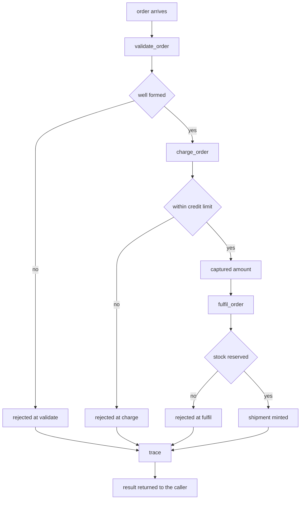

# Order Processing System

## Purpose

A system is not a big module, it is a wiring decision. This one takes an
order through three parts that each own exactly one concern, in an order where
a refusal by an earlier part makes a later part's work pointless. Validation is
free, charging moves money, fulfilment moves goods, and only validation is
allowed to run before the system knows the order is worth processing at all.

The composition is deliberately explicit. The system owns the sequence and the
trace; it does not own the rules, which live in the parts and are testable on
their own.

## Inputs

| Name | Type | Required | Description |
|------|------|----------|-------------|
| order_id | string | Yes | Customer-facing identifier, unique per system |
| customer | string | Yes | Account the order is billed to |
| items | list | Yes | List of `sku`/`quantity` pairs, priced in cents |
| credit_limit | integer | Yes | Largest charge the system will take for one order |

## Outputs

| Name | Type | Description |
|------|------|-------------|
| status | string | `fulfilled`, or `rejected` with the rejecting stage named |
| total | integer | Order total in cents, computed by the system |
| trace | list | One record per stage that ran, with its verdict |
| shipment | object | Reservation id and warehouse, present only when fulfilled |

## Capabilities

### validate_order

Reject orders that are empty, mispriced, or addressed to nobody.

### charge_order

Take the payment or refuse the order when it exceeds the credit limit.

### fulfil_order

Reserve the stock and mint a shipment for a paid order.

### orchestrate

Run the three parts in order, stop at the first refusal, and record the trace.

## Modules

| Module | Owns | Depends on |
|--------|------|------------|
| `validate` | Order well-formedness and pricing | nothing |
| `charge` | Payment capture and credit limit | `validate` having accepted |
| `fulfil` | Stock reservation and shipment id | `charge` having captured |

## System Definition

- The system owns the sequence `validate -> charge -> fulfil` and nothing else.
- Each part is a callable with a name, so the trace can attribute every verdict.
- A part returns a dict with at least a `ok` boolean; the system never inspects
  anything else in it.
- The system stops at the first part that returns `ok = false` and does not run
  the rest. Money is therefore never taken for an order that will not ship.
- The system never retries. Retrying a charge without an idempotency key is
  worse than failing, and idempotency is a part's responsibility, not the
  system's.
- The trace is append-only and is returned with the result, so a run is
  auditable without a log store.

## Rules

- Every order carries a non-empty `order_id`; two runs of the same id produce
  the same trace, which makes the system testable.
- Totals are integer cents. No float ever touches an amount.
- Validation must run before charging; charging must run before fulfilment.
- A refusal names the stage that refused and never includes a later stage.
- The system exposes no partial success: the result is either a shipment or a
  named rejection.
- No part performs I/O in this example; the effects are represented as data.

## Workflow



## Python

```python
import hashlib
from typing import Any, Callable, Dict, List

ModuleFn = Callable[[Dict[str, Any]], Dict[str, Any]]

MAX_CAPTURE_CENTS = 90_000


class SystemError(Exception):
    """Raised for misuse of the system itself, not for a rejected order."""


def _refuse(stage: str, reason: str, **extra: Any) -> Dict[str, Any]:
    return {"ok": False, "stage": stage, "reason": reason, **extra}


def _accept(stage: str, **extra: Any) -> Dict[str, Any]:
    return {"ok": True, "stage": stage, **extra}


def _total(items: List[Dict[str, Any]]) -> int:
    total = 0
    for item in items:
        unit = item.get("unit_price_cents")
        quantity = item.get("quantity")
        if not isinstance(unit, int) or not isinstance(quantity, int):
            raise SystemError("items must carry integer unit_price_cents and quantity")
        total += unit * quantity
    return total


def validate_order(order: Dict[str, Any]) -> Dict[str, Any]:
    """Refuse orders that are empty, mispriced, or addressed to nobody."""
    stage = "validate"
    credit_limit = order.get("credit_limit", 100_000)
    if not order.get("order_id"):
        return _refuse(stage, "an order_id is required")
    if not order.get("customer"):
        return _refuse(stage, "a customer is required")
    items = order.get("items") or []
    if not items:
        return _refuse(stage, "an order needs at least one item")
    for item in items:
        if not item.get("sku"):
            return _refuse(stage, "every item needs a sku")
        if item.get("quantity", 0) <= 0:
            return _refuse(stage, f"quantity for {item.get('sku')} must be positive")
    total = _total(items)
    if total <= 0:
        return _refuse(stage, "the order total must be positive")
    if total > credit_limit:
        return _refuse(stage, "the order exceeds the credit limit", total=total)
    return _accept(stage, total=total)


def charge_order(order: Dict[str, Any]) -> Dict[str, Any]:
    """Capture the payment, or refuse the order when it needs a human."""
    stage = "charge"
    total = order["total"]
    card_last4 = str(order.get("card_last4", ""))
    if not card_last4.isdigit() or len(card_last4) != 4:
        return _refuse(stage, "a four digit card reference is required")
    if total > MAX_CAPTURE_CENTS:
        return _refuse(stage, f"captures above {MAX_CAPTURE_CENTS} cents need a human", total=total)
    seed = f"{order['order_id']}:{total}:{card_last4}".encode("utf-8")
    return _accept(stage, captured_cents=total, capture_id=hashlib.sha256(seed).hexdigest()[:16])


def fulfil_order(order: Dict[str, Any]) -> Dict[str, Any]:
    """Reserve every line against stock, all of it or none of it."""
    stage = "fulfil"
    stock = order["stock"]
    for item in order["items"]:
        if stock.get(item["sku"], 0) < item["quantity"]:
            return _refuse(stage, f"{item['sku']} is out of stock", sku=item["sku"])
    for item in order["items"]:
        stock[item["sku"]] -= item["quantity"]
    seed = f"ship:{order['order_id']}".encode("utf-8")
    return _accept(
        stage,
        shipment_id="SHP-" + hashlib.sha256(seed).hexdigest()[:10].upper(),
        warehouse="eu-west-1",
        lines=len(order["items"]),
    )


class OrderProcessingSystem:
    """Owns the sequence and the trace; owns none of the rules."""

    def __init__(self, credit_limit: int = 100_000, stock: Dict[str, int] | None = None) -> None:
        if credit_limit <= 0:
            raise SystemError("the credit limit must be positive")
        self.credit_limit = credit_limit
        self.stock = dict(stock or {})
        self.modules: List[Dict[str, Any]] = []

    def install(self, name: str, fn: ModuleFn) -> None:
        if not callable(fn):
            raise SystemError(f"module {name!r} is not callable")
        if any(m["name"] == name for m in self.modules):
            raise SystemError(f"module {name!r} is already installed")
        self.modules.append({"name": name, "fn": fn})

    def _by_name(self) -> Dict[str, ModuleFn]:
        return {m["name"]: m["fn"] for m in self.modules}

    def run(self, order: Dict[str, Any], card_last4: str = "4242") -> Dict[str, Any]:
        installed = self._by_name()
        for required in ("validate", "charge", "fulfil"):
            if required not in installed:
                raise SystemError(f"module {required!r} is not installed")
        staged = dict(order)
        staged["credit_limit"] = self.credit_limit
        staged["card_last4"] = card_last4
        trace: List[Dict[str, Any]] = []
        total = 0
        shipment: Dict[str, Any] = {}
        for name in ("validate", "charge", "fulfil"):
            if name == "fulfil":
                staged["stock"] = self.stock
            verdict = installed[name](staged)
            trace.append(verdict)
            if not verdict.get("ok"):
                return {
                    "status": "rejected",
                    "rejected_at": name,
                    "reason": verdict.get("reason"),
                    "total": total,
                    "trace": trace,
                    "shipment": {},
                }
            total = verdict.get("total", total)
            staged["total"] = total
            if name == "fulfil":
                shipment = {k: v for k, v in verdict.items() if k not in ("ok", "stage", "reason")}
        return {
            "status": "fulfilled",
            "rejected_at": None,
            "reason": None,
            "total": total,
            "trace": trace,
            "shipment": shipment,
        }


def build_system() -> OrderProcessingSystem:
    system = OrderProcessingSystem(credit_limit=100_000, stock={"SKU-1": 10, "SKU-2": 3})
    system.install("validate", validate_order)
    system.install("charge", charge_order)
    system.install("fulfil", fulfil_order)
    return system
```

## Tests

### Input

```yaml
order_id: ORD-1001
customer: acme
items:
  - sku: SKU-1
    quantity: 2
    unit_price_cents: 1250
```

### Expected

```yaml
status: fulfilled
total: 2500
rejected_at: null
```

```python
def _order(**overrides):
    order = {
        "order_id": "ORD-1001",
        "customer": "acme",
        "items": [{"sku": "SKU-1", "quantity": 2, "unit_price_cents": 1250}],
    }
    order.update(overrides)
    return order


def test_happy_path_is_fulfilled():
    result = build_system().run(_order())
    assert result["status"] == "fulfilled"
    assert result["total"] == 2500
    assert result["rejected_at"] is None
    assert result["shipment"]["warehouse"] == "eu-west-1"
    assert result["shipment"]["shipment_id"].startswith("SHP-")


def test_trace_names_every_stage_that_ran():
    result = build_system().run(_order())
    assert [t["stage"] for t in result["trace"]] == ["validate", "charge", "fulfil"]
    assert all(t["ok"] for t in result["trace"])


def test_validation_refusal_stops_the_run():
    result = build_system().run(_order(items=[]))
    assert result["status"] == "rejected"
    assert result["rejected_at"] == "validate"
    assert [t["stage"] for t in result["trace"]] == ["validate"]
    assert result["shipment"] == {}


def test_charge_refusal_skips_fulfilment():
    system = build_system()
    order = _order(items=[{"sku": "SKU-1", "quantity": 76, "unit_price_cents": 1250}])
    result = system.run(order)
    assert result["status"] == "rejected"
    assert result["rejected_at"] == "charge"
    assert [t["stage"] for t in result["trace"]] == ["validate", "charge"]
    assert system.stock["SKU-1"] == 10


def test_charge_refuses_a_malformed_card_reference():
    result = build_system().run(_order(), card_last4="42")
    assert result["rejected_at"] == "charge"
    assert result["reason"] == "a four digit card reference is required"


def test_fulfilment_refusal_after_capture_is_reported():
    system = build_system()
    result = system.run(_order(items=[{"sku": "SKU-9", "quantity": 1, "unit_price_cents": 100}]))
    assert result["rejected_at"] == "fulfil"
    assert "out of stock" in result["reason"]


def test_stock_is_decremented_exactly_once():
    system = build_system()
    system.run(_order())
    assert system.stock["SKU-1"] == 8


def test_credit_limit_is_enforced_by_validation():
    result = build_system().run(_order(items=[{"sku": "SKU-1", "quantity": 100, "unit_price_cents": 1250}]))
    assert result["rejected_at"] == "validate"
    assert result["reason"] == "the order exceeds the credit limit"
    assert result["trace"][0]["total"] == 125000


def test_run_is_deterministic():
    system = build_system()
    first = system.run(_order())
    second = build_system().run(_order())
    assert first["shipment"] == second["shipment"]
    assert first["trace"][1]["capture_id"] == second["trace"][1]["capture_id"]


def test_missing_module_is_a_system_error():
    system = OrderProcessingSystem()
    system.install("validate", validate_order)
    try:
        system.run(_order())
    except SystemError as exc:
        assert "charge" in str(exc)
    else:
        raise AssertionError("expected SystemError")


def test_install_is_unique_and_callable():
    system = build_system()
    for name, fn in (("validate", lambda o: None), ("nope", "not callable")):
        try:
            system.install(name, fn)
        except SystemError:
            continue
        raise AssertionError(f"expected SystemError for {name}")
```

## Examples

```python
import hashlib


class SystemError(Exception):
    pass


class OrderProcessingSystem:
    def __init__(self, credit_limit=100_000, stock=None):
        self.credit_limit = credit_limit
        self.stock = dict(stock or {})
        self.modules = []

    def install(self, name, fn):
        if not callable(fn):
            raise SystemError(f"module {name!r} is not callable")
        if any(m["name"] == name for m in self.modules):
            raise SystemError(f"module {name!r} is already installed")
        self.modules.append({"name": name, "fn": fn})

    def run(self, order, card_last4="4242"):
        installed = {m["name"]: m["fn"] for m in self.modules}
        for required in ("validate", "charge", "fulfil"):
            if required not in installed:
                raise SystemError(f"module {required!r} is not installed")
        staged = dict(order, credit_limit=self.credit_limit, card_last4=card_last4)
        trace, total, shipment = [], 0, {}
        for name in ("validate", "charge", "fulfil"):
            if name == "fulfil":
                staged["stock"] = self.stock
            verdict = installed[name](staged)
            trace.append(verdict)
            if not verdict["ok"]:
                return {"status": "rejected", "rejected_at": name,
                        "reason": verdict["reason"], "total": total,
                        "trace": trace, "shipment": {}}
            total = verdict.get("total", total)
            staged["total"] = total
            if name == "fulfil":
                shipment = {k: v for k, v in verdict.items() if k not in ("ok", "stage", "reason")}
        return {"status": "fulfilled", "rejected_at": None, "reason": None,
                "total": total, "trace": trace, "shipment": shipment}


def validate(order):
    if not order.get("order_id"):
        return {"ok": False, "stage": "validate", "reason": "an order_id is required"}
    if not order.get("items"):
        return {"ok": False, "stage": "validate", "reason": "an order needs at least one item"}
    total = sum(i["unit_price_cents"] * i["quantity"] for i in order["items"])
    if total > order["credit_limit"]:
        return {"ok": False, "stage": "validate", "reason": "the order exceeds the credit limit", "total": total}
    return {"ok": True, "stage": "validate", "total": total}


def charge(order):
    seed = f"{order['order_id']}:{order['total']}:{order['card_last4']}".encode("utf-8")
    return {"ok": True, "stage": "charge", "captured_cents": order["total"],
            "capture_id": hashlib.sha256(seed).hexdigest()[:16]}


def fulfil(order):
    stock = order["stock"]
    for item in order["items"]:
        if stock.get(item["sku"], 0) < item["quantity"]:
            return {"ok": False, "stage": "fulfil", "reason": f"{item['sku']} is out of stock"}
    for item in order["items"]:
        stock[item["sku"]] -= item["quantity"]
    seed = f"ship:{order['order_id']}".encode("utf-8")
    return {"ok": True, "stage": "fulfil",
            "shipment_id": "SHP-" + hashlib.sha256(seed).hexdigest()[:10].upper(),
            "warehouse": "eu-west-1", "lines": len(order["items"])}


def main():
    system = OrderProcessingSystem(credit_limit=100_000, stock={"SKU-1": 10, "SKU-2": 3})
    system.install("validate", validate)
    system.install("charge", charge)
    system.install("fulfil", fulfil)

    cases = [
        {"order_id": "ORD-1001", "items": [{"sku": "SKU-1", "quantity": 2, "unit_price_cents": 1250}]},
        {"order_id": "ORD-1002", "items": [{"sku": "SKU-2", "quantity": 1, "unit_price_cents": 9900}]},
        {"order_id": "ORD-1003", "items": [{"sku": "SKU-7", "quantity": 1, "unit_price_cents": 500}]},
    ]
    for case in cases:
        result = system.run(case)
        print(case["order_id"], result["status"], result["total"],
              result["shipment"].get("shipment_id") or result["reason"])
    print("stock left:", system.stock)


main()
# ORD-1001 fulfilled 2500 SHP-A4F07990DF
# ORD-1002 fulfilled 9900 SHP-0BC5CCAC24
# ORD-1003 rejected 500 SKU-7 is out of stock
# stock left: {'SKU-1': 8, 'SKU-2': 2}
```

## References

- [MAM Specification](../../plan-doc/full-mam.md)
- [System templates](../../templates/system/)
- [Workflow templates](../../templates/workflow/)
