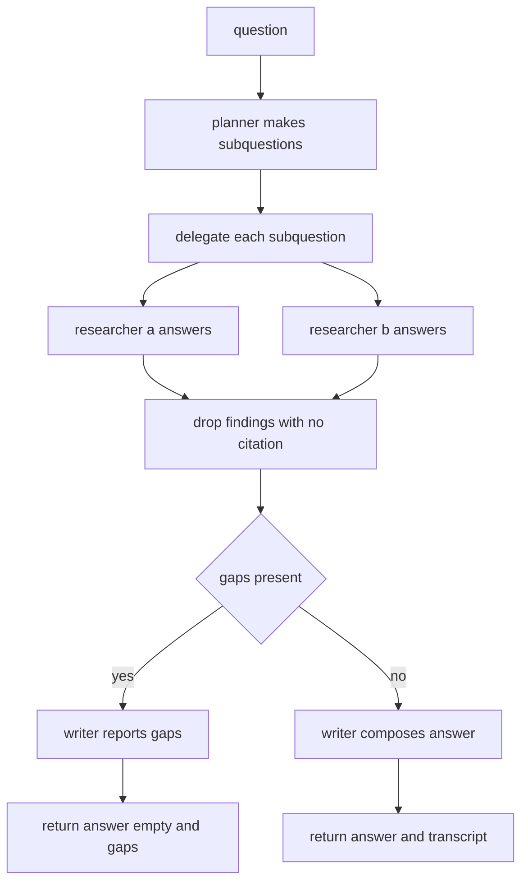

# Research Team

## Purpose

A `team` is several agents with an explicit shape: who leads, who reports to
whom, and what a handoff carries. This team answers a technical question about
a codebase. A `Planner` breaks the question into independent sub-questions, two
`Researcher` agents each answer the sub-questions they were given, and a
`Writer` merges the findings into a single answer with citations.

Handoffs are values, not side channels. Every handoff is a `Handoff` record
with a sender, a receiver, a kind and a payload, which makes the whole run
auditable: you can print the transcript and replay it. The team is
deterministic — researchers answer from an injected corpus, never the network —
so the same question always produces the same answer.

## Inputs

| Name | Type | Required | Description |
|------|------|----------|-------------|
| question | string | Yes | The user question the team must answer |
| corpus | object | Yes | Mapping of topic id to the passages a researcher may cite |
| max_subquestions | number | No | Planner fan-out limit, defaults to 4 |
| min_citations | number | No | Writer refuses to answer below this many citations |

## Outputs

| Name | Type | Description |
|------|------|-------------|
| subquestions | list | The plan the planner produced |
| findings | list | One finding per answered sub-question |
| answer | string | The composed answer, empty when evidence was insufficient |
| transcript | list | Every handoff in order |
| gaps | list | Sub-questions no researcher could support |

## Capabilities

### plan

Split a question into at most `max_subquestions` independent sub-questions.

### delegate

Route each sub-question to a researcher and collect the resulting findings.

### compose

Merge findings into a single cited answer, or report the evidence gaps.

## Rules

- Exactly one Planner and one Writer may exist; any number of Researchers may
  join the team.
- A researcher may only answer sub-questions assigned to it by a handoff.
- A finding without at least one citation is dropped and recorded as a gap.
- The writer must not invent facts; every sentence must trace to a finding.
- When the number of surviving citations is below `min_citations` the answer is
  empty and the gaps are returned instead.
- Handoffs are append-only; the transcript is never rewritten.
- The team runs to completion in a single pass with no retries.

## Workflow



## Python

```python
from dataclasses import dataclass, field
from typing import Any, Dict, List, Optional

MIN_PASSAGE_LENGTH = 40


@dataclass(frozen=True)
class Handoff:
    sender: str
    receiver: str
    kind: str
    payload: Dict[str, Any] = field(default_factory=dict)


@dataclass(frozen=True)
class SubQuestion:
    id: str
    text: str
    topic: str


@dataclass(frozen=True)
class Finding:
    subquestion_id: str
    text: str
    citations: List[str]


class Planner:
    """Turns one question into independent, topic-tagged sub-questions."""

    role = "planner"

    def __init__(self, max_subquestions: int = 4) -> None:
        if max_subquestions < 1:
            raise ValueError("max_subquestions must be at least 1")
        self.max_subquestions = max_subquestions

    def plan(self, question: str) -> List[SubQuestion]:
        cleaned = question.strip()
        if not cleaned:
            return []
        words = [word.strip(".,?;:").lower() for word in cleaned.split()]
        words = [word for word in words if len(word) > 3]
        seen: List[str] = []
        for word in words:
            if word not in seen:
                seen.append(word)
        chosen = seen[: self.max_subquestions]
        return [SubQuestion(id=f"sq{index + 1}", text=word, topic=word)
                for index, word in enumerate(chosen)]


class Researcher:
    """Answers sub-questions from an injected corpus, with citations."""

    role = "researcher"

    def __init__(self, name: str, corpus: Dict[str, str]) -> None:
        self.name = name
        self.corpus = corpus

    def research(self, subquestion: SubQuestion) -> Optional[Finding]:
        passage = self.corpus.get(subquestion.topic, "")
        if not passage or len(passage) < MIN_PASSAGE_LENGTH:
            return None
        return Finding(subquestion_id=subquestion.id, text=passage,
                       citations=[f"{self.corpus_name()}:{subquestion.topic}"])

    def corpus_name(self) -> str:
        return "corpus/" + self.name


class Writer:
    """Composes one answer from findings, or reports the gaps."""

    role = "writer"

    def __init__(self, min_citations: int = 1) -> None:
        if min_citations < 1:
            raise ValueError("min_citations must be at least 1")
        self.min_citations = min_citations

    def compose(self, question: str, findings: List[Finding], gaps: List[str]) -> Dict[str, Any]:
        if gaps or len(findings) < self.min_citations:
            return {"answer": "", "gaps": gaps or ["insufficient_evidence"]}
        lines = [f"Answering: {question}"]
        for finding in findings:
            lines.append(f"- {finding.text} [{', '.join(finding.citations)}]")
        return {"answer": "\n".join(lines), "gaps": []}


class ResearchTeam:
    """A planner, one or more researchers and a writer, joined by handoffs."""

    name = "Research Team"

    def __init__(self, corpus: Dict[str, str], max_subquestions: int = 4,
                 min_citations: int = 1) -> None:
        self.transcript: List[Handoff] = []
        self.planner = Planner(max_subquestions)
        self.researchers = [Researcher("alpha", corpus), Researcher("beta", corpus)]
        self.writer = Writer(min_citations)

    def _record(self, handoff: Handoff) -> None:
        self.transcript.append(handoff)

    def plan(self, question: str) -> List[SubQuestion]:
        subquestions = self.planner.plan(question)
        self._record(Handoff("planner", "researchers", "assign",
                             {"count": len(subquestions)}))
        return subquestions

    def delegate(self, subquestions: List[SubQuestion]) -> List[Finding]:
        findings: List[Finding] = []
        for index, subquestion in enumerate(subquestions):
            researcher = self.researchers[index % len(self.researchers)]
            self._record(Handoff("planner", researcher.name, "research",
                                 {"subquestion_id": subquestion.id}))
            finding = researcher.research(subquestion)
            if finding is None:
                continue
            findings.append(finding)
            self._record(Handoff(researcher.name, "writer", "finding",
                                 {"subquestion_id": finding.subquestion_id,
                                  "citations": finding.citations}))
        return findings

    def run(self, question: str) -> Dict[str, Any]:
        subquestions = self.plan(question)
        findings = self.delegate(subquestions)
        answered = {finding.subquestion_id for finding in findings}
        gaps = [sq.id for sq in subquestions if sq.id not in answered]
        self._record(Handoff("researchers", "writer", "gaps", {"gaps": gaps}))
        composed = self.writer.compose(question, findings, gaps)
        self._record(Handoff("writer", "caller", "answer", {"gaps": gaps}))
        return {
            "subquestions": [sq.id for sq in subquestions],
            "findings": findings,
            "answer": composed["answer"],
            "gaps": gaps,
            "transcript": list(self.transcript),
        }


def run(question: str, corpus: Dict[str, str], **options: Any) -> Dict[str, Any]:
    return ResearchTeam(corpus, **options).run(question)
```

## Tests

### Input

```yaml
question: "How does the parser build the AST and validate the frontmatter?"
corpus:
  parser: "The parser tokenizes markdown, then folds each block into an AST node keyed by heading level."
  frontmatter: "Frontmatter is parsed first; every field becomes a typed attribute of the module node."
```

### Expected

```yaml
answer_starts_with: "Answering:"
gaps: []
```

```python
CORPUS = {
    "parser": "The parser tokenizes markdown, then folds each block into an AST node keyed by heading level.",
    "frontmatter": "Frontmatter is parsed first; every field becomes a typed attribute of the module node.",
    "ast": "The AST is the machine representation and is what the runtime consumes instead of markdown.",
}


def test_planner_splits_the_question():
    subquestions = Planner(max_subquestions=2).plan("How does the parser build the AST?")
    assert [sq.id for sq in subquestions] == ["sq1", "sq2"]
    assert all(len(sq.topic) > 3 for sq in subquestions)


def test_planner_rejects_empty_question():
    assert Planner().plan("   ") == []


def test_researcher_requires_a_real_passage():
    researcher = Researcher("alpha", CORPUS)
    assert researcher.research(SubQuestion("sq1", "parser", "parser")) is not None
    assert researcher.research(SubQuestion("sq2", "unknown", "unknown")) is None


def test_team_composes_a_cited_answer():
    result = run("parser frontmatter ast validator", CORPUS, max_subquestions=3)
    assert result["answer"].startswith("Answering:")
    assert "[" in result["answer"]
    assert result["gaps"] == []


def test_team_records_gaps_instead_of_inventing():
    result = run("What about the tokenizer and the lexer?", {})
    assert result["answer"] == ""
    assert result["gaps"]
    assert result["gaps"] == result["subquestions"]


def test_transcript_is_append_only_and_ordered():
    team = ResearchTeam(CORPUS, max_subquestions=2)
    result = team.run("How does the parser build the AST?")
    assert result["transcript"] == team.transcript
    senders = [h.sender for h in result["transcript"]]
    assert senders[0] == "planner"
    assert senders[-1] == "writer"
    assert result["transcript"][-1].kind == "answer"


def test_every_finding_has_a_citation():
    result = run("How does the parser build the AST?", CORPUS, max_subquestions=4)
    for finding in result["findings"]:
        assert finding.citations
        assert finding.text in CORPUS.values()
```

## Examples

```python
CORPUS = {
    "parser": "The parser tokenizes markdown, then folds each block into an AST node keyed by heading level.",
    "ast": "The AST is the machine representation and is what the runtime consumes instead of markdown.",
    "validator": "Validation walks the AST and reports every violation it finds rather than stopping at the first.",
    "frontmatter": "Frontmatter is parsed first; every field becomes a typed attribute of the module node.",
}

team = ResearchTeam(CORPUS, max_subquestions=4)
result = team.run("How does the parser build and validate the AST frontmatter?")

print(result["answer"])
print("gaps:", result["gaps"])
print("handoffs:")
for handoff in result["transcript"]:
    print(" ", handoff.sender, "->", handoff.receiver, handoff.kind)
```

## References

- [MAM Specification](../../plan-doc/full-mam.md)
- [Team templates](../../templates/team/)
- [Session Memory](../memory/memory.mam)
