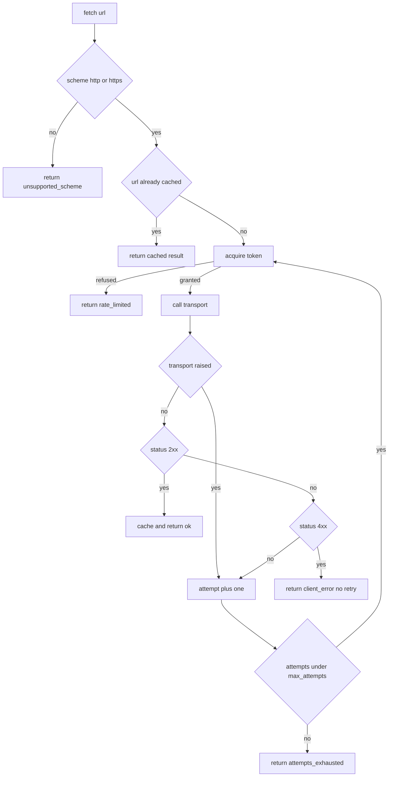

# Rate-Limited HTTP Fetcher

## Purpose

A `tool` is something an agent calls with arguments and gets a typed result
back. This one is the least glamorous tool that still matters in production: a
URL fetcher wrapped in a token bucket and an exponential backoff. It is
**side-effecting** in the sense that it makes outbound requests, but it is
**idempotent** from the caller's point of view — fetching the same URL twice
returns the same body and does not double-charge the bucket for a retry of the
same request.

The transport is injected. That is what makes the tool testable: the example
passes a fake transport and never touches the network, while a real deployment
passes a `urllib` backed transport.

## Inputs

| Name | Type | Required | Description |
|------|------|----------|-------------|
| url | string | Yes | Absolute http or https URL to fetch |
| transport | object | Yes | Callable taking a URL and returning a `Response` |
| capacity | number | No | Token bucket capacity, defaults to 3 |
| refill_per_second | number | No | Steady-state refill rate, defaults to 1.0 |
| max_attempts | number | No | Total attempts including the first, defaults to 3 |

## Outputs

| Name | Type | Description |
|------|------|-------------|
| ok | boolean | True when the fetch returned a 2xx response |
| status | number | HTTP status code, 0 when the transport raised |
| body | string | Response body, empty on failure |
| attempts | number | How many attempts were actually made |
| reason | string | Why the fetch failed, empty on success |

## Capabilities

### fetch

Fetch a URL subject to the rate limit and retry policy, returning a normalized
result dictionary.

### acquire_token

Consume one token from the bucket, blocking logically by reporting refusal when
the bucket is empty.

## Rules

- The tool is idempotent per URL: repeating a call with the same arguments
  returns an equal result and does not perform new work once cached.
- The tool is side-effecting: it performs outbound requests and mutates the
  token bucket, so it must never be retried by the caller on a 5xx.
- Only `http` and `https` schemes are accepted; other schemes return
  `reason: unsupported_scheme` without calling the transport.
- Retries use exponential backoff of 0.5, 1.0, 2.0 seconds capped at 3 attempts.
- A 4xx response is never retried because it will not become a 2xx.
- The tool never raises; every failure mode is reported in the result.

## Workflow



## Python

```python
from dataclasses import dataclass
from typing import Any, Callable, Dict, List, Optional

ALLOWED_SCHEMES = ("http://", "https://")
RETRYABLE_STATUSES = (500, 502, 503, 504)
CLIENT_ERROR_STATUSES = (400, 401, 403, 404, 410, 422)
BACKOFF_BASE_SECONDS = 0.5
MAX_BACKOFF_SECONDS = 2.0


@dataclass(frozen=True)
class Response:
    status: int
    body: str


class TokenBucket:
    def __init__(self, capacity: int = 3, refill_per_second: float = 1.0) -> None:
        if capacity < 1:
            raise ValueError("capacity must be at least 1")
        if refill_per_second <= 0:
            raise ValueError("refill_per_second must be positive")
        self.capacity = capacity
        self.refill_per_second = refill_per_second
        self.tokens = float(capacity)
        self.elapsed = 0.0

    def acquire(self) -> bool:
        if self.tokens >= 1.0:
            self.tokens -= 1.0
            return True
        return False

    def advance(self, seconds: float) -> None:
        self.elapsed += seconds
        self.tokens = min(float(self.capacity),
                          self.tokens + self.refill_per_second * seconds)


def backoff_delay(attempt: int) -> float:
    return min(BACKOFF_BASE_SECONDS * (2 ** (attempt - 1)), MAX_BACKOFF_SECONDS)


class RateLimitedFetcher:
    """Fetch URLs through a token bucket and a bounded exponential backoff."""

    def __init__(self, transport: Callable[[str], Response],
                 capacity: int = 3, refill_per_second: float = 1.0,
                 max_attempts: int = 3) -> None:
        if not callable(transport):
            raise TypeError("transport must be callable")
        if max_attempts < 1:
            raise ValueError("max_attempts must be at least 1")
        self.transport = transport
        self.bucket = TokenBucket(capacity, refill_per_second)
        self.max_attempts = max_attempts
        self.cache: Dict[str, Dict[str, Any]] = {}

    def acquire_token(self) -> bool:
        return self.bucket.acquire()

    def _failure(self, url: str, status: int, reason: str, attempts: int) -> Dict[str, Any]:
        return {"url": url, "ok": False, "status": status, "body": "",
                "attempts": attempts, "reason": reason}

    def fetch(self, url: str) -> Dict[str, Any]:
        if not isinstance(url, str) or not url.startswith(ALLOWED_SCHEMES):
            return self._failure(str(url), 0, "unsupported_scheme", 0)
        if url in self.cache:
            return dict(self.cache[url])

        last: Optional[Dict[str, Any]] = None
        for attempt in range(1, self.max_attempts + 1):
            if not self.acquire_token():
                result = self._failure(url, 429, "rate_limited", attempt - 1)
                return last or result
            try:
                response = self.transport(url)
            except Exception as exc:  # transport failures are retryable
                last = self._failure(url, 0, f"transport_error:{type(exc).__name__}", attempt)
                if attempt == self.max_attempts:
                    return last
                self.bucket.advance(backoff_delay(attempt))
                continue
            if 200 <= response.status < 300:
                result = {"url": url, "ok": True, "status": response.status,
                          "body": response.body, "attempts": attempt, "reason": ""}
                self.cache[url] = dict(result)
                return result
            if response.status in CLIENT_ERROR_STATUSES:
                return self._failure(url, response.status, "client_error", attempt)
            last = self._failure(url, response.status, "server_error", attempt)
            if attempt == self.max_attempts:
                return last
            self.bucket.advance(backoff_delay(attempt))
        return last or self._failure(url, 0, "attempts_exhausted", self.max_attempts)


def fetch(url: str, transport: Callable[[str], Response], **options: Any) -> Dict[str, Any]:
    return RateLimitedFetcher(transport, **options).fetch(url)
```

## Tests

### Input

```yaml
url: "https://api.example.com/status"
transport: returns 200 with body "ok"
```

### Expected

```yaml
ok: true
status: 200
attempts: 1
```

```python
class RecordingTransport:
    def __init__(self, responses):
        self.responses = list(responses)
        self.calls = []

    def __call__(self, url):
        self.calls.append(url)
        item = self.responses.pop(0)
        if isinstance(item, Exception):
            raise item
        return item


def test_fetches_successfully():
    transport = RecordingTransport([Response(200, "ok")])
    result = fetch("https://api.example.com/status", transport)
    assert result["ok"] is True
    assert result["status"] == 200
    assert result["body"] == "ok"
    assert result["attempts"] == 1
    assert transport.calls == ["https://api.example.com/status"]


def test_rejects_unsupported_scheme():
    transport = RecordingTransport([])
    result = fetch("file:///etc/passwd", transport)
    assert result["reason"] == "unsupported_scheme"
    assert transport.calls == []


def test_is_idempotent_via_cache():
    transport = RecordingTransport([Response(200, "ok")])
    tool = RateLimitedFetcher(transport)
    first = tool.fetch("https://api.example.com/status")
    second = tool.fetch("https://api.example.com/status")
    assert first == second
    assert len(transport.calls) == 1


def test_client_error_is_not_retried():
    transport = RecordingTransport([Response(404, "missing")])
    result = fetch("https://api.example.com/nope", transport, max_attempts=3)
    assert result["reason"] == "client_error"
    assert result["attempts"] == 1
    assert len(transport.calls) == 1


def test_server_error_is_retried_then_exhausted():
    transport = RecordingTransport([Response(503, "down"), Response(503, "down")])
    result = fetch("https://api.example.com/flaky", transport, max_attempts=2)
    assert result["ok"] is False
    assert result["reason"] == "server_error"
    assert result["attempts"] == 2
    assert len(transport.calls) == 2


def test_rate_limit_is_reported():
    transport = RecordingTransport([Response(200, "a"), Response(200, "b"), Response(200, "c")])
    tool = RateLimitedFetcher(transport, capacity=1, max_attempts=1)
    assert tool.fetch("https://api.example.com/a")["ok"] is True
    denied = tool.fetch("https://api.example.com/b")
    assert denied["ok"] is False
    assert denied["reason"] == "rate_limited"
    assert len(transport.calls) == 1


def test_transport_exception_is_wrapped():
    transport = RecordingTransport([TimeoutError("slow"), Response(200, "ok")])
    result = fetch("https://api.example.com/slow", transport, max_attempts=2)
    assert result["ok"] is True
    assert result["attempts"] == 2


def test_backoff_is_bounded():
    assert backoff_delay(1) == 0.5
    assert backoff_delay(2) == 1.0
    assert backoff_delay(9) == 2.0
```

## Examples

```python
def fake_transport(url):
    if "missing" in url:
        return Response(404, "not found")
    if "flaky" in url:
        return Response(503, "unavailable")
    return Response(200, "hello from " + url)


tool = RateLimitedFetcher(fake_transport, capacity=5, max_attempts=2)

print(tool.fetch("https://api.example.com/health"))
print(tool.fetch("https://api.example.com/health"))
print(tool.fetch("https://api.example.com/missing"))
print(tool.fetch("https://api.example.com/flaky"))
print(tool.fetch("ftp://api.example.com/thing"))
```

## References

- [MAM Specification](../../plan-doc/full-mam.md)
- [Tool templates](../../templates/tool/)
- [Support Triage Agent](../agent/agent.mam)
