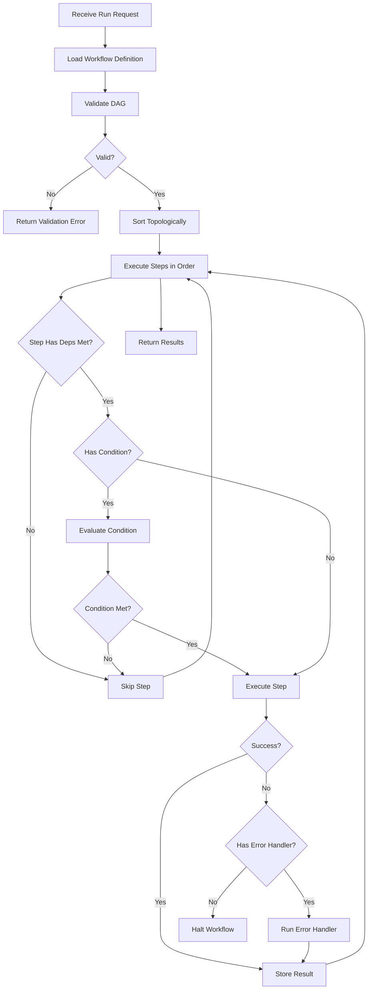

---
# MAM Metadata
id: data-workflow
name: Workflow Module
version: 1.0.0
type: workflow

author: MAM Team
description: >
  Generic workflow engine with DAG-based step execution, conditions,
  and error handling.

license: MIT

runtime:
  language: python
  version: ">=3.12"

tags:
  - workflow
  - orchestration
  - pipeline
  - automation

dependencies:
  - name: mam-runtime
    version: ">=1.0.0"

capabilities:
  - define
  - validate
  - run
  - register_handler

permissions:
  filesystem:
    - read
  memory:
    - local
---

# Workflow Module

## Purpose

Orchestrates multi-step workflows as directed acyclic graphs (DAGs). Each step is an atomic operation with optional conditions, retries, and error handlers. The engine executes steps in dependency order with support for parallel execution and branching.

## Inputs

| Name | Type | Required | Description |
|------|------|----------|-------------|
| action | string | Yes | "run", "validate", "status" |
| workflow_id | string | No | Workflow to execute (required for run) |
| input_data | dict | No | Input payload for the workflow |
| step_overrides | dict | No | Override specific step parameters |

## Outputs

| Name | Type | Description |
|------|------|-------------|
| status | string | "completed", "failed", "running", or "validated" |
| results | dict | Step-by-step results |
| output | any | Final workflow output |
| errors | list | List of errors encountered |

## Capabilities

### define

Register a workflow as an ordered set of steps.

### validate

Validate the workflow DAG, detecting missing and circular dependencies.

### run

Execute a workflow in dependency order and return results.

### register_handler

Register a callable handler for use by workflow steps.

## Rules

- Workflow definitions must form a valid DAG (no cycles)
- Steps with unmet dependencies are skipped
- Maximum 100 steps per workflow
- Step retries are capped at 5
- Failed steps with no error handler halt the workflow
- Each step must have a unique name within its workflow

## Workflow



## Python

```python
from dataclasses import dataclass, field
from typing import Any, Callable, Dict, List, Optional
from collections import defaultdict
import time

@dataclass
class Step:
    name: str
    handler: str  # function name or lambda string
    depends_on: List[str] = field(default_factory=list)
    condition: Optional[str] = None
    error_handler: Optional[str] = None
    retries: int = 0
    params: Dict[str, Any] = field(default_factory=dict)

@dataclass
class StepResult:
    name: str
    status: str  # "completed", "failed", "skipped"
    output: Any = None
    error: Optional[str] = None
    duration_ms: float = 0

class WorkflowEngine:
    MAX_STEPS = 100
    MAX_RETRIES = 5

    def __init__(self):
        self._workflows: Dict[str, List[Step]] = {}
        self._handlers: Dict[str, Callable] = {}
        self._register_builtins()

    def _register_builtins(self):
        self._handlers["passthrough"] = lambda **kw: kw.get("input")
        self._handlers["upper"] = lambda **kw: str(kw.get("input", "")).upper()
        self._handlers["length"] = lambda **kw: len(str(kw.get("input", "")))
        self._handlers["echo"] = lambda **kw: kw

    def register_handler(self, name: str, fn: Callable):
        self._handlers[name] = fn

    def define(self, workflow_id: str, steps: List[Step]):
        if len(steps) > self.MAX_STEPS:
            raise ValueError(f"Workflow exceeds max {self.MAX_STEPS} steps")
        self._workflows[workflow_id] = steps

    def validate(self, workflow_id: str) -> List[str]:
        """Validate workflow DAG. Returns list of errors (empty = valid)."""
        steps = self._workflows.get(workflow_id)
        if not steps:
            return [f"Workflow '{workflow_id}' not found"]

        errors = []
        step_names = {s.name for s in steps}

        for step in steps:
            for dep in step.depends_on:
                if dep not in step_names:
                    errors.append(f"Step '{step.name}' depends on unknown step '{dep}'")

        if not errors:
            visited = set()
            path = set()

            def dfs(name):
                if name in path:
                    return True
                if name in visited:
                    return False
                visited.add(name)
                path.add(name)
                step = next((s for s in steps if s.name == name), None)
                if step:
                    for dep in step.depends_on:
                        if dfs(dep):
                            errors.append(f"Circular dependency at '{name}'")
                            return True
                path.discard(name)
                return False

            for s in steps:
                dfs(s.name)

        return errors

    def run(self, workflow_id: str, input_data: Dict = None) -> Dict:
        """Execute a workflow and return results."""
        errors = self.validate(workflow_id)
        if errors:
            return {"status": "failed", "errors": errors, "results": {}, "output": None}

        steps = self._workflows[workflow_id]
        results: Dict[str, StepResult] = {}
        completed = set()
        input_data = input_data or {}

        step_map = {s.name: s for s in steps}

        def deps_met(step):
            return all(d in completed for d in step.depends_on)

        remaining = [s.name for s in steps]

        while remaining:
            executable = [name for name in remaining if deps_met(step_map[name])]

            if not executable:
                break

            for name in executable:
                remaining.remove(name)
                step = step_map[name]
                start = time.time()

                if step.condition:
                    try:
                        cond_fn = self._handlers.get(step.condition)
                        if cond_fn and not cond_fn(**input_data):
                            results[name] = StepResult(name=name, status="skipped")
                            completed.add(name)
                            continue
                    except Exception:
                        pass

                try:
                    handler = self._handlers.get(step.handler, self._handlers["passthrough"])
                    step_input = {**input_data, **step.params}
                    for dep in step.depends_on:
                        if dep in results and results[dep].status == "completed":
                            step_input[dep] = results[dep].output

                    output = handler(**step_input)
                    duration = (time.time() - start) * 1000
                    results[name] = StepResult(name=name, status="completed",
                                               output=output, duration_ms=round(duration, 2))
                    completed.add(name)

                except Exception as e:
                    if step.error_handler and step.error_handler in self._handlers:
                        try:
                            err_output = self._handlers[step.error_handler](error=str(e))
                            results[name] = StepResult(name=name, status="completed",
                                                       output=err_output)
                            completed.add(name)
                        except Exception:
                            results[name] = StepResult(name=name, status="failed",
                                                       error=str(e))
                            return {"status": "failed", "errors": [str(e)],
                                    "results": {k: v.__dict__ for k, v in results.items()},
                                    "output": None}
                    else:
                        results[name] = StepResult(name=name, status="failed", error=str(e))
                        return {"status": "failed", "errors": [str(e)],
                                "results": {k: v.__dict__ for k, v in results.items()},
                                "output": None}

        last = results[steps[-1].name] if steps else None
        final_output = last.output if last and last.status == "completed" else None

        return {
            "status": "completed",
            "results": {k: v.__dict__ for k, v in results.items()},
            "output": final_output,
            "errors": [],
        }
```

## Tests

### Test: Simple Run

Input:

```yaml
action: run
workflow_id: simple
```

Expected:

```yaml
status: completed
```

```python
def test_validate_missing_workflow():
    engine = WorkflowEngine()
    errors = engine.validate("nonexistent")
    assert len(errors) == 1

def test_validate_dag():
    engine = WorkflowEngine()
    engine.define("bad", [
        Step(name="a", handler="passthrough", depends_on=["b"]),
        Step(name="b", handler="passthrough", depends_on=["a"]),
    ])
    errors = engine.validate("bad")
    assert len(errors) > 0

def test_simple_run():
    engine = WorkflowEngine()
    engine.define("simple", [
        Step(name="s1", handler="upper", params={"input": "test"}),
    ])
    result = engine.run("simple")
    assert result["status"] == "completed"
    assert result["output"] == "TEST"

def test_dependency_order():
    engine = WorkflowEngine()
    engine.define("chain", [
        Step(name="s1", handler="upper", params={"input": "hello"}),
        Step(name="s2", handler="length", depends_on=["s1"]),
    ])
    result = engine.run("chain")
    assert result["status"] == "completed"
    assert result["output"] == 5

def test_error_halts():
    engine = WorkflowEngine()
    engine.register_handler("fail", lambda **kw: 1 / 0)
    engine.define("err", [
        Step(name="s1", handler="fail"),
    ])
    result = engine.run("err")
    assert result["status"] == "failed"
```

## Examples

### Basic Usage

```python
engine = WorkflowEngine()

engine.define("etl", [
    Step(name="extract", handler="passthrough", params={"input": "raw-data"}),
    Step(name="transform", handler="upper", depends_on=["extract"]),
    Step(name="load", handler="length", depends_on=["transform"]),
])

result = engine.run("etl", {"input": "hello world"})
print(result["status"])   # completed
print(result["output"])   # 11 (length of "HELLO WORLD")
```

### Expected Flow

```text
Define → Validate → Topological Sort → Execute Steps → Results
```

## References

- MAM Workflow Examples
- DAG execution and topological ordering
