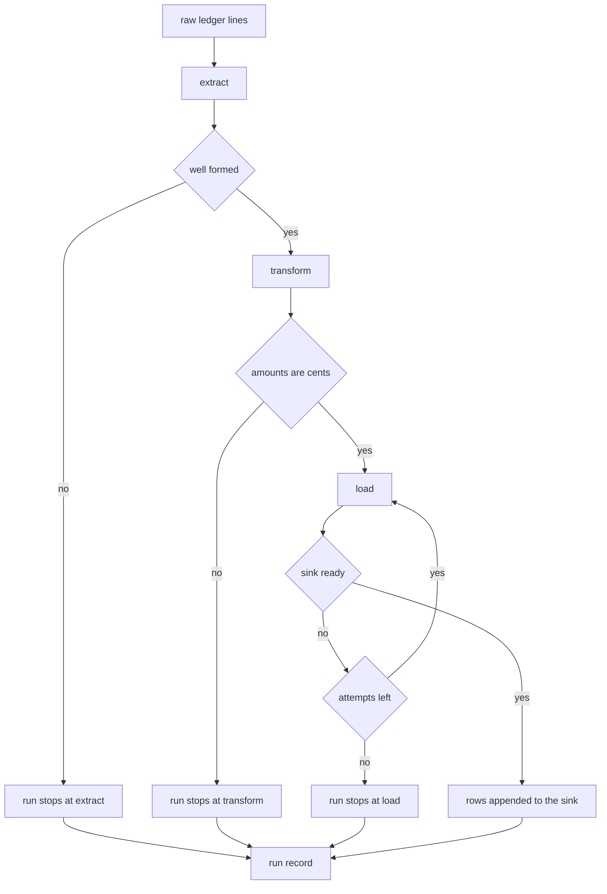

# Ledger Extract Transform Load

## Purpose

A workflow is a process with an order and a failure policy. This one moves a
day of ledger lines from a raw export into a queryable sink. Extract parses,
transform normalises and de-duplicates, and load writes. Only the load step
talks to a remote sink, so only the load step can fail for reasons outside our
control, and only the load step therefore carries a retry policy.

Retrying a load is only safe because the write is all-or-nothing per batch: a
failed attempt appends nothing, so the retry cannot duplicate a row.

## Inputs

| Name | Type | Required | Description |
|------|------|----------|-------------|
| raw | list | Yes | Raw ledger lines as they came out of the export |
| batch_id | string | Yes | Identity of the batch being loaded, used for retry safety |
| sink | object | Yes | Destination that records the rows it accepted |
| retries | integer | No | Attempts allowed for the load step, defaults to 3 |

## Outputs

| Name | Type | Description |
|------|------|-------------|
| records | list | Parsed ledger records, one dict per line |
| rows | list | Normalised rows, de-duplicated by `entry_id` |
| written | integer | Number of rows the sink accepted |
| run | object | Per-step record of `name`, `attempts`, `ok` and `error` |

## Capabilities

### extract

Parse raw ledger lines into records, refusing anything malformed.

### transform

Normalise amounts, uppercase the currency, and drop duplicate entry ids.

### load

Write the batch to the sink, retrying on a sink that is not yet ready.

### run_pipeline

Run the three steps in order, applying the retry policy and stopping at the
first step that cannot be completed.

## Workflow Definition

| Step | Reads | Writes | Retries | Refuses when |
|------|-------|--------|---------|--------------|
| `extract` | `raw` | `records` | 0 | a line is not three comma-separated fields |
| `transform` | `records` | `rows` | 0 | an amount is not an integer number of cents |
| `load` | `rows` | `sink` | 3 | the sink reports it is not ready |

- Steps run strictly in order. There is no branching and no parallelism in this
  version, because a pipeline whose order can change is a pipeline nobody can
  reason about during an incident.
- A step reads only what the previous step wrote, plus the run context.
- The first step that cannot be completed ends the run. Later steps never run,
  and the run reports the steps that did complete.
- A refused step is a permanent refusal; only the load step has a retry
  policy, and only for a transient sink error.

### Step: extract

Turns `id,currency,amount` lines into records. It is deliberately literal: it
does not validate the amount, because that is the transform's job, and it does
not reorder anything.

### Step: transform

Turns amounts into integer cents, normalises currency codes to uppercase, and
keeps only the first record for any repeated `entry_id`, because the export
re-sends the last hour of entries in every batch.

### Step: load

Hands the batch to the sink. The first attempt against a sink that reports
itself as not ready fails, the second succeeds, and a third is never used. The
write appends nothing on failure, so a retry is safe.

## Rules

- A retry never changes the payload: the same `rows` are handed to the sink on
  every attempt.
- The load step is the only step allowed to run more than once.
- A refused `extract` or `transform` is never retried; retrying bad data is how
  a pipeline becomes a denial-of-service tool.
- The sink accumulates rows across batches and never removes them.
- The run record is ordered by step and is complete even for a failed run.
- Amounts are integer cents; the pipeline never converts currency.

## Workflow



## Python

```python
from typing import Any, Dict, List, Optional


class StepRefused(Exception):
    """A permanent refusal: the payload is wrong, retrying cannot help."""

    def __init__(self, step: str, reason: str) -> None:
        super().__init__(f"{step}: {reason}")
        self.step = step
        self.reason = reason


class WorkflowFailed(Exception):
    """A step could not be completed, even after its retry policy."""

    def __init__(self, step: str, reason: str, attempts: int) -> None:
        super().__init__(f"{step} failed after {attempts} attempt(s): {reason}")
        self.step = step
        self.reason = reason
        self.attempts = attempts


class SinkUnavailable(Exception):
    """A transient sink error: the same payload may succeed on a retry."""


class Sink:
    def __init__(self, flaky: Optional[List[str]] = None) -> None:
        self.flaky = set(flaky or [])
        self.attempts: Dict[str, int] = {}
        self.rows: List[Dict[str, Any]] = []

    def write(self, batch_id: str, rows: List[Dict[str, Any]]) -> int:
        attempt = self.attempts.get(batch_id, 0) + 1
        self.attempts[batch_id] = attempt
        if batch_id in self.flaky and attempt == 1:
            raise SinkUnavailable(f"sink for {batch_id} is not ready")
        self.rows.extend(rows)
        return len(rows)


def extract(context: Dict[str, Any]) -> List[Dict[str, Any]]:
    """Parse `id,currency,amount` lines into records."""
    records: List[Dict[str, Any]] = []
    for number, line in enumerate(context.get("raw", []), start=1):
        parts = str(line).split(",")
        if len(parts) != 3:
            raise StepRefused("extract", f"line {number} is not three comma-separated fields")
        entry_id, currency, amount = (part.strip() for part in parts)
        if not entry_id:
            raise StepRefused("extract", f"line {number} has no entry id")
        records.append({"entry_id": entry_id, "currency": currency, "amount": amount})
    if not records:
        raise StepRefused("extract", "the export contained no lines")
    return records


def transform(context: Dict[str, Any]) -> List[Dict[str, Any]]:
    """Normalise amounts and currency, keeping the first of each entry id."""
    rows: List[Dict[str, Any]] = []
    seen = set()
    for record in context.get("records", []):
        raw_amount = str(record["amount"])
        if not raw_amount.lstrip("-").isdigit():
            raise StepRefused("transform", f"amount {raw_amount!r} is not an integer number of cents")
        entry_id = record["entry_id"]
        if entry_id in seen:
            continue
        seen.add(entry_id)
        rows.append(
            {
                "entry_id": entry_id,
                "currency": record["currency"].upper(),
                "amount_cents": int(raw_amount),
            }
        )
    return rows


def load(context: Dict[str, Any]) -> int:
    """Write the batch, retrying a sink that reports itself as not ready."""
    sink: Sink = context["sink"]
    return sink.write(context["batch_id"], context.get("rows", []))


STEPS = [("extract", extract, "records"), ("transform", transform, "rows"), ("load", load, "written")]


def run_pipeline(
    raw: List[str],
    batch_id: str,
    sink: Sink,
    retries: int = 3,
) -> Dict[str, Any]:
    """Run extract, transform, and load, honouring the retry policy."""
    context: Dict[str, Any] = {"raw": list(raw), "batch_id": batch_id, "sink": sink}
    run: List[Dict[str, Any]] = []
    for name, step, key in STEPS:
        allowed = max(1, retries) if name == "load" else 1
        attempts = 0
        while True:
            attempts += 1
            try:
                context[key] = step(context)
            except StepRefused as exc:
                run.append({"step": name, "attempts": attempts, "ok": False, "error": exc.reason})
                return {"ok": False, "failed_at": name, "run": run, "written": 0}
            except SinkUnavailable as exc:
                if attempts >= allowed:
                    run.append({"step": name, "attempts": attempts, "ok": False, "error": str(exc)})
                    return {"ok": False, "failed_at": name, "run": run, "written": 0}
                continue
            run.append({"step": name, "attempts": attempts, "ok": True, "error": None})
            break
    return {
        "ok": True,
        "failed_at": None,
        "run": run,
        "written": context["written"],
        "rows": context["rows"],
    }
```

## Tests

### Input

```yaml
raw:
  - "E-1,eur,1250"
  - "E-2,USD, 900"
  - "E-1,eur,1250"
batch_id: 2026-03-01
```

### Expected

```yaml
ok: true
written: 2
attempts_load: 1
```

```python
def test_happy_path_loads_every_row():
    sink = Sink()
    result = run_pipeline(["E-1,eur,1250", "E-2,usd,900"], "B-1", sink)
    assert result["ok"] is True
    assert result["written"] == 2
    assert len(sink.rows) == 2
    assert [r["currency"] for r in result["rows"]] == ["EUR", "USD"]
    assert [r["amount_cents"] for r in result["rows"]] == [1250, 900]


def test_duplicate_entry_ids_are_dropped():
    sink = Sink()
    lines = ["E-1,eur,1250", "E-2,usd,900", "E-1,eur,1250"]
    result = run_pipeline(lines, "B-1", sink)
    assert [r["entry_id"] for r in result["rows"]] == ["E-1", "E-2"]
    assert result["written"] == 2


def test_load_retries_a_flaky_sink_once():
    sink = Sink(flaky=["B-7"])
    result = run_pipeline(["E-1,eur,1250"], "B-7", sink)
    assert result["ok"] is True
    load_step = result["run"][-1]
    assert load_step["step"] == "load"
    assert load_step["attempts"] == 2
    assert len(sink.rows) == 1


def test_retry_never_duplicates_rows():
    sink = Sink(flaky=["B-7"])
    run_pipeline(["E-1,eur,1250", "E-2,usd,10"], "B-7", sink)
    assert [r["entry_id"] for r in sink.rows] == ["E-1", "E-2"]
    assert sink.attempts["B-7"] == 2


def test_load_gives_up_after_the_retry_budget():
    class AlwaysDown(Sink):
        def write(self, batch_id, rows):
            self.attempts[batch_id] = self.attempts.get(batch_id, 0) + 1
            raise SinkUnavailable("sink is down")

    sink = AlwaysDown()
    result = run_pipeline(["E-1,eur,1250"], "B-9", sink, retries=2)
    assert result["ok"] is False
    assert result["failed_at"] == "load"
    assert result["run"][-1]["attempts"] == 2
    assert sink.rows == []


def test_extract_refusal_is_never_retried():
    sink = Sink()
    result = run_pipeline(["E-1,eur"], "B-2", sink)
    assert result["failed_at"] == "extract"
    assert result["run"] == [
        {"step": "extract", "attempts": 1, "ok": False,
         "error": "line 1 is not three comma-separated fields"}
    ]
    assert sink.rows == []


def test_transform_refusal_is_never_retried():
    result = run_pipeline(["E-1,eur,twelve"], "B-3", Sink())
    assert result["failed_at"] == "transform"
    assert [s["step"] for s in result["run"]] == ["extract", "transform"]
    assert result["run"][-1]["attempts"] == 1


def test_empty_export_is_refused():
    result = run_pipeline([], "B-4", Sink())
    assert result["failed_at"] == "extract"
    assert "no lines" in result["run"][0]["error"]


def test_step_order_is_fixed():
    result = run_pipeline(["E-1,eur,1"], "B-5", Sink())
    assert [s["step"] for s in result["run"]] == ["extract", "transform", "load"]


def test_later_steps_do_not_run_after_a_refusal():
    sink = Sink()
    result = run_pipeline(["E-1,eur,nope"], "B-6", sink)
    assert "load" not in [s["step"] for s in result["run"]]
    assert sink.attempts == {}
```

## Examples

```python
from typing import Any, Dict, List, Optional


class StepRefused(Exception):
    def __init__(self, step, reason):
        super().__init__(f"{step}: {reason}")
        self.step = step
        self.reason = reason


class SinkUnavailable(Exception):
    pass


class Sink:
    def __init__(self, flaky=None):
        self.flaky = set(flaky or [])
        self.attempts = {}
        self.rows = []

    def write(self, batch_id, rows):
        attempt = self.attempts.get(batch_id, 0) + 1
        self.attempts[batch_id] = attempt
        if batch_id in self.flaky and attempt == 1:
            raise SinkUnavailable(f"sink for {batch_id} is not ready")
        self.rows.extend(rows)
        return len(rows)


def extract(raw):
    records = []
    for number, line in enumerate(raw, start=1):
        parts = str(line).split(",")
        if len(parts) != 3:
            raise StepRefused("extract", f"line {number} is not three comma-separated fields")
        entry_id, currency, amount = (part.strip() for part in parts)
        records.append({"entry_id": entry_id, "currency": currency, "amount": amount})
    return records


def transform(records):
    rows, seen = [], set()
    for record in records:
        if record["entry_id"] in seen:
            continue
        seen.add(record["entry_id"])
        rows.append({"entry_id": record["entry_id"],
                     "currency": record["currency"].upper(),
                     "amount_cents": int(record["amount"])})
    return rows


def main():
    sink = Sink(flaky=["2026-03-01"])
    days = [
        ("2026-02-28", ["E-1,eur,1250", "E-2,usd,900", "E-1,eur,1250"], []),
        ("2026-03-01", ["E-3,gbp,2400", "E-4,EUR,-150"], []),
    ]
    for batch_id, lines, _ in days:
        try:
            records = extract(lines)
            rows = transform(records)
        except StepRefused as exc:
            print(batch_id, "refused at", exc.step, "-", exc.reason)
            continue
        for attempt in (1, 2):
            try:
                written = sink.write(batch_id, rows)
            except SinkUnavailable as exc:
                print(f"  attempt {attempt}: {exc}")
                continue
            print(batch_id, "loaded", written, "rows on attempt", attempt)
            break
    print("sink holds", len(sink.rows), "rows:", [r["entry_id"] for r in sink.rows])


main()
# 2026-02-28 loaded 2 rows on attempt 1
#   attempt 1: sink for 2026-03-01 is not ready
# 2026-03-01 loaded 2 rows on attempt 2
# sink holds 4 rows: ['E-1', 'E-2', 'E-3', 'E-4']
```

## References

- [MAM Specification](../../plan-doc/full-mam.md)
- [Workflow templates](../../templates/workflow/)
- [Runtime templates](../../templates/runtime/)
