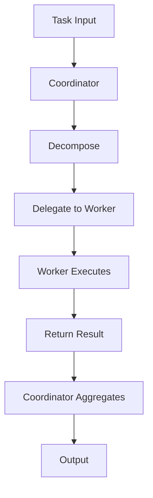

---
# MAM Metadata
id: template-agent
name: Agent Template
version: 2.0.0
type: system

author: MAM Team
description: >
  Starter template for building multi agent MAM systems with tools,
  shared memory, and a safety policy.

license: MIT

runtime:
  language: python
  version: ">=3.12"

tags:
  - template
  - agent
  - multi-agent
  - system

dependencies:
  - name: mam-runtime
    version: ">=1.0.0"

capabilities:
  - orchestrate
  - delegate
  - execute

permissions:
  filesystem:
    - read
  network:
    - internet
  python:
    - sandbox
---

# Agent Module Template

## Purpose

Template for creating a multi agent system with tools, shared memory, and safety policies. Copy this file and customize the agents, tools, and edges for your use case.

## Inputs

| Name | Type | Required | Description |
|------|------|----------|-------------|
| task | string | Yes | Task or goal for the system |
| context | object | No | Optional context shared with all agents |

## Outputs

| Name | Type | Description |
|------|------|-------------|
| result | object | Aggregated result produced by the system |
| agents | list | Names of the agents that participated |

## Capabilities

### orchestrate

Break an incoming task into ordered work items.

### delegate

Assign each work item to the appropriate agent.

### execute

Run delegated work and return structured results.

## System Definition

module MySystem

type:
    system

agents:
    - Coordinator
    - Worker

edges:
    Coordinator -> Worker

memory:
    shared: SharedMemory

policy:
    SafetyPolicy

## Agent: Coordinator

module Coordinator

type:
    agent

role:
    Orchestration

goal:
    Decompose incoming tasks and delegate them to the appropriate worker agent

memory:
    shared

tools:
    - PlannerTool

handoff:
    - Worker

## Agent: Worker

module Worker

type:
    agent

role:
    Execution

goal:
    Execute delegated tasks and return structured results

memory:
    shared

tools:
    - Python

## Tool: PlannerTool

module PlannerTool

type:
    tool

provider:
    planner

capabilities:
    - plan
    - schedule
    - prioritize

## Tool: Python

module PythonRuntime

type:
    tool

provider:
    python

permissions:
    python: sandbox

capabilities:
    - execute
    - analyze
    - transform

## Memory: SharedMemory

module SharedMemory

type:
    memory

format:
    vector

backend:
    sqlite

scope:
    workspace

ttl:
    24h

## Policy: SafetyPolicy

module SafetyPolicy

type:
    policy

allow:
    - python
    - planner

deny:
    - shell.rm
    - network.internal

permissions:
    filesystem: read
    network: internet
    python: sandbox

## Rules

- Agents must validate all inputs before processing
- Shared memory is read and write for all agents in the system
- SafetyPolicy deny rules are enforced at runtime
- Maximum 10 agents per system
- Agent roles must be unique within a system

## Workflow



## Python

```python
from typing import Any, Dict, List


class Coordinator:
    """Break a task into work items and delegate execution."""

    role = "Orchestration"
    goal = "Decompose incoming tasks and delegate them to the appropriate worker agent"

    def plan(self, task: str) -> List[str]:
        if not task:
            return []
        return [task]

    def delegate(self, work_items: List[str]) -> List[Dict[str, Any]]:
        worker = Worker()
        return [worker.run(item) for item in work_items]


class Worker:
    """Execute delegated work items and return structured results."""

    role = "Execution"
    goal = "Execute delegated tasks and return structured results"

    def run(self, work_item: str) -> Dict[str, Any]:
        return {"task": work_item, "status": "completed"}


def orchestrate(task: str) -> Dict[str, Any]:
    coordinator = Coordinator()
    results = coordinator.delegate(coordinator.plan(task))
    return {"result": results, "agents": ["Coordinator", "Worker"]}
```

## Tests

### Input

```yaml
task: summarize the repository
```

### Expected

```yaml
result: one completed entry
agents:
  - Coordinator
  - Worker
```

```python
def test_orchestrate():
    output = orchestrate("summarize the repository")
    assert output["agents"] == ["Coordinator", "Worker"]
    assert output["result"][0]["status"] == "completed"


def test_empty_task():
    output = orchestrate("")
    assert output["result"] == []
```

## Examples

### Basic Usage

```python
system = {
    "name": "MySystem",
    "agents": ["Coordinator", "Worker"],
    "memory": "SharedMemory",
    "policy": "SafetyPolicy",
}
output = orchestrate("summarize the repository")
print(output["agents"])  # ['Coordinator', 'Worker']
```

### Expected Flow

```text
Input -> Coordinator -> Worker -> Aggregate -> Output
```

## References

- [MAM Agent Specification](../../spec/sections/)
- [Multi Agent BugHunter Example](../examples/bug-hunter.mam.md)
