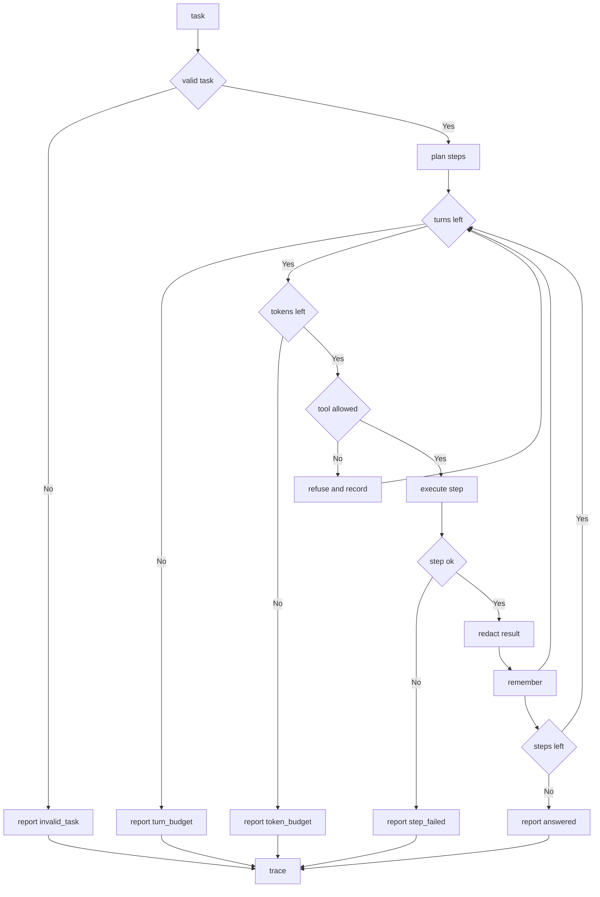

---
# MAM Metadata
id: template-agent-advanced
name: Agent Template (Advanced)
version: 2.0.0
type: agent

author: MAM Team
description: >
  A production agent with tool and token budgets, a pre and post action
  guardrail policy, refusal handling and per run observability.

license: MIT

runtime:
  language: python
  version: ">=3.12"

tags:
  - template
  - agent
  - advanced
  - guardrails
  - observability

dependencies:
  - name: mam-runtime
    version: ">=1.0.0"
  - name: mam-permissions
    version: ">=1.0.0"
  - name: telemetry
    version: "^2.0"

capabilities:
  - plan
  - execute
  - remember
  - guard
  - report

permissions:
  filesystem:
    - read
  memory:
    - local
  python:
    - sandbox
  network:
    - internet
---

# Agent Template (Advanced)

## Purpose

The basic agent, plus everything a long lived agent needs. It declares a tool
budget and a token budget, screens every step through a guard policy before and
after it runs, reports a stable stop reason and an error code for every run,
and emits a trace that says what happened without echoing secrets. Use it as
the base for any agent that other systems will call unattended.

## Inputs

| Name | Type | Required | Description |
|------|------|----------|-------------|
| task | string | Yes | Question or instruction for the agent |
| context | object | No | Notes the agent may read instead of starting empty |
| max_turns | number | No | Tool step cap. Defaults to 8 |
| max_tokens | number | No | Token budget for the whole run. Defaults to 4000 |
| policy | object | No | Extra deny rules layered onto the default policy |

## Outputs

| Name | Type | Description |
|------|------|-------------|
| answer | string | Result of the last successful step, empty on refusal or failure |
| turns | array | One record per executed step, including refusals |
| stop_reason | string | `answered`, `turn_budget`, `token_budget`, `refused`, `failed` or `no_task` |
| code | string | Stable machine readable reason, empty when the run succeeded |
| tokens_used | number | Tokens charged against the run budget |
| trace | object | Counts and timings for the run |

## Capabilities

### plan

Turn the task into the ordered list of tool steps the agent will attempt, in
allow-list order.

### execute

Run one step through the allow list, charging it against the run budgets.

### remember

Write a value into the agent's notes, subject to the redaction rules.

### guard

Screen the agent and each step against the policy before and after execution.

### report

Summarize the run as counts, a stop reason and a stable code.

## Agent Definition

```text
module ResearchAgent

type:
    agent

role:
    Research

goal:
    Answer a task from its own notes within a bounded budget

tools:
    - notes.read
    - notes.write
    - http.fetch

memory:
    local

budgets:
    max_turns: 8
    max_tokens: 4000

policy:
    GuardPolicy

telemetry:
    trace
```

## Budgets

| Budget | Default | Exhausted stop reason |
|--------|---------|-----------------------|
| `max_turns` | 8 | `turn_budget` |
| `max_tokens` | 4000 | `token_budget` |

A step that would push the run past `max_tokens` is not started. The agent
stops with `token_budget` and reports the answer so far, partial rather than
empty.

## Guardrails

| Stage | Check | On failure |
|-------|-------|------------|
| Pre-agent | Task is non-empty and is a string | `no_task` |
| Pre-step | Tool is on the allow list | `refused` / `tool_not_allowed` |
| Pre-step | Turn budget remains | `turn_budget` |
| Pre-step | Token budget remains | `token_budget` |
| Pre-step | Tool is not on the deny list | `refused` / `tool_denied` |
| Post-step | Step returned `ok` | `failed` |
| Post-step | Result contains no secret pattern | answer redacted, step kept |

## Error Codes

| Code | Meaning |
|------|---------|
| `tool_not_allowed` | The planner produced a step outside the allow list |
| `tool_denied` | The policy explicitly denies the tool |
| `step_failed` | The step ran and returned a failure |
| `redacted` | A step result matched a secret pattern and was scrubbed |
| `invalid_task` | The task was not a non-empty string |

## Permissions

| Scope | Access | Reason |
|-------|--------|--------|
| filesystem | read | Read local context files |
| memory | local | Read and write agent notes |
| python | sandbox | Execute steps in a sandbox |
| network | internet | Let the agent reach an approved upstream only |

## Rules

- Every step is screened before it runs and again after it returns.
- A denied or disallowed step is recorded and counted, never silently dropped.
- Budgets are enforced by the agent, not by the caller.
- A run that exhausts either budget still reports a partial answer.
- Redaction happens before a step result reaches the transcript or the trace.
- Errors are values: a run returns a code, it does not raise to the caller.
- Every failure is recorded in the trace so a silent stop is impossible.

## Workflow



## Python

```python
import time
from typing import Any, Dict, List, Set

MAX_TURNS = 8
MAX_TOKENS = 4000
TOKENS_PER_STEP = 250
SECRET_MARKERS = ("password", "api_key", "token")

ALLOWED_TOOLS = ("notes.read", "notes.write", "http.fetch")
DEFAULT_DENY = ("shell.rm", "http.internal")


class Agent:
    """A bounded agent: budgets, guardrails, stable codes and a trace."""

    role = "Research"
    goal = "Answer a task from its own notes within a bounded budget"

    def __init__(self, notes: Dict[str, Any] = None, max_turns: int = MAX_TURNS,
                 max_tokens: int = MAX_TOKENS, deny: List[str] = None) -> None:
        self.notes: Dict[str, Any] = dict(notes or {})
        self.max_turns = max_turns
        self.max_tokens = max_tokens
        self.deny: Set[str] = set(DEFAULT_DENY) | set(deny or [])
        self.tokens_used = 0
        self.refusals: List[str] = []

    def guard(self, step: str) -> Dict[str, Any]:
        """Screen a step before it runs."""
        if step not in ALLOWED_TOOLS:
            return {"allowed": False, "code": "tool_not_allowed"}
        if step in self.deny:
            return {"allowed": False, "code": "tool_denied"}
        return {"allowed": True, "code": ""}

    def _redact(self, value: Any) -> Any:
        if not isinstance(value, str):
            return value
        lowered = value.lower()
        if any(marker in lowered for marker in SECRET_MARKERS):
            return "[redacted]"
        return value

    def plan(self, task: str) -> List[str]:
        """Plan the ordered steps for a task."""
        if not task:
            return []
        return list(ALLOWED_TOOLS)

    def execute(self, task: str, step: str) -> Dict[str, Any]:
        """Run one screened step and charge it against the run budgets."""
        verdict = self.guard(step)
        if not verdict["allowed"]:
            self.refusals.append(step)
            return {"tool": step, "ok": False, "code": verdict["code"], "value": ""}

        self.tokens_used += TOKENS_PER_STEP
        if step == "notes.read":
            value = self.notes.get(task, "")
        elif step == "notes.write":
            value = self.remember(f"answer:{task}", f"answer for {task}")
        else:
            value = f"fetched {task}"

        value = self._redact(value)
        code = "redacted" if value == "[redacted]" else ""
        return {"tool": step, "ok": True, "code": code, "value": value}

    def remember(self, key: str, value: Any) -> Any:
        """Write a value into the agent's notes."""
        self.notes[key] = value
        return value

    def report(self, stop_reason: str, code: str, turns: List[Dict[str, Any]],
               started: float) -> Dict[str, Any]:
        """Summarize the run without echoing step values."""
        failed = [turn for turn in turns if not turn["ok"]]
        return {
            "stop_reason": stop_reason,
            "code": code,
            "tokens_used": self.tokens_used,
            "turns": turns,
            "trace": {
                "turns": len(turns),
                "refused": len(self.refusals),
                "failed": len(failed),
                "tools": sorted({turn["tool"] for turn in turns}),
                "duration_ms": round((time.perf_counter() - started) * 1000, 3),
            },
        }

    def run(self, task: str) -> Dict[str, Any]:
        """Run the agent once under budget, guardrail and trace enforcement."""
        started = time.perf_counter()
        if not isinstance(task, str) or not task:
            out = self.report("no_task", "invalid_task", [], started)
            out["answer"] = ""
            return out

        self.tokens_used = 0
        self.refusals = []
        steps = self.plan(task)
        turns: List[Dict[str, Any]] = []
        stop_reason, code = "answered", ""

        for step in steps:
            if len(turns) >= self.max_turns:
                stop_reason, code = "turn_budget", ""
                break
            if self.tokens_used + TOKENS_PER_STEP > self.max_tokens:
                stop_reason, code = "token_budget", ""
                break

            turn = self.execute(task, step)
            turns.append(turn)
            if not turn["ok"]:
                if turn["code"] in ("tool_not_allowed", "tool_denied"):
                    stop_reason, code = "refused", turn["code"]
                else:
                    stop_reason, code = "failed", turn["code"]
                break

        out = self.report(stop_reason, code, turns, started)
        out["answer"] = self.notes.get(f"answer:{task}", "")
        return out
```

## Tests

### Input

```yaml
task: what is mam
context:
  what is mam: a module format
max_turns: 8
max_tokens: 4000
```

### Expected

```yaml
answer: "answer for what is mam"
stop_reason: answered
code: ""
tokens_used: 750
```

```python
def test_successful_run_reports_observability():
    agent = Agent(notes={"what is mam": "a module format"})
    out = agent.run("what is mam")
    assert out["stop_reason"] == "answered"
    assert out["code"] == ""
    assert out["answer"] == "answer for what is mam"
    assert out["tokens_used"] == 750
    assert out["trace"]["tools"] == ["http.fetch", "notes.read", "notes.write"]
    assert out["trace"]["failed"] == 0
    assert out["trace"]["duration_ms"] >= 0


def test_invalid_task_is_a_code_not_an_exception():
    out = Agent().run("")
    assert out["stop_reason"] == "no_task"
    assert out["code"] == "invalid_task"
    assert out["trace"]["turns"] == 0


def test_turn_budget_stops_the_loop():
    out = Agent(max_turns=1).run("what is mam")
    assert out["stop_reason"] == "turn_budget"
    assert len(out["turns"]) == 1


def test_token_budget_stops_before_the_step():
    out = Agent(max_tokens=200).run("what is mam")
    assert out["stop_reason"] == "token_budget"
    assert out["turns"] == []
    assert out["tokens_used"] == 0


def test_denied_tool_is_refused_and_recorded():
    out = Agent(deny=["http.fetch"]).run("what is mam")
    assert out["stop_reason"] == "refused"
    assert out["code"] == "tool_denied"
    assert out["trace"]["refused"] == 1
    assert out["turns"][-1]["tool"] == "http.fetch"
    assert out["turns"][-1]["ok"] is False


def test_unlisted_tool_is_refused():
    assert Agent().guard("shell.rm")["code"] == "tool_not_allowed"


def test_secret_results_are_redacted():
    agent = Agent(notes={"what is mam": "token: hunter2"})
    turn = agent.execute("what is mam", "notes.read")
    assert turn["code"] == "redacted"
    assert turn["value"] == "[redacted]"


def test_trace_never_echoes_step_values():
    out = Agent(notes={"what is mam": "a module format"}).run("what is mam")
    assert "a module format" not in str(out["trace"])
```

## Examples

```python
agent = Agent(notes={"what is mam": "a module format"}, max_turns=2)
out = agent.run("what is mam")
print(out["stop_reason"], out["code"])   # answered
print(out["trace"]["tools"])            # ['notes.read', 'notes.write']
print(out["tokens_used"])               # 500
```

### Expected Flow

```text
task -> guard -> plan -> execute -> redact -> remember -> report -> trace
```

## References

- [MAM Agent Specification](../../spec/sections/)
- [Agent Template (full)](./agent.mam)
- [MAM Permission Model](../../spec/sections/)
- [MAM Specification](../../plan-doc/full-mam.md)
