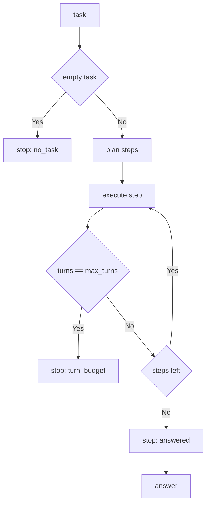

---
# MAM Metadata
id: template-agent-basic
name: Agent Template (Basic)
version: 2.0.0
type: agent

author: MAM Team
description: >
  A single agent with one role, one goal, a fixed tool list and a bounded
  observe and act loop that stops on a terminal answer.

license: MIT

runtime:
  language: python
  version: ">=3.12"

tags:
  - template
  - agent
  - basic
  - single-agent

dependencies:
  - name: mam-runtime
    version: ">=1.0.0"

capabilities:
  - plan
  - execute
  - remember

permissions:
  filesystem:
    - read
  memory:
    - local
  python:
    - sandbox
---

# Agent Template (Basic)

## Purpose

One agent, one job. It receives a task, plans a short ordered list of tool
steps, runs them in order, writes what it learned back into its own notes and
then stops with an explicit reason. Use
[`agent.mam`](../agent.mam) for a coordinator and a worker sharing a policy, and
[`agent-advanced.mam`](./agent-advanced.mam) for budgets, guardrails and
observability.

## Inputs

| Name | Type | Required | Description |
|------|------|----------|-------------|
| task | string | Yes | Question or instruction for the agent |
| context | object | No | Notes the agent may read instead of starting empty |
| max_turns | number | No | Hard cap on tool steps per run. Defaults to 3 |

## Outputs

| Name | Type | Description |
|------|------|-------------|
| answer | string | Result produced by the last successful step, empty if none |
| turns | array | One record per executed tool step |
| stop_reason | string | `answered`, `turn_budget` or `no_task` |

## Capabilities

### plan

Turn the task into the ordered list of tool steps the agent will run.

### execute

Run one planned step through the agent's allow list and return its record.

### remember

Write a value into the agent's notes so later steps and later runs can read it.

## Agent Definition

The basic agent is one `agent` module. It has no handoffs: it is the only
participant in its own system.

```text
module ResearchAgent

type:
    agent

role:
    Research

goal:
    Answer a task from its own notes without leaving the sandbox

tools:
    - notes.read
    - notes.write

memory:
    local
```

## Tool Allow List

| Tool | Effect | Side effects |
|------|--------|---------------|
| `notes.read` | Read the value stored for the task | None |
| `notes.write` | Store the answer for the task | Writes to agent notes |

## Stop Conditions

| Condition | `stop_reason` | Meaning |
|-----------|---------------|---------|
| Every planned step ran | `answered` | The loop is finished and the answer is valid |
| `max_turns` reached | `turn_budget` | The loop was cut short, answer may be partial |
| Task was empty | `no_task` | Nothing was planned, so nothing ran |

## Rules

- The agent only ever calls tools on its allow list.
- One task produces one run; the agent does not accept follow-up turns.
- `max_turns` is enforced inside the loop, not by the caller.
- An empty task is not an error: the agent stops with `no_task` and runs nothing.
- Notes live in the agent's own memory; the agent never reads another agent's notes.
- The agent writes its answer to notes before reporting it.

## Workflow



## Python

```python
from typing import Any, Dict, List

MAX_TURNS = 3

ALLOWED_TOOLS = ("notes.read", "notes.write")


class Agent:
    """A single agent with a fixed tool list and an explicit stop reason."""

    role = "Research"
    goal = "Answer a task from its own notes without leaving the sandbox"

    def __init__(self, notes: Dict[str, Any] = None, max_turns: int = MAX_TURNS) -> None:
        self.notes: Dict[str, Any] = dict(notes or {})
        self.max_turns = max_turns

    def plan(self, task: str) -> List[str]:
        """Turn a task into the ordered tool steps that will run."""
        if not task:
            return []
        return list(ALLOWED_TOOLS)

    def execute(self, task: str, step: str) -> Dict[str, Any]:
        """Run one planned step if it is on the allow list."""
        if step not in ALLOWED_TOOLS:
            return {"tool": step, "ok": False, "value": "tool not allowed"}
        if step == "notes.read":
            return {"tool": step, "ok": True, "value": self.notes.get(task, "")}
        self.remember(f"answer:{task}", f"answer for {task}")
        return {"tool": step, "ok": True, "value": self.notes[f"answer:{task}"]}

    def remember(self, key: str, value: Any) -> bool:
        """Write a value into the agent's notes."""
        self.notes[key] = value
        return True

    def run(self, task: str) -> Dict[str, Any]:
        """Run the agent once and report why it stopped."""
        steps = self.plan(task)
        if not steps:
            return {"task": task, "answer": "", "turns": [], "stop_reason": "no_task"}

        turns: List[Dict[str, Any]] = []
        stop_reason = "answered"
        for step in steps:
            turns.append(self.execute(task, step))
            if len(turns) >= self.max_turns:
                stop_reason = "turn_budget"
                break

        return {
            "task": task,
            "answer": self.notes.get(f"answer:{task}", ""),
            "turns": turns,
            "stop_reason": stop_reason,
        }
```

## Tests

### Input

```yaml
task: what is mam
context:
  what is mam: a module format
```

### Expected

```yaml
answer: "answer for what is mam"
stop_reason: answered
```

```python
def test_answers_and_stops():
    agent = Agent(notes={"what is mam": "a module format"})
    out = agent.run("what is mam")
    assert out["stop_reason"] == "answered"
    assert out["answer"] == "answer for what is mam"
    assert [turn["tool"] for turn in out["turns"]] == list(ALLOWED_TOOLS)


def test_empty_task_runs_nothing():
    agent = Agent()
    out = agent.run("")
    assert out["stop_reason"] == "no_task"
    assert out["turns"] == []
    assert out["answer"] == ""


def test_turn_budget_is_enforced():
    agent = Agent(max_turns=1)
    out = agent.run("what is mam")
    assert out["stop_reason"] == "turn_budget"
    assert len(out["turns"]) == 1


def test_unlisted_tool_is_refused():
    agent = Agent()
    turn = agent.execute("what is mam", "shell.rm")
    assert turn["ok"] is False
    assert turn["value"] == "tool not allowed"


def test_remember_is_readable_by_a_later_run():
    agent = Agent()
    agent.remember("owner", "mam team")
    assert agent.notes["owner"] == "mam team"
```

## Examples

```python
agent = Agent(notes={"what is mam": "a module format"})
out = agent.run("what is mam")
print(out["stop_reason"])   # answered
print(out["answer"])        # answer for what is mam
```

### Expected Flow

```text
task -> plan -> notes.read -> notes.write -> stop: answered
```

## References

- [MAM Agent Specification](../../spec/sections/)
- [Agent Template (full)](./agent.mam)
- [MAM Specification](../../plan-doc/full-mam.md)
