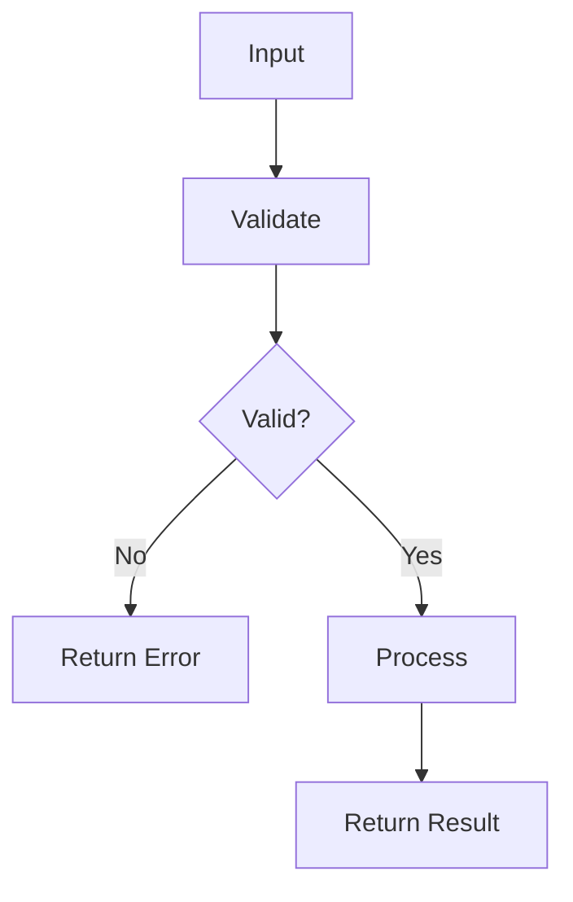

---
# MAM Metadata
id: template-basic
name: Basic Module Template
version: 2.0.0
type: module

author: MAM Team
description: >
  Canonical starter template for a single MAM module with inputs, outputs,
  capabilities, rules, workflow, Python, and tests.

license: MIT

runtime:
  language: python
  version: ">=3.12"

tags:
  - template
  - starter
  - basic
  - module

dependencies:
  - name: mam-runtime
    version: ">=1.0.0"

capabilities:
  - process
  - validate

permissions:
  filesystem:
    - read
  network:
    - internet
---

# Basic Module Template

## Purpose

Provide a minimal but complete MAM module that new modules can copy and extend. It reads a single input, processes it, and returns a structured result.

## Inputs

| Name | Type | Required | Description |
|------|------|----------|-------------|
| input1 | string | Yes | Primary value to process |

## Outputs

| Name | Type | Description |
|------|------|-------------|
| output1 | string | Processed result derived from input1 |
| status | string | Processing status ok or error |

## Capabilities

### process

Transform the input value into a normalized result.

### validate

Check that the input is present and well formed before processing.

## Rules

- Validate all inputs before processing
- Never raise unhandled exceptions to the caller
- Return a structured result for every invocation
- Keep the module deterministic and side effect free
- Never log secrets or personal data

## Workflow



## Python

```python
from typing import Any, Dict


class BasicModule:
    """Minimal MAM module implementation."""

    def validate(self, input1: str) -> bool:
        return isinstance(input1, str) and len(input1) > 0

    def process(self, input1: str) -> Dict[str, Any]:
        if not self.validate(input1):
            return {"output1": None, "status": "error"}

        output1 = f"Processed: {input1}"
        return {"output1": output1, "status": "ok"}


def process(input1: str) -> Dict[str, Any]:
    return BasicModule().process(input1)
```

## Tests

### Input

```yaml
input1: hello
```

### Expected

```yaml
status: ok
output1: Processed: hello
```

```python
def test_process():
    result = process("hello")
    assert result["status"] == "ok"
    assert result["output1"] == "Processed: hello"


def test_process_empty_input():
    result = process("")
    assert result["status"] == "error"
```

## Examples

### Basic Usage

```python
result = process("hello")
print(result)  # {'output1': 'Processed: hello', 'status': 'ok'}
```

### Expected Flow

```text
Input -> Validate -> Process -> Result
```

## References

- [MAM Specification](../../plan-doc/full-mam.md)
- [Workflow Example](../examples/workflow.mam.md)
