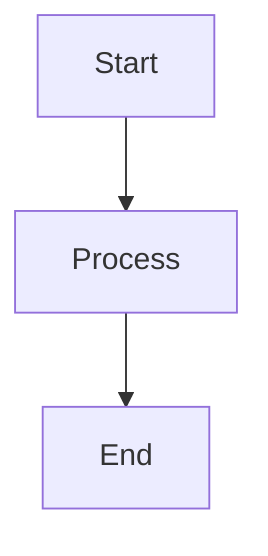

# Module Name

## Purpose

Describe what this module does in one or two sentences.

## Inputs

| Name | Type | Required | Description |
|------|------|----------|-------------|
| input1 | string | Yes | Description of input |

## Outputs

| Name | Type | Description |
|------|------|-------------|
| output1 | string | Description of output |

## Rules

- Rule 1: First behavioral constraint
- Rule 2: Second behavioral constraint
- Rule 3: Third behavioral constraint

## Workflow



## Python

```python
def process(input1: str) -> dict:
    """
    Process the input and return results.
    
    Args:
        input1: Description of input
        
    Returns:
        dict with output1 key
    """
    # Implementation here
    output1 = f"Processed: {input1}"
    
    return {"output1": output1}
```

## Examples

```python
result = process("hello")
print(result)  # {'output1': 'Processed: hello'}
```

## Tests

```python
def test_process():
    result = process("test")
    assert result["output1"] == "Processed: test"
```

## References

- [Documentation Link](https://example.com)

## Dependencies

- None
