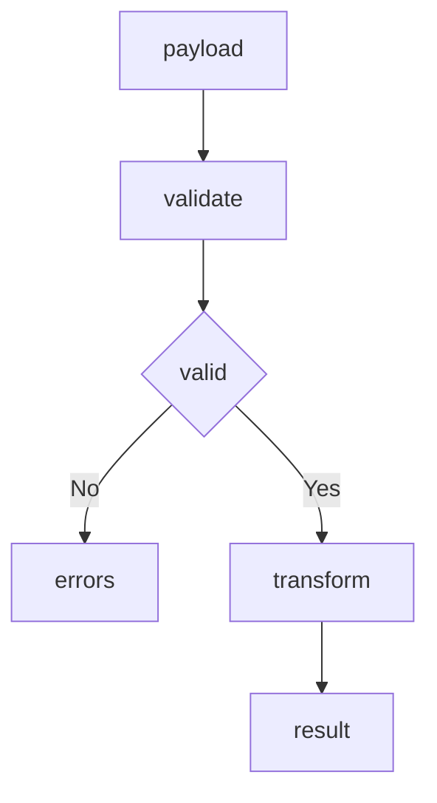

# Component Template

## Purpose

Provide a reusable unit with a clear boundary. The component declares its inputs, its outputs, and a contract that callers can rely on. Copy this file and replace the sample transform with your own logic.

## Inputs

| Name | Type | Required | Description |
|------|------|----------|-------------|
| payload | object | Yes | Structured data to process |
| options | object | No | Processing options |

## Outputs

| Name | Type | Description |
|------|------|-------------|
| result | object | Processed data |
| valid | boolean | Whether the input matched the contract |
| errors | array | Validation errors when the input is invalid |

## Capabilities

### validate

Check the input against the declared contract.

### transform

Produce the output from a valid input.

### describe

Return the component contract as structured data.

## Contract

| Field | Type | Required | Description |
|-------|------|----------|-------------|
| payload | object | Yes | Structured data to process |
| result | object | Yes | Processed data |
| valid | boolean | Yes | Validation outcome |

The component guarantees that a valid input produces a result and that an invalid input produces errors instead of a result.

## Rules

- The component must validate every input before it transforms.
- The component must not mutate the caller input.
- The component must return errors instead of raising on invalid input.
- The contract must stay stable across minor versions.
- The component must be free of hidden global state.

## Workflow



## Python

```python
class Component:
    def __init__(self, required=None):
        self.required = required or ["payload"]

    def validate(self, payload):
        errors = []
        if not isinstance(payload, dict):
            return ["payload must be an object"]
        for field in self.required:
            if field not in payload:
                errors.append("missing field: " + field)
        return errors

    def transform(self, payload):
        return {"echo": payload}

    def describe(self):
        return {"required": self.required, "outputs": ["result", "valid", "errors"]}

    def run(self, payload):
        errors = self.validate(payload)
        if errors:
            return {"valid": False, "errors": errors}
        return {"valid": True, "errors": [], "result": self.transform(payload)}
```

## Tests

### Input

```yaml
payload:
  name: example
```

### Expected

```yaml
valid: true
```

```python
def test_valid_input():
    component = Component()
    out = component.run({"name": "example"})
    assert out["valid"] is True
    assert out["result"] == {"echo": {"name": "example"}}

def test_invalid_input():
    component = Component()
    out = component.run({})
    assert out["valid"] is False
    assert out["errors"] == ["missing field: payload"]
```

## Examples

```python
component = Component(required=["payload"])
out = component.run({"payload": {"id": 1}})
print(out["result"])
```

## References

- MAM Component Contract
- MAM Interface Specification
