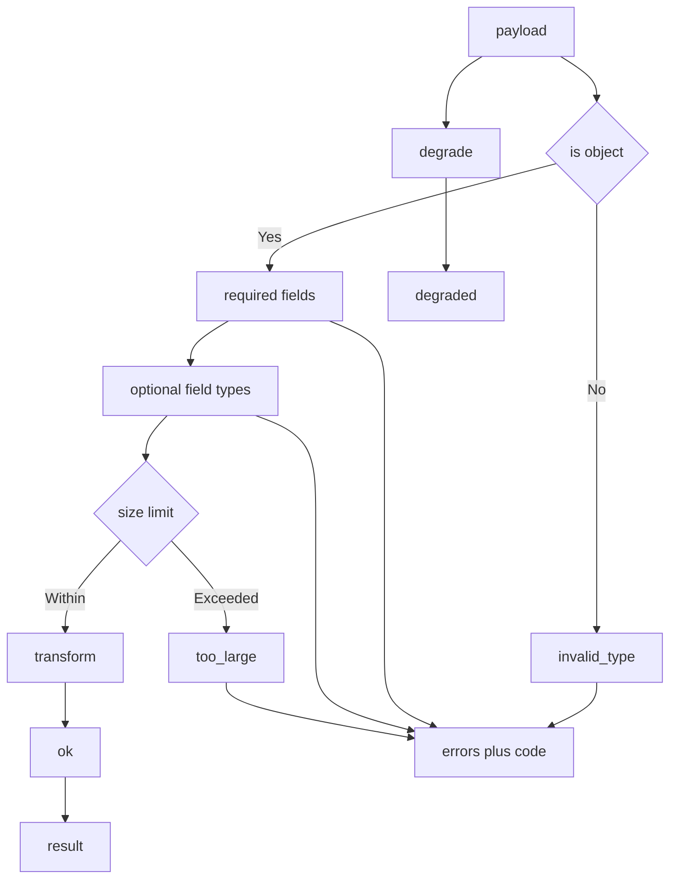

---
# MAM Metadata
id: template-component-advanced
name: Component Template (Advanced)
version: 2.0.0
type: component

author: MAM Team
description: >
  A contract carrying component with typed optional fields, a size limit, a
  stable error code on every outcome, a versioned contract, and a degraded path
  that returns documented defaults instead of nothing.

license: MIT

runtime:
  language: python
  version: ">=3.12"

tags:
  - template
  - component
  - advanced
  - contract
  - versioning

dependencies:
  - name: schema-validator
    version: "^1.0"
  - name: telemetry
    version: "^2.0"

capabilities:
  - validate
  - transform
  - describe
  - degrade
  - version

permissions:
  filesystem:
    - read
---

# Component Template (Advanced)

## Purpose

A component that other systems depend on, so the contract has to be precise.
Every outcome carries a stable `code` a caller can branch on, optional fields
are type checked, the payload is bounded before it is transformed, the contract
carries a version, and `degrade` returns documented defaults when a caller
would rather have a weak result than an error. Use
[`component-basic.mam`](./component-basic.mam) when the caller is in the same
repository and can read the code.

## Inputs

| Name | Type | Required | Description |
|------|------|----------|-------------|
| payload | object | Yes | Structured data to process |
| options | object | No | Processing options |
| required | array | No | Fields the contract requires |
| optional | array | No | Optional fields, checked as strings |
| max_size | integer | No | Maximum size of the payload. Defaults to `1024` |

## Outputs

| Name | Type | Description |
|------|------|-------------|
| result | object | Processed data, or `null` on failure |
| valid | boolean | Whether the input matched the contract |
| errors | array | Structured validation errors |
| code | string | Stable code for the outcome |

## Capabilities

### validate

Check the input against the contract and return structured errors carrying a
field, a stable code and a message.

### transform

Produce the output from a valid input, filling every declared optional field,
without mutating the caller's data.

### describe

Return the versioned contract, the limits and the output fields as structured
data.

### degrade

Return a weak but well formed result built from documented defaults, for
callers that prefer a default over an error.

### version

Return the contract version the component currently implements.

## Contract

| Field | Type | Required | Description |
|-------|------|----------|-------------|
| payload | object | Yes | Structured data to process |
| result | object | Yes | Processed data, or `null` on failure |
| valid | boolean | Yes | Validation outcome |
| errors | array | Yes | Empty on success, populated on failure |
| code | string | Yes | Stable code for the outcome |

The component guarantees that a valid input produces a result and that an
invalid input produces errors and a code instead of a result.

## Error Codes

| Code | Meaning | When |
|------|---------|------|
| `ok` | The contract was satisfied | Every required field present, nothing oversized |
| `invalid_type` | A field had the wrong type | Payload is not an object, or an optional field is not a string |
| `missing_field` | A required field was absent | The field list is non-empty |
| `too_large` | The payload exceeded the limit | Checked before the transform, so a limit cannot be bypassed |
| `degraded` | A default result was produced | The caller asked for `degrade` |

`degraded` is the only code that is paired with a result and a `valid` of
`false`, so a caller can tell a weak result from a broken one.

## Contract Versioning

| Version | Change | Caller impact |
|---------|--------|---------------|
| 1.0 | `payload` required, `result` and `valid` returned | Initial contract |
| 1.1 | `code` added, optional fields and `max_size` added | Additive; a 1.0 caller may ignore `code` |

A minor bump may only add fields. Removing a field, renaming one, or changing a
type is a major bump and must ship alongside a migration.

## Rules

- The component must validate every input before it transforms.
- The size limit is checked before the transform, never after.
- The component must not mutate the caller input.
- The component must return errors and a code instead of raising on invalid input.
- Every outcome, including success, carries a code.
- `degrade` fills defaults for required fields rather than inventing values.
- The contract must stay stable across minor versions.
- The component must be free of hidden global state.

## Workflow



## Python

```python
class Component:
    CONTRACT_VERSION = "1.1"

    def __init__(self, required=None, optional=None, max_size=1024):
        self.required = list(required) if required is not None else ["payload"]
        self.optional = list(optional or [])
        self.max_size = max_size

    def version(self):
        return self.CONTRACT_VERSION

    def validate(self, payload):
        if not isinstance(payload, dict):
            return [self._error("payload", "invalid_type", "payload must be an object")]
        errors = []
        for field in self.required:
            if field not in payload:
                errors.append(self._error(field, "missing_field", "missing field: " + field))
        for field in self.optional:
            if field in payload and not isinstance(payload[field], str):
                errors.append(self._error(field, "invalid_type", field + " must be a string"))
        if len(str(payload)) > self.max_size:
            errors.append(
                self._error("payload", "too_large", "payload exceeds the size limit")
            )
        return errors

    def _error(self, field, code, message):
        return {"field": field, "code": code, "message": message}

    def transform(self, payload):
        result = {"echo": dict(payload)}
        for field in self.optional:
            result[field] = payload.get(field)
        return result

    def degrade(self, payload):
        defaults = {field: None for field in self.required}
        if isinstance(payload, dict):
            defaults.update({k: v for k, v in payload.items() if k in self.required})
        return {
            "valid": False,
            "errors": [],
            "code": "degraded",
            "result": self.transform(defaults),
        }

    def describe(self):
        return {
            "contract_version": self.CONTRACT_VERSION,
            "required": list(self.required),
            "optional": list(self.optional),
            "max_size": self.max_size,
            "outputs": ["result", "valid", "errors", "code"],
        }

    def run(self, payload):
        errors = self.validate(payload)
        if errors:
            return {
                "valid": False,
                "errors": errors,
                "code": errors[0]["code"],
                "result": None,
            }
        return {"valid": True, "errors": [], "code": "ok", "result": self.transform(payload)}
```

## Tests

### Input

```yaml
payload:
  name: example
optional:
  - trace
```

### Expected

```yaml
valid: true
code: ok
```

```python
def test_valid_input_fills_optional_fields():
    component = Component(required=["payload"], optional=["trace"])
    out = component.run({"payload": {"name": "example"}})
    assert out["valid"] is True
    assert out["code"] == "ok"
    assert out["result"] == {"echo": {"payload": {"name": "example"}}, "trace": None}


def test_missing_field_has_a_stable_code():
    out = Component(required=["payload"]).run({})
    assert out["valid"] is False
    assert out["code"] == "missing_field"
    assert out["result"] is None
    assert out["errors"][0]["field"] == "payload"


def test_optional_type_is_checked():
    out = Component(required=["payload"], optional=["trace"]).run({"payload": {}, "trace": 5})
    assert out["code"] == "invalid_type"
    assert out["errors"][0]["field"] == "trace"


def test_size_limit_is_checked_before_the_transform():
    out = Component(required=["payload"], max_size=10).run({"payload": "x" * 100})
    assert out["code"] == "too_large"
    assert out["result"] is None


def test_non_object_payload_is_invalid_type():
    assert Component().run("not a payload")["code"] == "invalid_type"


def test_degrade_returns_documented_defaults():
    out = Component(required=["payload"]).degrade({})
    assert out["valid"] is False
    assert out["code"] == "degraded"
    assert out["result"] == {"echo": {"payload": None}}


def test_input_is_not_mutated():
    component = Component(required=["payload"], optional=["trace"])
    payload = {"payload": {"name": "example"}}
    component.run(payload)
    assert payload == {"payload": {"name": "example"}}


def test_describe_reports_the_versioned_contract():
    described = Component(required=["payload"], optional=["trace"], max_size=64).describe()
    assert described["contract_version"] == "1.1"
    assert described["max_size"] == 64
    assert described["outputs"] == ["result", "valid", "errors", "code"]
    assert Component().version() == "1.1"
```

## Examples

```python
component = Component(required=["payload"], optional=["trace"], max_size=4096)

print(component.run({"payload": {"id": 1}, "trace": "abc"}))
print(component.run({})["code"])
print(component.run({"payload": "x" * 10000})["code"])
print(component.degrade({}))
print(component.describe())
```

## References

- [MAM Component Template](./component.mam)
- [MAM Component Contract](../../spec/sections/)
- [MAM Interface Specification](../../spec/sections/)
- [MAM Semantic Versioning](../../spec/sections/)
