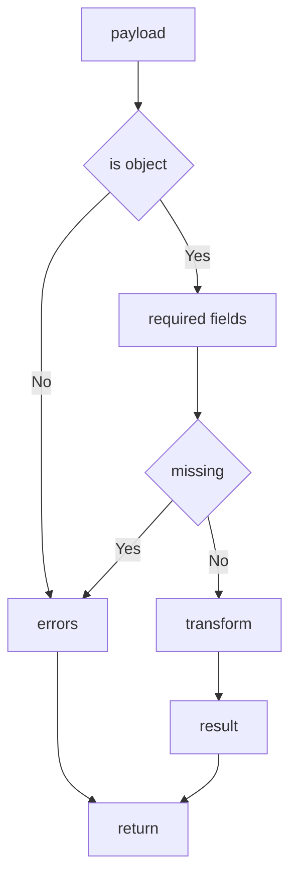

---
# MAM Metadata
id: template-component-basic
name: Component Template (Basic)
version: 2.0.0
type: component

author: MAM Team
description: >
  A reusable unit with a declared contract: required fields checked before the
  transform runs, errors returned instead of raised, and a describe that hands
  the contract back as data.

license: MIT

runtime:
  language: python
  version: ">=3.12"

tags:
  - template
  - component
  - basic
  - contract

dependencies:
  - name: schema-validator
    version: "^1.0"

capabilities:
  - validate
  - transform
  - describe

permissions:
  filesystem:
    - read
---

# Component Template (Basic)

## Purpose

A reusable unit with a clear boundary. The component declares the fields it
requires, checks the input before it transforms, returns errors instead of
raising, and never mutates the caller's input. Use
[`component.mam`](../component.mam) for the documented version of the same
shape, and [`component-advanced.mam`](./component-advanced.mam) when the
component needs typed optional fields, size limits, stable error codes, a
versioned contract and a degraded path.

## Inputs

| Name | Type | Required | Description |
|------|------|----------|-------------|
| payload | object | Yes | Structured data to process |
| options | object | No | Processing options |

## Outputs

| Name | Type | Description |
|------|------|-------------|
| result | object | Processed data |
| valid | boolean | Whether the input matched the contract |
| errors | array | Validation errors when the input is invalid |

## Capabilities

### validate

Check the input against the required fields declared by the contract and return
the list of problems.

### transform

Produce the output from a valid input without mutating the caller's data.

### describe

Return the component contract as structured data.

## Contract

| Field | Type | Required | Description |
|-------|------|----------|-------------|
| payload | object | Yes | Structured data to process |
| result | object | Yes | Processed data |
| valid | boolean | Yes | Validation outcome |
| errors | array | Yes | Empty on success, populated on failure |

The component guarantees that a valid input produces a result and that an
invalid input produces errors instead of a result. A non-object input is
rejected before any field check, so a caller never sees a field error for a
value that was never a payload.

## Rules

- The component must validate every input before it transforms.
- The component must not mutate the caller input.
- The component must return errors instead of raising on invalid input.
- A non-object payload is rejected before the field checks run.
- The contract must stay stable across minor versions.
- The component must be free of hidden global state.

## Workflow



## Python

```python
class Component:
    def __init__(self, required=None):
        self.required = list(required) if required is not None else ["payload"]

    def validate(self, payload):
        if not isinstance(payload, dict):
            return ["payload must be an object"]
        errors = []
        for field in self.required:
            if field not in payload:
                errors.append("missing field: " + field)
        return errors

    def transform(self, payload):
        return {"echo": dict(payload)}

    def describe(self):
        return {
            "required": list(self.required),
            "outputs": ["result", "valid", "errors"],
        }

    def run(self, payload):
        errors = self.validate(payload)
        if errors:
            return {"valid": False, "errors": errors}
        return {"valid": True, "errors": [], "result": self.transform(payload)}
```

## Tests

### Input

```yaml
payload:
  name: example
```

### Expected

```yaml
valid: true
```

```python
def test_valid_input():
    component = Component(required=["payload"])
    out = component.run({"payload": {"name": "example"}})
    assert out["valid"] is True
    assert out["errors"] == []
    assert out["result"] == {"echo": {"payload": {"name": "example"}}}


def test_missing_required_field():
    component = Component(required=["payload"])
    out = component.run({})
    assert out["valid"] is False
    assert out["errors"] == ["missing field: payload"]
    assert "result" not in out


def test_non_object_is_rejected_before_field_checks():
    assert Component().validate("not a payload") == ["payload must be an object"]


def test_input_is_not_mutated():
    component = Component(required=["payload"])
    payload = {"payload": {"name": "example"}}
    component.run(payload)
    assert payload == {"payload": {"name": "example"}}


def test_describe_returns_the_contract():
    described = Component(required=["payload", "options"]).describe()
    assert described["required"] == ["payload", "options"]
    assert described["outputs"] == ["result", "valid", "errors"]
```

## Examples

```python
component = Component(required=["payload"])

print(component.run({"payload": {"id": 1}}))
print(component.run({})["errors"])
print(component.describe())
```

## References

- [MAM Component Template](./component.mam)
- [MAM Component Contract](../../spec/sections/)
- [MAM Interface Specification](../../spec/sections/)
