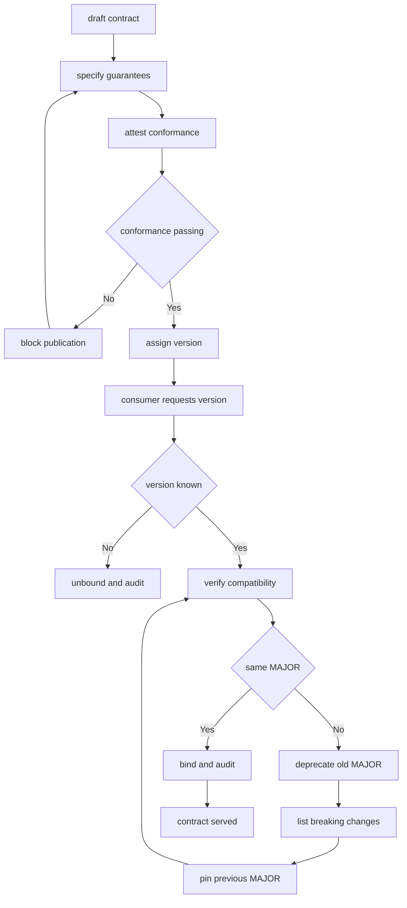

---
# MAM Metadata
id: template-contract-advanced
name: Contract Template (Advanced)
version: 2.0.0
type: contract

author: MAM Team
description: >
  A contract with a versioned guarantee history, a deprecation window, a
  conformance suite and an audit trail of every binding decision.

license: MIT

runtime:
  language: python
  version: ">=3.12"

tags:
  - template
  - contract
  - api
  - versioning
  - deprecation
  - conformance

dependencies:
  - name: semver
    version: "^2.0"
  - name: telemetry
    version: "^2.0"

capabilities:
  - specify
  - guarantee
  - version
  - verify
  - deprecate
  - attest

permissions:
  filesystem:
    - read
    - write
  network:
    - internal
---

# Contract Template (Advanced)

## Purpose

A production contract. Alongside the guarantees themselves it records the
version that introduced each one, runs a conformance suite before publication,
holds a deprecation window for superseded majors, and writes every binding
decision to an audit trail so a support engineer can answer "what was this
consumer promised, and when".

## Inputs

| Name | Type | Required | Description |
|------|------|----------|-------------|
| contract | object | Yes | The published agreement, e.g. `{ "id": "orders-api", "version": "3.0.0" }` |
| consumer | string | Yes | Identifier of the party asking to be bound |
| requested_version | string | No | Version the consumer expects. Defaults to the published version |
| previous_guarantees | array | No | Guarantees the consumer was previously bound to |

## Outputs

| Name | Type | Description |
|------|------|-------------|
| status | string | `compatible`, `breaking` or `unbound` |
| version | string | Published version the consumer is bound to |
| guarantees | array | Guarantees that apply to the consumer |
| breaking_changes | array | Changes since the requested version, empty when compatible |
| withdraw_after | string | Date the requested version stops being served, or `null` |
| conformance | object | Result of the conformance suite |
| audit | array | Binding decisions recorded in this process |

## Capabilities

### specify

Publish the guarantees the provider makes to a named consumer group.

### guarantee

Record a promise together with the version that introduced it.

### version

Assign a semantic version and classify each change against the guarantee history.

### verify

Answer whether a consumer's requested version can still be honoured.

### deprecate

Open a withdrawal window for a superseded major, with a named replacement.

### attest

Run the conformance suite and record whether the contract may be published.

## Guarantees

| Guarantee | Kind | Introduced | Statement |
|-----------|------|------------|-----------|
| availability | availability | 1.0.0 | The endpoint answers `99.9%` of requests in a calendar month |
| pagination | compatibility | 1.0.0 | Collections are cursor paginated and cursors stay valid for 24h |
| idempotency | integrity | 2.0.0 | Replaying a request with the same key returns the first result |
| partial_refunds | integrity | 3.0.0 | A refund may settle partially and reports the settled amount |

## Versioning

| Bump | Trigger | Guarantee effect |
|------|---------|------------------|
| MAJOR | A guarantee is removed or weakened | Consumers must rebind |
| MINOR | A guarantee is added or widened | Consumers may ignore the addition |
| PATCH | A guarantee is clarified only | No consumer action |

A `MAJOR` never reuses a number. Superseded majors stay published for
`deprecation_days` after the bump and are then withdrawn rather than deleted.

## Compatibility

| Check | Failure mode | Response |
|-------|--------------|----------|
| Requested version parses | Consumer asks for `two.one` | `unbound` |
| Requested MAJOR matches | Consumer pins an old major | `breaking` with the change list |
| Requested version is not newer | Consumer asks for a future version | `unbound` |
| Guarantee still published | Consumer relies on a withdrawn guarantee | Listed in `breaking_changes` |

## Deprecation

| Field | Value | Description |
|-------|-------|-------------|
| window | 90 days | Minimum time a superseded major stays served |
| notice | changelog + consumer email | How consumers learn about the window |
| replacement | `orders-api@3` | What consumers should migrate to |
| withdraw_after | computed | Date the superseded major stops being served |

## Conformance

The suite runs before publication and fails the release on any breach:

- Every guarantee has a non-empty, single-sentence statement.
- Guarantee names are unique and match `[a-z][a-z0-9_]*`.
- A withdrawn guarantee is not present in the published set.
- The contract declares at least one guarantee of each advertised kind.
- Every `MAJOR` bump records at least one breaking change.

## Rules

- A contract states promises; it never contains implementation logic.
- Conformance must pass before a contract is published.
- A guarantee is only removed through a `MAJOR` version bump.
- A superseded major stays published for at least the deprecation window.
- A consumer is never silently moved to a different `MAJOR`.
- An unknown or future requested version results in `unbound`, never a guess.
- Every binding decision is written to the audit trail with its outcome.
- Guarantee statements are never edited in place; they are superseded.

## Workflow



## Python

```python
import re

NAME_PATTERN = re.compile(r"^[a-z][a-z0-9_]*$")


def parse_version(text):
    parts = str(text).strip().lstrip("v").split(".")
    if len(parts) != 3:
        raise ValueError(f"not a semantic version: {text}")
    try:
        return tuple(int(part) for part in parts)
    except ValueError as error:
        raise ValueError(f"non-numeric version: {text}") from error


def format_version(version):
    return ".".join(str(part) for part in version)


def add_days(iso_date, days):
    """Return `iso_date` shifted by `days`, using the stdlib only."""
    from datetime import date, timedelta
    return (date.fromisoformat(iso_date) + timedelta(days=days)).isoformat()


class Guarantee:
    def __init__(self, name, kind, statement, introduced_in, withdrawn_in=None):
        self.name = name
        self.kind = kind
        self.statement = statement
        self.introduced_in = parse_version(introduced_in)
        self.withdrawn_in = parse_version(withdrawn_in) if withdrawn_in else None

    def active(self, version):
        target = parse_version(version)
        if target < self.introduced_in:
            return False
        return self.withdrawn_in is None or target < self.withdrawn_in

    def as_dict(self):
        return {
            "name": self.name,
            "kind": self.kind,
            "statement": self.statement,
            "introduced_in": format_version(self.introduced_in),
            "withdrawn_in": format_version(self.withdrawn_in) if self.withdrawn_in else None,
        }


class Contract:
    def __init__(self, id, version, guarantees, deprecation_days=90):
        self.id = id
        self.version = parse_version(version)
        self.deprecation_days = deprecation_days
        self.guarantees = {g.name: g for g in guarantees}
        self.deprecations = []
        self.history = []
        self.audit = []

    def active_guarantees(self, version=None):
        target = version or format_version(self.version)
        return [g.as_dict() for g in self.guarantees.values() if g.active(target)]

    def by_kind(self, kind):
        return [g.as_dict() for g in self.guarantees.values() if g.kind == kind]

    def compatible_with(self, version):
        try:
            wanted = parse_version(version)
        except ValueError:
            return False
        return wanted[0] == self.version[0] and wanted <= self.version

    def breaking_changes_since(self, previous_version, previous_guarantees=()):
        previous = parse_version(previous_version)
        changes = []
        if previous[0] != self.version[0]:
            changes.append(f"major version {previous[0]} -> {self.version[0]}")
        kept = set(self.guarantees)
        withdrawn = {g.name for g in previous_guarantees} - kept
        changes.extend(f"guarantee removed: {name}" for name in sorted(withdrawn))
        for name in sorted(kept):
            guarantee = self.guarantees[name]
            if guarantee.introduced_in > previous:
                changes.append(f"guarantee added: {name}")
        return changes

    def deprecate(self, version, replacement, announced_on):
        window = self.deprecations.append({
            "version": version,
            "replacement": replacement,
            "announced_on": announced_on,
            "withdraw_after": add_days(announced_on, self.deprecation_days),
        })
        return window

    def attest(self):
        failures = []
        if not self.guarantees:
            failures.append("contract declares no guarantees")
        for name, guarantee in sorted(self.guarantees.items()):
            if not NAME_PATTERN.match(name):
                failures.append(f"invalid guarantee name: {name}")
            if not guarantee.statement.strip():
                failures.append(f"empty statement: {name}")
            if guarantee.withdrawn_in and guarantee.withdrawn_in <= self.version:
                failures.append(f"withdrawn guarantee still published: {name}")
        report = {"status": "passing" if not failures else "failing",
                  "failures": failures}
        self.audit.append({"check": "attest", "status": report["status"]})
        return report

    def bind(self, consumer, requested_version=None, previous_guarantees=()):
        wanted = requested_version or format_version(self.version)
        try:
            target = parse_version(wanted)
        except ValueError:
            target = None
        if target is None or target > self.version:
            self.audit.append({"consumer": consumer, "requested": wanted,
                               "status": "unbound"})
            return {"status": "unbound", "version": None, "guarantees": [],
                    "breaking_changes": [], "withdraw_after": None}
        changes = self.breaking_changes_since(wanted, previous_guarantees)
        active = self.active_guarantees(wanted)
        window = next((d for d in self.deprecations if d["version"] == wanted), None)
        self.audit.append({"consumer": consumer, "requested": wanted,
                           "status": "breaking" if changes else "compatible"})
        return {
            "status": "breaking" if changes else "compatible",
            "version": format_version(self.version),
            "guarantees": [g["name"] for g in active],
            "breaking_changes": changes,
            "withdraw_after": window["withdraw_after"] if window else None,
        }
```

## Tests

### Input

```yaml
contract:
  id: orders-api
  version: 3.0.0
consumer: legacy-billing
requested_version: 2.0.0
```

### Expected

```yaml
status: breaking
breaking_changes:
  - major version 2 -> 3
  - guarantee removed: pagination
withdraw_after: 2026-04-01
```

```python
def test_withdrawn_guarantee_fails_conformance():
    published = Contract("orders-api", "3.0.0", [
        Guarantee("availability", "availability", "99.9% monthly", "1.0.0"),
        Guarantee("pagination", "compatibility", "Cursor pagination", "1.0.0", "3.0.0"),
    ])
    report = published.attest()
    assert report["status"] == "failing"
    assert "withdrawn guarantee still published: pagination" in report["failures"]

    published.guarantees["pagination"].withdrawn_in = None
    assert published.attest()["status"] == "passing"


def test_binding_reports_breaking_changes_and_window():
    published = Contract("orders-api", "3.0.0", [
        Guarantee("availability", "availability", "99.9% monthly", "1.0.0"),
        Guarantee("idempotency", "integrity", "Replays are safe", "2.0.0"),
    ])
    published.deprecate("2.0.0", "orders-api@3", "2026-01-01")

    bound = published.bind("legacy-billing", "2.0.0", [
        Guarantee("pagination", "compatibility", "Cursor pagination", "1.0.0"),
    ])
    assert bound["status"] == "breaking"
    assert bound["breaking_changes"] == [
        "major version 2 -> 3",
        "guarantee removed: pagination",
    ]
    assert bound["withdraw_after"] == "2026-04-01"
    assert bound["guarantees"] == ["availability", "idempotency"]
    assert published.audit[-1]["consumer"] == "legacy-billing"


def test_future_version_is_unbound():
    published = Contract("orders-api", "3.0.0", [])
    assert published.compatible_with("4.0.0") is False
    assert published.bind("checkout", "4.0.0")["status"] == "unbound"
```

## Examples

```python
published = Contract("orders-api", "3.0.0", [
    Guarantee("availability", "availability", "99.9% monthly", "1.0.0"),
    Guarantee("idempotency", "integrity", "Replays are safe", "2.0.0"),
    Guarantee("partial_refunds", "integrity", "Refunds may settle partially", "3.0.0"),
])
published.deprecate("2.0.0", "orders-api@3", "2026-01-01")

print(published.attest())
print(published.bind("checkout", "3.0.0")["guarantees"])
print(published.bind("legacy-billing", "2.0.0")["breaking_changes"])
print([entry["status"] for entry in published.audit])
```

## References

- MAM API Contract Specification
- MAM Semantic Versioning Policy
- MAM Deprecation Windows
- [Contract template](./contract.mam)
- [Extension templates](../extension/)
