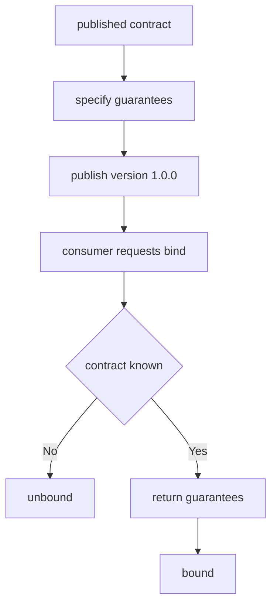

---
# MAM Metadata
id: template-contract-basic
name: Contract Template (Basic)
version: 2.0.0
type: contract

author: MAM Team
description: >
  A single-endpoint contract with two guarantees and one major version.

license: MIT

runtime:
  language: python
  version: ">=3.12"

tags:
  - template
  - contract
  - api
  - basic

capabilities:
  - specify
  - guarantee

permissions:
  filesystem:
    - read
---

# Contract Template (Basic)

## Purpose

The smallest useful contract: one provider, a fixed set of guarantees, and a
single published major version. Use
[`contract.mam`](../contract.mam) when you need a compatibility matrix or a
breaking-change policy, and
[`contract-advanced.mam`](./contract-advanced.mam) for deprecation windows and
conformance tests.

## Inputs

| Name | Type | Required | Description |
|------|------|----------|-------------|
| contract | object | Yes | The published agreement, e.g. `{ "id": "orders-api", "version": "1.0.0" }` |
| consumer | string | Yes | Identifier of the party asking to be bound |

## Outputs

| Name | Type | Description |
|------|------|-------------|
| status | string | `bound` or `unbound` |
| version | string | Published version the consumer is bound to |
| guarantees | array | Names of the guarantees that apply |

## Capabilities

### specify

Publish the guarantees the provider makes to its consumers.

### guarantee

Record a single promise with its kind.

## Guarantees

| Guarantee | Kind | Statement |
|-----------|------|-----------|
| availability | availability | The endpoint answers `99.9%` of requests in a calendar month |
| idempotency | integrity | Replaying a request with the same key returns the first result |

## Versioning

The contract ships at `1.0.0` and is not re-versioned. A consumer either binds
to `1.0.0` or is unbound. Guarantees may be added, but nothing in this template
weakens a promise after publication.

## Rules

- A contract states promises; it never contains implementation logic.
- A guarantee is never removed or weakened without a new major version.
- A consumer is never silently moved to a different major version.
- Guarantees are listed in the contract and mirrored in the consumer's config.

## Workflow



## Python

```python
class Contract:
    def __init__(self, id, version="1.0.0", guarantees=None):
        self.id = id
        self.version = version
        self.guarantees = [
            {"name": "availability", "kind": "availability",
             "statement": "99.9% monthly"},
            {"name": "idempotency", "kind": "integrity",
             "statement": "Replays return the first result"},
        ]
        if guarantees is not None:
            self.guarantees = list(guarantees)

    def names(self):
        return sorted(g["name"] for g in self.guarantees)

    def bind(self, consumer, requested_version=None):
        wanted = requested_version or self.version
        if wanted != self.version:
            return {
                "consumer": consumer,
                "contract": self.id,
                "status": "unbound",
                "version": None,
                "guarantees": [],
            }
        return {
            "consumer": consumer,
            "contract": self.id,
            "status": "bound",
            "version": self.version,
            "guarantees": self.names(),
        }
```

## Tests

### Input

```yaml
contract:
  id: orders-api
  version: 2.0.0
consumer: checkout
```

### Expected

```yaml
status: bound
version: 2.0.0
```

```python
def test_bind_current_version():
    contract = Contract("orders-api")
    bound = contract.bind("checkout")
    assert bound["status"] == "bound"
    assert bound["version"] == "1.0.0"
    assert bound["guarantees"] == ["availability", "idempotency"]


def test_bind_unknown_version():
    contract = Contract("orders-api")
    assert contract.bind("checkout", "0.9.0")["status"] == "unbound"
```

## Examples

```python
contract = Contract("orders-api")
print(contract.bind("checkout"))
print(contract.names())
```

## References

- MAM API Contract Specification
- [Contract template](./contract.mam)
- [Contract template (advanced)](./contract-advanced.mam)
