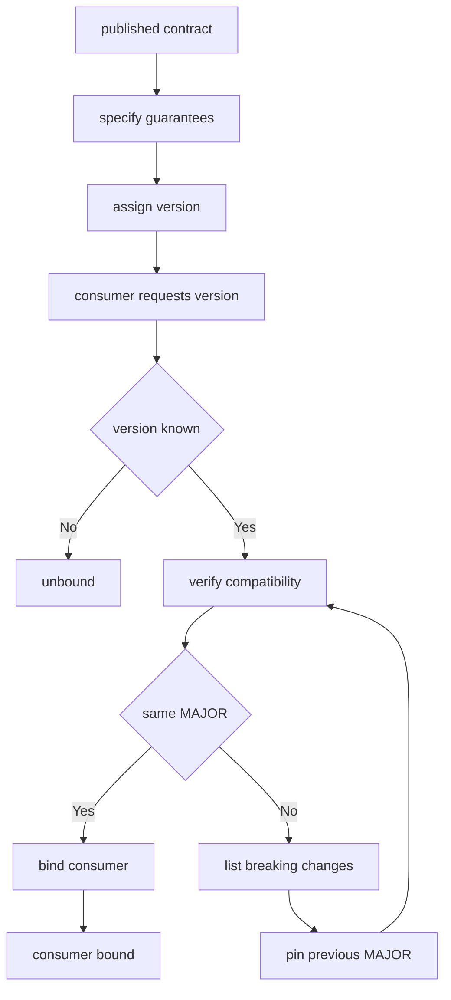

---
# MAM Metadata
id: template-contract
name: Contract Template
version: 2.0.0
type: contract
author: MAM Team
description: >
  Starter template for an API agreement between a provider and its consumers,
  declaring guarantees, versioning rules and a breaking-change policy.
license: MIT
runtime:
  language: python
  version: ">=3.12"
tags:
  - template
  - contract
  - api
  - versioning
dependencies:
  - name: semver
    version: "^2.0"
capabilities:
  - specify
  - guarantee
  - version
  - verify
permissions:
  filesystem:
    - read
---

# Contract Template

## Purpose

Describe an agreement between two parties: what a provider promises its
consumers, under which version that promise holds, and what a consumer must do
when it no longer does. A contract contains no implementation logic. It states
promises and the conditions under which they may be changed.

## Inputs

| Name | Type | Required | Description |
|------|------|----------|-------------|
| contract | object | Yes | The published agreement, e.g. `{ "id": "orders-api", "version": "2.1.0" }` |
| consumer | string | Yes | Identifier of the party asking to be bound |
| requested_version | string | No | Version the consumer expects. Defaults to the published version |

## Outputs

| Name | Type | Description |
|------|------|-------------|
| status | string | `compatible`, `breaking` or `unbound` |
| version | string | Published version the consumer is bound to |
| guarantees | array | Guarantees that apply to the consumer |
| breaking_changes | array | Changes since the requested version, empty when compatible |

## Capabilities

### specify

Publish the guarantees the provider makes to a named consumer group.

### guarantee

Record a single promise with its kind, so it can be checked rather than implied.

### version

Assign a semantic version to the agreement and classify each change against it.

### verify

Answer whether a consumer's requested version can still be honoured.

## Guarantees

| Guarantee | Kind | Statement |
|-----------|------|-----------|
| availability | availability | The endpoint answers `99.9%` of requests in a calendar month |
| idempotency | integrity | Replaying a request with the same key returns the first result |
| pagination | compatibility | Collections are cursor paginated and cursors stay valid for 24h |
| retention | integrity | Created records are retained for 90 days |

## Versioning

| Range | Meaning | Consumer action |
|-------|---------|-----------------|
| `2.0.0` | Current published contract | Bind directly |
| `1.x` | Accepted, no new guarantees | Bind, expect no additions |
| `<1.0.0` | Withdrawn | Rebind before upgrading |

A contract version is `MAJOR.MINOR.PATCH`. A new guarantee is `MINOR`. A
removed or weakened guarantee is `MAJOR`. A clarification that keeps every
promise is `PATCH`.

## Compatibility

| Change | Breaking | Version bump |
|--------|----------|--------------|
| Guarantee added | No | MINOR |
| Guarantee widened | No | MINOR |
| Guarantee clarified | No | PATCH |
| Guarantee removed | Yes | MAJOR |
| Guarantee weakened | Yes | MAJOR |
| Field renamed | Yes | MAJOR |
| Field made optional | No | MINOR |

## Breaking Changes

- Every breaking change is announced in the contract before it ships.
- A breaking change ships with a `MAJOR` bump in the same release.
- The previous `MAJOR` stays published for at least 90 days after the bump.
- A consumer that pins an older version keeps receiving the old behaviour.
- A consumer that requests an unknown version is unbound, never guessed.

## Rules

- A contract states promises; it never contains implementation logic.
- A guarantee is only removed through a `MAJOR` version bump.
- A consumer is never silently moved to a different `MAJOR`.
- An unknown requested version results in `unbound`, not a default binding.
- Every change to a guarantee is recorded with the version that introduced it.
- Guarantees are additive within a `MAJOR`; consumers may rely on the floor.

## Workflow



## Python

```python
def parse_version(text):
    """Parse a MAJOR.MINOR.PATCH string into a comparable tuple."""
    parts = str(text).strip().lstrip("v").split(".")
    if len(parts) != 3:
        raise ValueError(f"not a semantic version: {text}")
    try:
        return tuple(int(part) for part in parts)
    except ValueError as error:
        raise ValueError(f"non-numeric version: {text}") from error


def format_version(version):
    """Render a version tuple back into its string form."""
    return ".".join(str(part) for part in version)


class Guarantee:
    def __init__(self, name, kind, statement):
        self.name = name
        self.kind = kind
        self.statement = statement

    def as_dict(self):
        return {"name": self.name, "kind": self.kind, "statement": self.statement}


class Contract:
    def __init__(self, id, version, guarantees):
        self.id = id
        self.version = parse_version(version)
        self.guarantees = {}
        for guarantee in guarantees:
            self.guarantees[guarantee.name] = guarantee

    def by_kind(self, kind):
        return [g.as_dict() for g in self.guarantees.values() if g.kind == kind]

    def compatible_with(self, version):
        """A consumer may stay on this contract while the MAJOR matches."""
        wanted = parse_version(version)
        return wanted[0] == self.version[0] and wanted <= self.version

    def breaking_changes_since(self, previous_version, previous_guarantees=()):
        """Differences that force a consumer to rebind."""
        previous = parse_version(previous_version)
        changes = []
        if previous[0] != self.version[0]:
            changes.append(f"major version {previous[0]} -> {self.version[0]}")
        withdrawn = {g.name for g in previous_guarantees} - set(self.guarantees)
        changes.extend(f"guarantee removed: {name}" for name in sorted(withdrawn))
        return changes

    def bind(self, consumer, requested_version=None, previous_guarantees=()):
        """Answer a consumer's request without ever guessing a version."""
        wanted = requested_version or format_version(self.version)
        try:
            parse_version(wanted)
        except ValueError:
            return {
                "consumer": consumer,
                "contract": self.id,
                "status": "unbound",
                "version": None,
                "guarantees": [],
                "breaking_changes": [],
            }
        changes = self.breaking_changes_since(wanted, previous_guarantees)
        return {
            "consumer": consumer,
            "contract": self.id,
            "status": "breaking" if changes else "compatible",
            "version": format_version(self.version),
            "guarantees": sorted(self.guarantees),
            "breaking_changes": changes,
        }
```

## Tests

### Input

```yaml
contract:
  id: orders-api
  version: 2.1.0
consumer: checkout
requested_version: 2.0.0
```

### Expected

```yaml
status: compatible
version: 2.1.0
breaking_changes: []
```

```python
def test_contract_binding():
    published = Contract("orders-api", "2.1.0", [
        Guarantee("availability", "availability", "99.9% monthly"),
        Guarantee("idempotency", "integrity", "Replays return the first result"),
    ])

    bound = published.bind("checkout", "2.0.0")
    assert bound["status"] == "compatible"
    assert bound["version"] == "2.1.0"
    assert bound["breaking_changes"] == []
    assert bound["guarantees"] == ["availability", "idempotency"]

    assert published.compatible_with("1.9.0") is False
    assert published.by_kind("integrity")[0]["name"] == "idempotency"


def test_unknown_version_is_unbound():
    published = Contract("orders-api", "2.1.0", [])
    bound = published.bind("checkout", "not-a-version")
    assert bound["status"] == "unbound"
    assert bound["version"] is None
```

## Examples

```python
published = Contract("orders-api", "2.1.0", [
    Guarantee("availability", "availability", "99.9% monthly"),
    Guarantee("pagination", "compatibility", "Cursor pagination"),
])

print(published.bind("checkout", "2.0.0")["status"])          # compatible
print(published.bind("legacy-billing", "1.9.0")["status"])    # breaking
print(published.bind("legacy-billing", "1.9.0")["breaking_changes"])
```

## References

- MAM API Contract Specification
- MAM Semantic Versioning Policy
- [Interface templates](../interface/)
- [Extension templates](../extension/)
