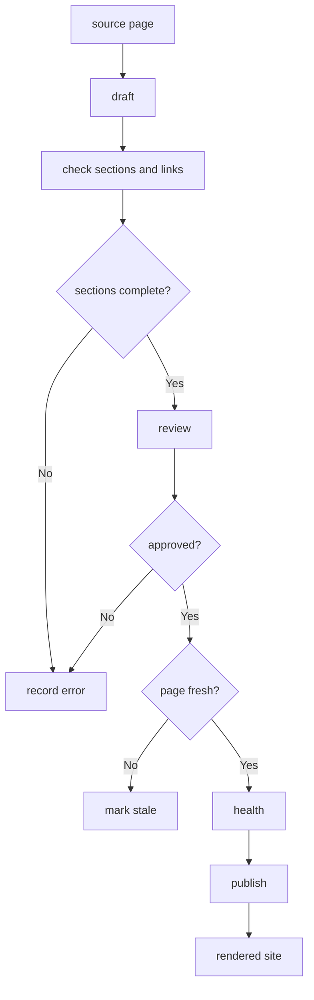

---
# MAM Metadata
id: template-documentation-advanced
name: Documentation Template (Advanced)
version: 2.0.0
type: documentation

author: MAM Team
description: >
  A production documentation module with staleness tracking against the
  module it describes, internal link checking, review sign-off, a health
  report, and a publish gate that refuses stale or broken pages.

license: MIT

runtime:
  language: python
  version: ">=3.12"

tags:
  - template
  - documentation
  - advanced
  - freshness
  - health

dependencies:
  - name: doc-renderer
    version: "^1.0"
  - name: link-checker
    version: "^2.0"

capabilities:
  - outline
  - draft
  - review
  - check
  - health
  - publish

permissions:
  filesystem:
    - read
    - write
  network:
    - internet
  environment:
    - read
---

# Documentation Template (Advanced)

## Purpose

Documentation that stays true. Each page records the module it describes and
the last time that module changed; a page older than its module is stale and
cannot be published. Internal links are checked before render, review
sign-off is required, and a health report names every stale page, broken
link and unsigned change. A publish either produces a complete site or
explains exactly what blocked it.

## Inputs

| Name | Type | Required | Description |
|------|------|----------|-------------|
| source | object | Yes | Page id to markdown body, the source of truth |
| audience | string | Yes | Primary reader the pages are written for |
| owner | string | No | Account charged with page freshness |
| module_versions | object | No | Module id to its last change stamp |
| stale_after_days | number | No | Age at which a page is stale. Defaults to `90` |
| limits | object | No | Overrides for the declared limits |

## Outputs

| Name | Type | Description |
|------|------|-------------|
| outline | array | Section order every page must present |
| pages | array | Page id, owner, reviewer, age and publication state |
| rendered | object | Page id to rendered body, produced only on publish |
| health | object | `ok` flag plus stale pages, broken links and unsigned changes |
| errors | array | Failures from the most recent operation, with their cause |

## Capabilities

### outline

Return the section order every page must present.

### draft

Add a page bound to the module it describes.

### review

Record a reviewer and a verdict for a page.

### check

Report missing sections and broken internal links.

### health

Report whether the documentation set is publishable.

### publish

Render every page that is complete, reviewed, link-clean and fresh.

## Audience

| Audience | Reads for | Expects |
|----------|-----------|---------|
| integrator | The first hour with the module | Install shape, one runnable example |
| maintainer | Changing the module | Rules, limits, ownership |
| reviewer | Approving a change | Rules, integrity checks, evidence |
| user | Debugging a failure | Error shapes, limits, known gaps |

## Structure

| Section | Required | Purpose |
|---------|----------|---------|
| Purpose | Yes | What the module is for, in two sentences |
| Inputs | Yes | What the module consumes |
| Outputs | Yes | What the module produces |
| Usage | Yes | One runnable example |
| Limits | No | The boundaries the module refuses to cross |
| Limitations | No | What the module explicitly does not do |

## Ownership

| Field | Meaning |
|-------|---------|
| owner | Account accountable for accuracy |
| reviewer | Account that approved the last change |
| module | Module id this page describes |
| updated | Day number the page last changed |
| status | `draft`, `reviewed`, `stale` or `published` |

## Freshness

A page is fresh when `now - updated <= stale_after_days` **and** the module it
describes has not changed since the page did. The second condition is the one
that matters: a page can be perfectly recent and still wrong if the module
moved underneath it.

## Limits

| Limit | Value | On breach |
|-------|-------|-----------|
| stale_after_days | 90 | Page is marked `stale` and blocked |
| max_pages | 500 | `DocumentationError`, reason `page limit reached` |
| max_page_bytes | 262144 | `DocumentationError`, page is refused |
| max_link_depth | 1 | Links deeper than this are not followed |

## Rules

- The markdown source is the source of truth; rendered output is disposable.
- A page without all required sections is refused at publish time.
- Publishing requires a reviewer other than the author of the change.
- A stale page is never published, however recently it was edited.
- An internal link that resolves to nothing blocks the page it appears on.
- Every limit is enforced before a page enters the set.
- Every failure is recorded in `errors` with its cause before it is raised.
- A publish is all-or-nothing for the pages it reports as blocked.

## Workflow



## Python

```python
import re

OUTLINE = ("Purpose", "Inputs", "Outputs", "Usage", "Limits", "Limitations")
REQUIRED = ("Purpose", "Inputs", "Outputs", "Usage")
LINK = re.compile(r"\]\((?!https?://)([^)#]+)")

LIMITS = {
    "stale_after_days": 90,
    "max_pages": 500,
    "max_page_bytes": 262144,
    "max_link_depth": 1,
}


class DocumentationError(Exception):
    """Raised when a page violates a declared documentation rule."""


class Documentation:
    """A documentation set with freshness, link checks and a publish gate."""

    def __init__(self, audience="integrator", owner="docs-team",
                 module_versions=None, limits=None, today=1000):
        self.audience = audience
        self.owner = owner
        self.today = today
        self.module_versions = dict(module_versions or {})
        self.limits = dict(LIMITS)
        if limits:
            self.limits.update(limits)
        self.source = {}
        self.pages = {}
        self.rendered = {}
        self.errors = []

    def _fail(self, reason):
        self.errors.append(reason)
        raise DocumentationError(reason)

    def outline(self):
        return list(OUTLINE)

    def draft(self, page_id, body, owner=None, module=None, updated=None):
        if len(self.source) >= self.limits["max_pages"] and page_id not in self.source:
            self._fail("page limit reached")
        if len(body.encode("utf-8")) > self.limits["max_page_bytes"]:
            self._fail(f"page too large: {page_id}")
        self.source[page_id] = body
        self.pages[page_id] = {
            "owner": owner or self.owner,
            "reviewer": None,
            "module": module,
            "updated": self.today if updated is None else updated,
            "status": "draft",
        }
        return self.pages[page_id]

    def review(self, page_id, reviewer, approved=True):
        page = self.pages[page_id]
        page["reviewer"] = reviewer
        page["status"] = "reviewed" if approved else "draft"
        return page

    def missing_sections(self, body):
        return [name for name in REQUIRED if f"## {name}" not in body]

    def broken_links(self, page_id):
        body = self.source[page_id]
        return sorted({t for t in LINK.findall(body) if t not in self.source})

    def check(self, page_id):
        report = {
            "missing_sections": self.missing_sections(self.source[page_id]),
            "broken_links": self.broken_links(page_id),
        }
        report["ok"] = not report["missing_sections"] and not report["broken_links"]
        return report

    def stale(self, page_id):
        page = self.pages[page_id]
        age = self.today - page["updated"]
        if age > self.limits["stale_after_days"]:
            return True
        module_stamp = self.module_versions.get(page["module"])
        return module_stamp is not None and module_stamp > page["updated"]

    def health(self):
        stale = sorted(p for p in self.source if self.stale(p))
        broken = {p: self.broken_links(p) for p in sorted(self.source) if self.broken_links(p)}
        unsigned = sorted(p for p, page in self.pages.items() if page["reviewer"] is None)
        return {
            "ok": not stale and not broken and not unsigned,
            "pages": len(self.source),
            "stale": stale,
            "broken_links": broken,
            "unsigned": unsigned,
            "errors": list(self.errors),
        }

    def publish(self):
        blocked = []
        rendered = {}
        for page_id, body in sorted(self.source.items()):
            report = self.check(page_id)
            if not report["ok"]:
                blocked.append(f"{page_id} incomplete: {report}")
                continue
            if self.pages[page_id]["status"] != "reviewed":
                blocked.append(f"{page_id} not reviewed")
                continue
            if self.stale(page_id):
                self.pages[page_id]["status"] = "stale"
                blocked.append(f"{page_id} is stale")
                continue
            rendered[page_id] = body
        self.rendered = rendered
        return {"published": sorted(rendered), "blocked": blocked}
```

## Tests

### Input

```yaml
audience: maintainer
owner: docs-team
module_versions:
  template-documentation: 900
stale_after_days: 30
```

### Expected

```yaml
health:
  ok: true
  stale: []
```

```python
def _body(with_usage=True):
    text = "## Purpose\nx\n## Inputs\ny\n## Outputs\nz\n"
    return text + ("## Usage\nmam docs\n" if with_usage else "")


def test_check_reports_sections_and_links():
    docs = Documentation(module_versions={"core": 10}, today=100)
    docs.draft("index", _body() + "See [limits](limits).\n")
    docs.draft("limits", _body())

    report = docs.check("index")
    assert report["missing_sections"] == []
    assert report["broken_links"] == []
    assert report["ok"] is True

    docs.draft("orphan", "## Purpose\nx\n## Usage\nmam docs\n[gone](gone)\n")
    assert docs.check("orphan")["ok"] is False


def test_stale_page_blocks_publish():
    # The page is only 20 days old, but the module it describes moved after
    # the page was last edited, so it is stale all the same.
    docs = Documentation(module_versions={"core": 990}, limits={"stale_after_days": 30}, today=1000)
    docs.draft("index", _body(), module="core", updated=980)
    docs.review("index", "reviewer-1", approved=True)

    result = docs.publish()
    assert result["published"] == []
    assert result["blocked"] == ["index is stale"]
    assert docs.pages["index"]["status"] == "stale"
    assert docs.health()["stale"] == ["index"]


def test_limits_and_error_isolation():
    tiny = Documentation(limits={"max_page_bytes": 40}, today=1000)
    try:
        tiny.draft("huge", _body())
    except DocumentationError:
        pass
    else:
        raise AssertionError("expected DocumentationError for an over-large page")
    assert tiny.errors[-1].startswith("page too large")
    assert tiny.source == {}

    docs = Documentation(today=1000)
    docs.draft("index", _body(), updated=1000)
    docs.draft("unsigned", _body(), updated=1000)
    docs.review("index", "reviewer-1", approved=True)

    health = docs.health()
    assert health["unsigned"] == ["unsigned"]
    result = docs.publish()
    assert result["published"] == ["index"]
    assert result["blocked"] == ["unsigned not reviewed"]
```

## Examples

```python
docs = Documentation(
    audience="maintainer",
    owner="docs-team",
    module_versions={"template-documentation": 940},
    today=1000,
)

# Index must stay fresher than the module version it documents, or check() fails.
body = """# Index

## Install
pip install example

## Usage
run the tool
"""

docs.draft("index", body, module="template-documentation", updated=990)
docs.review("index", "reviewer-1")

print(docs.check("index"))
print(docs.health())
print(docs.publish())
```

## References

- MAM Documentation Module Conventions
- MAM Source of Truth Policy
- MAM Page Ownership Rules
- MAM Documentation Freshness Policy
