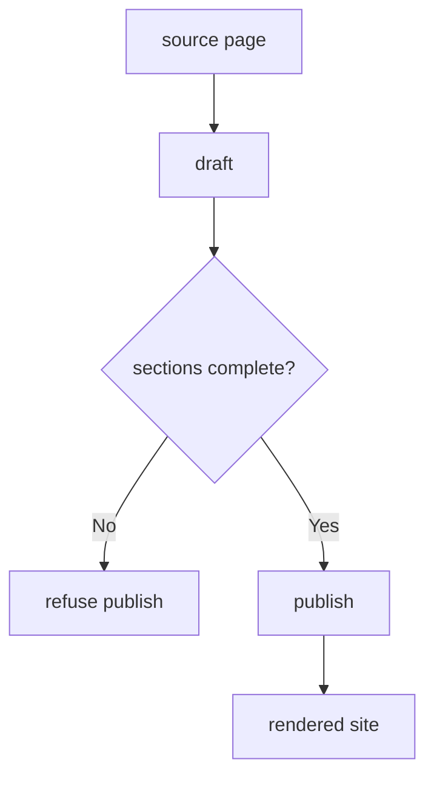

---
# MAM Metadata
id: template-documentation-basic
name: Documentation Template (Basic)
version: 2.0.0
type: documentation

author: MAM Team
description: >
  A small documentation set: one page, a fixed section order, and a publish
  step that renders whatever the source already contains.

license: MIT

runtime:
  language: python
  version: ">=3.12"

tags:
  - template
  - documentation
  - basic

dependencies:
  - name: doc-renderer
    version: "^1.0"

capabilities:
  - outline
  - draft
  - publish

permissions:
  filesystem:
    - read
---

# Documentation Template (Basic)

## Purpose

The smallest documentation module: one audience, one outline, and a publish
step that renders the pages you drafted. Use
[`documentation.mam`](../documentation.mam) when pages need owners and a
review gate, and [`documentation-advanced.mam`](./documentation-advanced.mam)
for freshness tracking, link checking and a health report.

## Inputs

| Name | Type | Required | Description |
|------|------|----------|-------------|
| source | object | Yes | Page id to markdown body, the source of truth |
| audience | string | No | Primary reader. Defaults to `integrator` |

## Outputs

| Name | Type | Description |
|------|------|-------------|
| outline | array | Section order used by the renderer |
| rendered | object | Page id to rendered body |
| status | string | `published` once every page is rendered |

## Capabilities

### outline

Return the section order the renderer lays pages out in.

### draft

Add a page to the source set.

### publish

Render every drafted page.

## Audience

| Audience | Reads for | Expects |
|----------|-----------|---------|
| integrator | The first hour with the module | Purpose, inputs, outputs, one example |

## Structure

| Section | Required | Purpose |
|---------|----------|---------|
| Purpose | Yes | What the module is for |
| Usage | Yes | One runnable example |

## Rules

- The markdown source is the source of truth; rendered output is disposable.
- A page always names an audience.
- Rendered output is never edited by hand.
- The outline is declared once and applies to every page.

## Workflow



## Python

```python
OUTLINE = ("Purpose", "Inputs", "Outputs", "Usage")
REQUIRED = ("Purpose", "Usage")


class Documentation:
    """A documentation set with a fixed outline and a publish step."""

    def __init__(self, audience="integrator"):
        self.audience = audience
        self.source = {}
        self.rendered = {}

    def outline(self):
        return list(OUTLINE)

    def draft(self, page_id, body):
        self.source[page_id] = body
        return page_id

    def missing_sections(self, body):
        return [name for name in REQUIRED if f"## {name}" not in body]

    def publish(self):
        blocked = []
        rendered = {}
        for page_id, body in sorted(self.source.items()):
            missing = self.missing_sections(body)
            if missing:
                blocked.append(f"{page_id} missing {', '.join(missing)}")
                continue
            rendered[page_id] = body
        self.rendered = rendered
        return {"published": sorted(rendered), "blocked": blocked}

    def status(self):
        return "published" if self.rendered else "draft"
```

## Tests

### Input

```yaml
audience: integrator
source:
  getting-started: |
    ## Purpose
    Start here.
    ## Usage
    mam docs
```

### Expected

```yaml
published:
  - getting-started
status: published
```

```python
def test_outline_and_draft():
    docs = Documentation()
    assert docs.outline() == ["Purpose", "Inputs", "Outputs", "Usage"]
    assert docs.draft("getting-started", "## Purpose\nx\n") == "getting-started"
    assert docs.status() == "draft"


def test_publish_requires_purpose_and_usage():
    docs = Documentation()
    body = "## Purpose\nx\n## Usage\nmam docs\n"
    docs.draft("getting-started", body)

    result = docs.publish()
    assert result["published"] == ["getting-started"]
    assert result["blocked"] == []
    assert docs.rendered["getting-started"] == body
    assert docs.status() == "published"

    docs.draft("orphan", "## Inputs\nonly\n")
    blocked = docs.publish()
    assert blocked["published"] == ["getting-started"]
    assert blocked["blocked"] == ["orphan missing Purpose, Usage"]
```

## Examples

```python
docs = Documentation(audience="integrator")
docs.draft("getting-started", "## Purpose\nx\n## Usage\nmam docs\n")
print(docs.outline())
print(docs.publish())
print(docs.status())
```

## References

- MAM Documentation Module Conventions
- MAM Section Layout Rules
