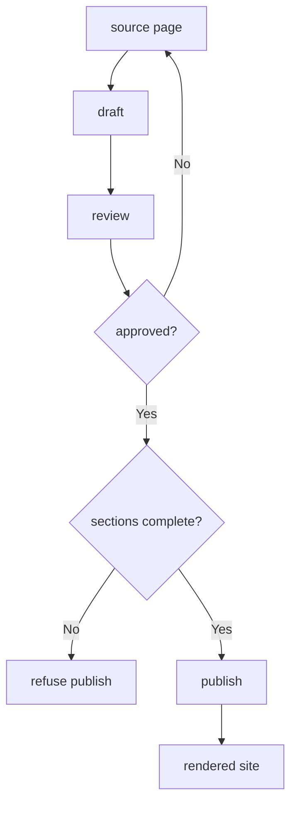

---
# MAM Metadata
id: template-documentation
name: Documentation Template
version: 2.0.0
type: documentation
author: MAM Team
description: >
  Starter template for documentation published as a module: a declared
  audience, a fixed page structure, a named owner per page, and a publish
  gate that refuses unreviewed content.
license: MIT
runtime:
  language: python
  version: ">=3.12"
tags:
  - template
  - documentation
  - publishing
  - ownership
dependencies:
  - name: doc-renderer
    version: "^1.0"
capabilities:
  - outline
  - draft
  - review
  - publish
permissions:
  filesystem:
    - read
  network:
    - internet
  environment:
    - read
---

# Documentation Template

## Purpose

Treat documentation as a deliverable rather than a side effect. This template
declares who the documentation is for, the sections every page must have, who
owns each page, and the gate a page passes before it is published. The
documentation source in this repository stays the truth; the rendered output
is a projection of it.

## Inputs

| Name | Type | Required | Description |
|------|------|----------|-------------|
| source | object | Yes | Page id to markdown body, the source of truth |
| audience | string | Yes | Primary reader the pages are written for |
| owner | string | No | Account charged with page freshness. Defaults to the audience owner |

## Outputs

| Name | Type | Description |
|------|------|-------------|
| outline | array | Section order every page must present |
| pages | array | Page id, owner, reviewer and publication state |
| rendered | object | Page id to rendered body, produced only on publish |
| status | string | `published` when every page passed the gate |

## Capabilities

### outline

Return the section order every page must present.

### draft

Add a page to the source set and mark it unreviewed.

### review

Record a reviewer and a verdict for a page.

### publish

Render every reviewed page and refuse the rest.

## Audience

| Audience | Reads for | Expects |
|----------|-----------|---------|
| integrator | The first hour with the module | Install shape, one runnable example |
| maintainer | Changing the module | Rules, limits, ownership |
| reviewer | Approving a change | Rules, integrity checks, evidence |

## Structure

| Section | Required | Purpose |
|---------|----------|---------|
| Purpose | Yes | What the module is for, in two sentences |
| Inputs | Yes | What the module consumes |
| Outputs | Yes | What the module produces |
| Usage | Yes | One runnable example |
| Limitations | No | What the module explicitly does not do |

## Ownership

| Field | Meaning |
|-------|---------|
| owner | Account accountable for accuracy |
| reviewer | Account that approved the last change |
| updated | Date the page last changed |
| status | `draft`, `reviewed`, or `published` |

## Rules

- The markdown source is the source of truth; rendered output is disposable.
- A page without all required sections is refused at publish time.
- Publishing requires a reviewer other than the author of the change.
- A page always names an owner.
- The outline is declared once and applies to every page.
- Rendered output is never edited by hand.

## Workflow



## Python

```python
OUTLINE = ("Purpose", "Inputs", "Outputs", "Usage", "Limitations")
REQUIRED = ("Purpose", "Inputs", "Outputs", "Usage")


class Documentation:
    """A documentation set with an outline, owners and a publish gate."""

    def __init__(self, audience="integrator", owner="docs-team"):
        self.audience = audience
        self.owner = owner
        self.source = {}
        self.pages = {}
        self.rendered = {}

    def outline(self):
        return list(OUTLINE)

    def missing_sections(self, body):
        found = {name for name in OUTLINE if f"## {name}" in body}
        return [name for name in REQUIRED if name not in found]

    def draft(self, page_id, body, owner=None):
        self.source[page_id] = body
        self.pages[page_id] = {
            "owner": owner or self.owner,
            "reviewer": None,
            "updated": "unsaved",
            "status": "draft",
        }
        return self.pages[page_id]

    def review(self, page_id, reviewer, approved=True):
        page = self.pages[page_id]
        page["reviewer"] = reviewer
        page["status"] = "reviewed" if approved else "draft"
        return page

    def publish(self):
        blocked = []
        rendered = {}
        for page_id, body in sorted(self.source.items()):
            page = self.pages[page_id]
            if page["status"] != "reviewed":
                blocked.append(page_id)
                continue
            missing = self.missing_sections(body)
            if missing:
                blocked.append(f"{page_id} missing {', '.join(missing)}")
                continue
            rendered[page_id] = body
        self.rendered = rendered
        return {"published": sorted(rendered), "blocked": blocked}
```

## Tests

### Input

```yaml
audience: integrator
source:
  getting-started: |
    ## Purpose
    Start here.
    ## Inputs
    A module id.
    ## Outputs
    A published page.
    ## Usage
    mam docs
```

### Expected

```yaml
published:
  - getting-started
blocked: []
```

```python
def test_outline_and_draft():
    docs = Documentation(audience="integrator")
    assert docs.outline()[0] == "Purpose"
    page = docs.draft("getting-started", "## Purpose\nx\n")
    assert page["status"] == "draft"
    assert page["owner"] == "docs-team"


def test_publish_gate():
    docs = Documentation()
    body = "## Purpose\nx\n## Inputs\ny\n## Outputs\nz\n## Usage\nmam docs\n"
    docs.draft("getting-started", body)
    docs.draft("limits", "## Purpose\nx\n")

    blocked = docs.publish()
    assert blocked["published"] == []
    assert len(blocked["blocked"]) == 2

    docs.review("getting-started", "reviewer-1", approved=True)
    docs.review("limits", "reviewer-1", approved=False)
    result = docs.publish()
    assert result["published"] == ["getting-started"]
    assert result["blocked"] == ["limits"]
    assert docs.rendered["getting-started"] == body


def test_missing_required_section_blocks_publish():
    docs = Documentation()
    docs.draft("usage", "## Purpose\nx\n## Usage\nmam docs\n")
    docs.review("usage", "reviewer-1", approved=True)
    result = docs.publish()
    assert result["published"] == []
    assert "usage missing Inputs, Outputs" in result["blocked"][0]
```

## Examples

```python
# A page body must carry every section in the outline, or publish is gated.
body = """# Getting Started

## Install
pip install example

## Usage
run the tool
"""

docs = Documentation(audience="integrator", owner="docs-team")
docs.draft("getting-started", body, owner="alex")
docs.review("getting-started", "reviewer-1")
print(docs.publish())
print(sorted(docs.rendered))
```

## References

- MAM Documentation Module Conventions
- MAM Source of Truth Policy
- MAM Page Ownership Rules
