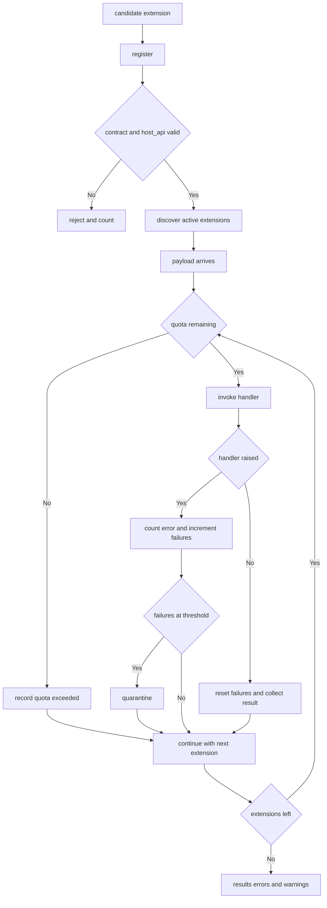

---
# MAM Metadata
id: template-extension-advanced
name: Extension Template (Advanced)
version: 2.0.0
type: extension

author: MAM Team
description: >
  An extension point with host compatibility gating, deterministic ordering,
  per-extension quotas, error quarantine, deprecation warnings and telemetry.

license: MIT

runtime:
  language: python
  version: ">=3.12"

tags:
  - template
  - extension
  - hooks
  - advanced
  - telemetry
  - deprecation

dependencies:
  - name: mam-host
    version: "^2.0"
  - name: telemetry
    version: "^2.0"

capabilities:
  - declare
  - register
  - discover
  - invoke
  - verify
  - quarantine

permissions:
  filesystem:
    - read
  environment:
    - read
  python:
    - sandbox
---

# Extension Template (Advanced)

## Purpose

A production extension point. A host may accept many contributions to one hook,
so the point has to answer harder questions than "does it load": is the
contribution compatible with this host, in what order will it run, what happens
when it fails repeatedly, when will it be withdrawn, and what did it cost last
night. This template adds all five on top of the basic shape.

## Inputs

| Name | Type | Required | Description |
|------|------|----------|-------------|
| extension | object | Yes | A candidate contribution, e.g. `{ "name": "csv-report", "host_api": "2.0.0", "priority": 10 }` |
| hook | string | Yes | Name of the hook being contributed to |
| payload | object | No | Arguments passed to the hook |
| max_calls | number | No | Per-extension invocation quota per host lifetime. Defaults to `1000` |

## Outputs

| Name | Type | Description |
|------|------|-------------|
| accepted | boolean | Whether the contribution satisfies the hook contract |
| reason | string | Why a contribution was rejected, empty when accepted |
| results | array | Values returned by each extension that ran |
| errors | array | Per-extension failures, including quota exhaustion |
| warnings | array | Deprecation notices for extensions that still ran |
| health | object | Registration, quarantine, call and metric counters |

## Capabilities

### declare

Publish the extension point, its cardinality and the host API it targets.

### register

Add a contribution after checking the hook contract and host compatibility.

### discover

Return the contributions available for a hook in stable invocation order.

### invoke

Call each contribution under quota and isolation, collecting results and errors.

### verify

Confirm a contribution still matches the host's major API before it is called.

### quarantine

Stop calling a contribution that has failed repeatedly, without unloading it.

## Extension Point

| Field | Value | Description |
|-------|-------|-------------|
| name | `report.render` | Hook a contribution targets |
| kind | `transform` | Contribution shape: a pure `value -> value` function |
| cardinality | many | How many contributions may register |
| host | example-host | Host system that owns the hook |
| host_api | 2.1.0 | Host API version a contribution must target |
| max_calls | 1000 | Per-extension invocation quota |

## Hook Contract

| Requirement | Rule |
|-------------|------|
| `name` | Unique, matches `[a-z][a-z0-9_-]*` |
| `handler` | Callable taking exactly one argument |
| `priority` | Integer in `[-100, 100]`, default `0` |
| `host_api` | Major version equal to the host's major version |
| `side_effects` | Declared; a `transform` may not declare `write` or `network` |
| `deprecated_in` | Optional; set when the host withdraws the contribution |

The contract is a promise about the *call*, not about the contribution's
internals. The host guarantees the payload shape and never mutates it; the
contribution guarantees to return a value of the same type it was given.

## Discovery

| Source | Order | Description |
|--------|-------|-------------|
| `entry_points` | registration order | Declarations in package metadata |
| `scan` | alphabetical by name | `.mam` modules declaring `extends: example-host` |
| `manual` | explicit | Names pinned in the host configuration |

All sources are merged, then sorted by descending `priority`, then ascending
`name`. Quarantined contributions stay registered but are skipped.

## Host Compatibility

| Host API | Contribution targets | Result |
|----------|----------------------|--------|
| `2.1.0` | `2.0.0` | Accepted, minor behind the host |
| `2.1.0` | `2.9.0` | Accepted, verified at invoke time |
| `2.1.0` | `1.9.0` | Rejected: `host_api` major mismatch |
| `2.1.0` | `3.0.0` | Rejected: newer than the host supports |
| `2.1.0` | unparseable | Rejected: `host_api` is not a semantic version |

## Quotas and Quarantine

| Limit | Value | Behaviour when exceeded |
|-------|-------|-------------------------|
| `max_calls` | 1000 | The extension is skipped and `quota exceeded` is recorded |
| `failure_threshold` | 3 | The extension is quarantined after 3 consecutive failures |
| recovery | automatic | One successful call resets the consecutive failure count |

Quarantine is not unregistration. A quarantined extension keeps its place in
the registry so it can be inspected, fixed and re-enabled without a host restart.

## Deprecation

| Field | Value | Description |
|-------|-------|-------------|
| `deprecated_in` | host API version | The version that withdrew the extension |
| `replacement` | `report.render@3` | What the host tells integrators to use instead |
| behaviour | warn | The extension still runs and emits a warning on every call |
| removal | next MAJOR | The extension is deleted, not left as a stub |

## Observability

| Metric | Type | Meaning |
|--------|------|---------|
| `registered` | counter | Contributions that passed the contract check |
| `rejected` | counter | Contributions refused, with a reason |
| `invoked` | counter | Successful handler calls |
| `errors` | counter | Handler failures and quota exhaustions |
| `quarantined` | gauge | Contributions currently skipped |

## Rules

- A contribution is registered against exactly one named hook.
- A contribution is rejected before it is ever called, never after failing.
- A contribution whose `host_api` major differs from the host's is rejected.
- Invocation order is deterministic and independent of discovery order.
- A contribution that raises does not prevent later contributions from running.
- A contribution over its quota is skipped, not called and then truncated.
- A quarantined contribution is skipped until one call succeeds.
- Unregistering a contribution is always possible and takes effect immediately.
- Telemetry records counts only; handler payloads are never recorded.

## Workflow



## Python

```python
import re

NAME_PATTERN = re.compile(r"^[a-z][a-z0-9_-]*$")
FORBIDDEN_SIDE_EFFECTS = ("write", "network")


def parse_major(version):
    major = str(version).strip().lstrip("v").split(".")[0]
    if not major.isdigit():
        raise ValueError(f"not a semantic version: {version}")
    return int(major)


class Hook:
    def __init__(self, name, kind="transform", cardinality="many",
                 host_api="2.1.0"):
        self.name = name
        self.kind = kind
        self.cardinality = cardinality
        self.host_api = host_api

    def describe(self):
        return {"hook": self.name, "kind": self.kind,
                "cardinality": self.cardinality, "host_api": self.host_api}


class Extension:
    def __init__(self, name, handler, priority=0, host_api="2.1.0",
                 side_effects=None, deprecated_in=None, replacement=None):
        self.name = name
        self.handler = handler
        self.priority = priority
        self.host_api = host_api
        self.side_effects = list(side_effects or [])
        self.deprecated_in = deprecated_in
        self.replacement = replacement
        self.calls = 0
        self.failures = 0
        self.quarantined = False

    @property
    def deprecated(self):
        return self.deprecated_in is not None


class ExtensionPoint:
    def __init__(self, hook, host="example-host", max_calls=1000,
                 failure_threshold=3):
        self.hook = hook
        self.host = host
        self.max_calls = max_calls
        self.failure_threshold = failure_threshold
        self.registered = {}
        self.metrics = {"registered": 0, "rejected": 0, "invoked": 0,
                        "errors": 0, "quarantined": 0}

    def check(self, extension):
        if not NAME_PATTERN.match(extension.name):
            return f"invalid extension name: {extension.name}"
        if not callable(extension.handler):
            return f"extension {extension.name} has no callable handler"
        if not -100 <= extension.priority <= 100:
            return f"priority out of range: {extension.priority}"
        try:
            major = parse_major(extension.host_api)
        except ValueError as error:
            return str(error)
        if major != parse_major(self.hook.host_api):
            return f"host_api major mismatch: {extension.host_api}"
        if self.hook.kind == "transform":
            blocked = [s for s in extension.side_effects
                       if s in FORBIDDEN_SIDE_EFFECTS]
            if blocked:
                return (f"a transform extension may not declare "
                        f"{', '.join(blocked)} side effects")
        return None

    def register(self, extension):
        reason = self.check(extension)
        if reason is not None:
            self.metrics["rejected"] += 1
            return {"accepted": False, "reason": reason}
        if self.hook.cardinality == "one" and self.registered:
            self.metrics["rejected"] += 1
            return {"accepted": False, "reason": "hook already has a contributor"}
        self.registered[extension.name] = extension
        self.metrics["registered"] += 1
        return {"accepted": True, "reason": ""}

    def unregister(self, name):
        return self.registered.pop(name, None) is not None

    def discover(self, include_quarantined=False):
        active = [e for e in self.registered.values()
                  if include_quarantined or not e.quarantined]
        return sorted(active, key=lambda e: (-e.priority, e.name))

    def verify(self, extension):
        """Re-check host compatibility just before the first call."""
        try:
            return parse_major(extension.host_api) == parse_major(self.hook.host_api)
        except ValueError:
            return False

    def invoke(self, payload):
        results, errors, warnings = [], [], []
        for extension in self.discover():
            if not self.verify(extension):
                errors.append({"name": extension.name,
                               "error": "host_api incompatible at invoke time"})
                continue
            if extension.deprecated:
                warnings.append(
                    f"{extension.name} is deprecated, use {extension.replacement}")
            if extension.calls >= self.max_calls:
                self.metrics["errors"] += 1
                errors.append({"name": extension.name, "error": "quota exceeded"})
                continue
            try:
                value = extension.handler(payload)
            except Exception as error:
                extension.failures += 1
                self.metrics["errors"] += 1
                errors.append({"name": extension.name, "error": str(error)})
                if extension.failures >= self.failure_threshold:
                    extension.quarantined = True
                    self.metrics["quarantined"] += 1
                continue
            extension.failures = 0
            extension.calls += 1
            self.metrics["invoked"] += 1
            results.append({"name": extension.name, "value": value,
                            "deprecated": extension.deprecated})
        return {"results": results, "errors": errors, "warnings": warnings}

    def health(self):
        return {
            "hook": self.hook.name,
            "host": self.host,
            "registered": len(self.registered),
            "active": len(self.discover()),
            "quarantined": sum(1 for e in self.registered.values()
                               if e.quarantined),
            "calls": sum(e.calls for e in self.registered.values()),
            "metrics": dict(self.metrics),
        }
```

## Tests

### Input

```yaml
extension:
  name: csv-report
  host_api: 2.0.0
  priority: 10
hook: report.render
payload: quarterly
max_calls: 1
```

### Expected

```yaml
accepted: true
results:
  - name: csv-report
    value: quarterly
    deprecated: false
```

```python
def test_quota_and_quarantine():
    point = ExtensionPoint(Hook("report.render", "transform"),
                           max_calls=1, failure_threshold=2)
    point.register(Extension("ok", lambda p: p, priority=10))
    point.register(Extension("flaky", lambda p: 1 / 0, priority=5))

    first = point.invoke("q")
    assert first["results"] == [
        {"name": "ok", "value": "q", "deprecated": False}
    ]
    assert [e["name"] for e in first["errors"]] == ["flaky"]

    second = point.invoke("q")
    assert [e["error"] for e in second["errors"]] == [
        "quota exceeded", "division by zero"
    ]
    assert [e.name for e in point.discover()] == ["ok"]
    assert [e.name for e in point.discover(include_quarantined=True)] == [
        "ok", "flaky"
    ]
    assert point.health()["quarantined"] == 1


def test_deprecated_extension_still_runs_with_a_warning():
    point = ExtensionPoint(Hook("report.render", "transform"))
    point.register(Extension("legacy", lambda p: p, deprecated_in="2.1.0",
                             replacement="report.render@3"))
    outcome = point.invoke("q")
    assert outcome["results"] == [
        {"name": "legacy", "value": "q", "deprecated": True}
    ]
    assert outcome["warnings"] == [
        "legacy is deprecated, use report.render@3"
    ]
    assert outcome["errors"] == []


def test_host_api_mismatch_is_rejected_before_registration():
    point = ExtensionPoint(Hook("report.render", "transform", host_api="2.1.0"))
    outcome = point.register(Extension("legacy", lambda p: p, host_api="1.4.0"))
    assert outcome["accepted"] is False
    assert outcome["reason"] == "host_api major mismatch: 1.4.0"
    assert point.health()["registered"] == 0
    assert point.health()["metrics"]["rejected"] == 1
```

## Examples

```python
point = ExtensionPoint(Hook("report.render", "transform"), max_calls=10)

point.register(Extension("upper", lambda p: str(p).upper(), priority=20))
point.register(Extension("legacy", lambda p: p, priority=5,
                         deprecated_in="2.1.0", replacement="report.render@3"))
point.register(Extension("noisy", lambda p: 1 / 0, priority=0))

print(point.invoke("quarterly")["results"])
print(point.invoke("quarterly")["warnings"])
print(point.health())
```

## References

- MAM Extension Point Specification
- MAM Host Compatibility Rules
- MAM Extension Quarantine Policy
- [Extension template](./extension.mam)
- [Contract templates](../contract/)
