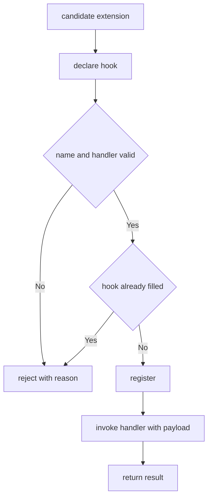

---
# MAM Metadata
id: template-extension-basic
name: Extension Template (Basic)
version: 2.0.0
type: extension

author: MAM Team
description: >
  A single extension point with one hook and no discovery ordering.

license: MIT

runtime:
  language: python
  version: ">=3.12"

tags:
  - template
  - extension
  - hooks
  - basic

capabilities:
  - declare
  - register

permissions:
  filesystem:
    - read
---

# Extension Template (Basic)

## Purpose

The smallest complete extension point: one hook, one contribution shape, and a
single registration path. Use
[`extension.mam`](../extension.mam) when you need priorities, a discovery
order and a host compatibility check, and
[`extension-advanced.mam`](./extension-advanced.mam) for quotas, deprecation
and telemetry.

## Inputs

| Name | Type | Required | Description |
|------|------|----------|-------------|
| extension | object | Yes | A candidate contribution, e.g. `{ "name": "csv-report", "handler": fn }` |
| hook | string | Yes | Name of the hook being contributed to |

## Outputs

| Name | Type | Description |
|------|------|-------------|
| accepted | boolean | Whether the contribution was registered |
| reason | string | Why the contribution was rejected, empty when accepted |

## Capabilities

### declare

Publish the extension point and the shape of what may be added to it.

### register

Add a contribution to the host after checking it against the hook contract.

## Extension Point

| Field | Value | Description |
|-------|-------|-------------|
| name | `report.render` | Hook a contribution targets |
| kind | `transform` | Contribution shape: a pure `value -> value` function |
| cardinality | one | How many contributions may register |
| host | example-host | Host system that owns the hook |

## Hook Contract

A contribution is accepted only when both of the following hold:

| Requirement | Rule |
|-------------|------|
| `name` | Non-empty and unique within the hook |
| `handler` | Callable taking exactly one argument |

The contract is a promise about the *call*: the host supplies the payload, the
contribution returns a value of the same type. Because cardinality is `one`,
registering a second contribution is rejected rather than queued.

## Rules

- A contribution is registered against exactly one named hook.
- A contribution is rejected before it is ever called, never after failing.
- This hook accepts a single contribution; a second one is rejected.
- The host owns the payload; a contribution may not mutate its input in place.
- Unregistering a contribution is always possible and takes effect immediately.

## Workflow



## Python

```python
class Hook:
    def __init__(self, name, kind="transform", cardinality="one"):
        self.name = name
        self.kind = kind
        self.cardinality = cardinality


class Extension:
    def __init__(self, name, handler):
        self.name = name
        self.handler = handler


class ExtensionPoint:
    def __init__(self, hook, host="example-host"):
        self.hook = hook
        self.host = host
        self.registered = None

    def register(self, extension):
        if not extension.name:
            return {"accepted": False, "reason": "extension name is required"}
        if not callable(extension.handler):
            return {"accepted": False,
                    "reason": f"extension {extension.name} has no handler"}
        if self.registered is not None:
            return {"accepted": False,
                    "reason": "hook already has a contributor"}
        self.registered = extension
        return {"accepted": True, "reason": ""}

    def unregister(self, name):
        if self.registered is not None and self.registered.name == name:
            self.registered = None
            return True
        return False

    def invoke(self, payload):
        if self.registered is None:
            return None
        return self.registered.handler(payload)
```

## Tests

### Input

```yaml
extension:
  name: csv-report
hook: report.render
payload:
  report: quarterly
```

### Expected

```yaml
accepted: true
reason: ""
```

```python
def test_register_once():
    point = ExtensionPoint(Hook("report.render"))
    assert point.register(Extension("csv-report", lambda p: p["report"])) == {
        "accepted": True, "reason": ""
    }
    assert point.invoke({"report": "quarterly"}) == "quarterly"

    second = point.register(Extension("pdf-report", lambda p: p))
    assert second["accepted"] is False
    assert second["reason"] == "hook already has a contributor"

    assert point.unregister("csv-report") is True
    assert point.invoke({}) is None


def test_missing_handler_is_rejected():
    point = ExtensionPoint(Hook("report.render"))
    assert point.register(Extension("empty", None))["accepted"] is False
```

## Examples

```python
point = ExtensionPoint(Hook("report.render"))
print(point.register(Extension("csv-report", lambda p: p["report"])))
print(point.invoke({"report": "quarterly"}))
print(point.unregister("csv-report"))
```

## References

- MAM Extension Point Specification
- [Extension template](./extension.mam)
- [Extension template (advanced)](./extension-advanced.mam)
