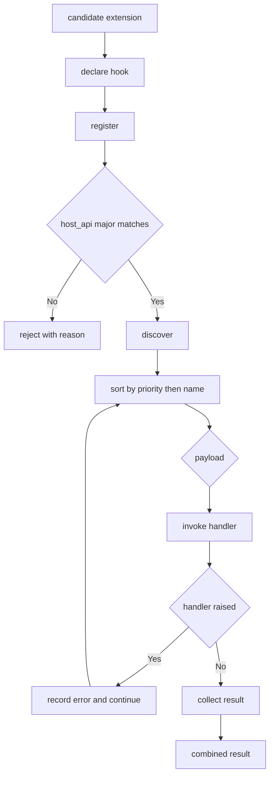

---
# MAM Metadata
id: template-extension
name: Extension Template
version: 2.0.0
type: extension
author: MAM Team
description: >
  Starter template for a domain extension point, declaring what may be added,
  the hook contract it must satisfy, and how a host discovers it.
license: MIT
runtime:
  language: python
  version: ">=3.12"
tags:
  - template
  - extension
  - hooks
  - plugin
dependencies:
  - name: mam-host
    version: "^2.0"
capabilities:
  - declare
  - register
  - discover
  - invoke
permissions:
  filesystem:
    - read
  python:
    - sandbox
---

# Extension Template

## Purpose

Describe a place in a host system where behaviour can be added without editing
the host. The template declares what kind of thing may be contributed, the hook
contract a contribution has to satisfy, and how the host finds contributions and
checks them against its own version.

## Inputs

| Name | Type | Required | Description |
|------|------|----------|-------------|
| extension | object | Yes | A candidate contribution, e.g. `{ "name": "csv-report", "host_api": "2.0.0" }` |
| hook | string | Yes | Name of the hook being contributed to |
| payload | object | No | Arguments passed to the hook |

## Outputs

| Name | Type | Description |
|------|------|-------------|
| accepted | boolean | Whether the contribution satisfies the hook contract |
| result | object | Value returned by the hook, `null` when rejected |
| reason | string | Why a contribution was rejected, empty when accepted |
| order | array | Contributions in the order the host will call them |

## Capabilities

### declare

Publish the extension point and the shape of what may be added to it.

### register

Add a contribution to a host after checking it against the hook contract.

### discover

Find the contributions available for a hook on a host.

### invoke

Call each contribution for a hook in a deterministic order and collect results.

## Extension Point

| Field | Value | Description |
|-------|-------|-------------|
| name | `report.render` | Hook a contribution targets |
| kind | `transform` | Contribution shape: a pure `value -> value` function |
| cardinality | many | How many contributions may register |
| host | example-host | Host system that owns the hook |
| host_api | 2.0.0 | Host API version a contribution must target |

## Hook Contract

A contribution is accepted only when all of the following hold:

| Requirement | Rule |
|-------------|------|
| `name` | Unique, matches `[a-z][a-z0-9_-]*` |
| `handler` | Callable taking exactly one argument |
| `priority` | Integer in `[-100, 100]`, default `0` |
| `host_api` | Major version equal to the host's major version |
| `side_effects` | Declared; a `transform` may not declare `write` |

The contract is a promise about the *call*, not about the contribution's
internals. The host guarantees the payload shape; the contribution guarantees
to return a value of the same type it was given.

## Discovery

| Source | Order | Description |
|--------|-------|-------------|
| `entry_points` | registration order | Declarative registrations in package metadata |
| `scan` | alphabetical by name | `.mam` modules declaring `extends: example-host` |
| `manual` | explicit | Names pinned in the host configuration |

Contributions from all three sources are merged, then sorted by descending
`priority` and ascending `name` so the call order is stable across hosts.

## Compatibility

| Host API | Contribution targets | Result |
|----------|----------------------|--------|
| `2.x` | `2.y.z` | Accepted |
| `2.x` | `1.y.z` | Rejected: `host_api` major mismatch |
| `2.x` | `3.y.z` | Rejected: contribution is not yet supported |
| `2.x` | unparseable | Rejected: `host_api` is not a semantic version |

## Rules

- A contribution is registered against exactly one named hook.
- A contribution is rejected before it is ever called, never after failing.
- A contribution whose `host_api` major differs from the host's is rejected.
- Invocation order is deterministic and independent of discovery order.
- A contribution that raises does not prevent later contributions from running.
- The host owns the payload; a contribution may not mutate its input in place.
- Unregistering a contribution is always possible and takes effect immediately.

## Workflow



## Python

```python
import re

NAME_PATTERN = re.compile(r"^[a-z][a-z0-9_-]*$")
WRITE = "write"


def parse_major(version):
    """Return the major component of a semantic version string."""
    major = str(version).strip().lstrip("v").split(".")[0]
    if not major.isdigit():
        raise ValueError(f"not a semantic version: {version}")
    return int(major)


class Hook:
    def __init__(self, name, kind, cardinality="many", host_api="2.0.0"):
        self.name = name
        self.kind = kind
        self.cardinality = cardinality
        self.host_api = host_api

    def describe(self):
        return {
            "hook": self.name,
            "kind": self.kind,
            "cardinality": self.cardinality,
            "host_api": self.host_api,
        }


class Extension:
    def __init__(self, name, handler, priority=0, host_api="2.0.0",
                 side_effects=None):
        self.name = name
        self.handler = handler
        self.priority = priority
        self.host_api = host_api
        self.side_effects = list(side_effects or [])


class ExtensionPoint:
    def __init__(self, hook, host="example-host"):
        self.hook = hook
        self.host = host
        self.registered = {}
        self.errors = []

    def check(self, extension):
        """Return None when the extension satisfies the hook contract."""
        if not NAME_PATTERN.match(extension.name):
            return f"invalid extension name: {extension.name}"
        if not callable(extension.handler):
            return f"extension {extension.name} has no callable handler"
        if not -100 <= extension.priority <= 100:
            return f"priority out of range: {extension.priority}"
        try:
            major = parse_major(extension.host_api)
        except ValueError as error:
            return str(error)
        if major != parse_major(self.hook.host_api):
            return f"host_api major mismatch: {extension.host_api}"
        if self.hook.kind == "transform" and WRITE in extension.side_effects:
            return "a transform extension may not declare write side effects"
        return None

    def register(self, extension):
        reason = self.check(extension)
        if reason is not None:
            return {"accepted": False, "reason": reason}
        if self.hook.cardinality == "one" and self.registered:
            return {"accepted": False, "reason": "hook already has a contributor"}
        self.registered[extension.name] = extension
        return {"accepted": True, "reason": ""}

    def unregister(self, name):
        return self.registered.pop(name, None) is not None

    def discover(self):
        """Extensions in invocation order: priority descending, then name."""
        return sorted(self.registered.values(),
                      key=lambda e: (-e.priority, e.name))

    def invoke(self, payload):
        results = []
        self.errors = []
        for extension in self.discover():
            try:
                results.append({"name": extension.name,
                                "value": extension.handler(payload)})
            except Exception as error:
                self.errors.append({"name": extension.name, "error": str(error)})
        return results
```

## Tests

### Input

```yaml
extension:
  name: csv-report
  host_api: 2.0.0
  priority: 10
hook: report.render
payload:
  report: quarterly
```

### Expected

```yaml
accepted: true
reason: ""
order:
  - csv-report
```

```python
def test_register_and_invoke():
    point = ExtensionPoint(Hook("report.render", "transform"))
    accepted = point.register(Extension("csv-report", lambda p: p["report"],
                                        priority=10))
    assert accepted == {"accepted": True, "reason": ""}
    assert point.invoke({"report": "quarterly"}) == [
        {"name": "csv-report", "value": "quarterly"}
    ]


def test_host_api_mismatch_is_rejected():
    point = ExtensionPoint(Hook("report.render", "transform", host_api="2.0.0"))
    outcome = point.register(Extension("legacy", lambda p: p, host_api="1.4.0"))
    assert outcome["accepted"] is False
    assert "host_api major mismatch" in outcome["reason"]
    assert point.discover() == []


def test_order_is_deterministic_and_failures_do_not_stop_the_chain():
    point = ExtensionPoint(Hook("report.render", "transform"))
    point.register(Extension("b-low", lambda p: "b", priority=0))
    point.register(Extension("a-high", lambda p: "a", priority=10))
    point.register(Extension("c-boom", lambda p: 1 / 0, priority=5))

    results = point.invoke({})
    assert [r["name"] for r in results] == ["a-high", "b-low"]
    assert [e["name"] for e in point.errors] == ["c-boom"]
```

## Examples

```python
point = ExtensionPoint(Hook("report.render", "transform"))

point.register(Extension("csv-report", lambda p: p, priority=10))
point.register(Extension("upper", lambda p: str(p).upper(), priority=20))

print([e.name for e in point.discover()])            # ['upper', 'csv-report']
print(point.invoke("quarterly"))                      # upper runs first
print(point.register(Extension("bad-write", lambda p: p,
                               side_effects=["write"])))
```

## References

- MAM Extension Point Specification
- MAM Host Compatibility Rules
- [Plugin templates](../plugin/)
- [Contract templates](../contract/)
