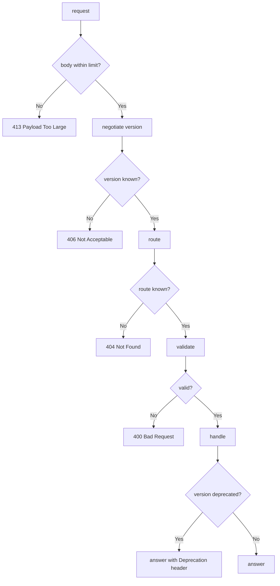

---
# MAM Metadata
id: template-interface-advanced
name: Interface Template (Advanced)
version: 2.0.0
type: interface

author: MAM Team
description: >
  A versioned public contract: content negotiation across supported versions,
  a deprecation window, an explicit compatibility matrix, enforced limits,
  and a health check over the route table.

license: MIT

runtime:
  language: python
  version: ">=3.12"

tags:
  - template
  - interface
  - advanced
  - versioning
  - compatibility

dependencies:
  - name: mam-runtime
    version: ">=1.0.0"
  - name: telemetry
    version: "^2.0"

capabilities:
  - negotiate
  - route
  - validate
  - handle
  - deprecate
  - health

permissions:
  filesystem:
    - read
  network:
    - internet
  environment:
    - read
---

# Interface Template (Advanced)

## Purpose

An interface that other teams depend on has to answer three questions before
anyone writes code against it: which versions exist, what happens when a
version is dropped, and what the interface refuses to do. This template makes
those explicit. Routes are versioned, callers negotiate a version or fall
back to the default, a deprecation window warns before a version is removed,
a compatibility matrix records which version answers for which client, and a
health check reports routes that have drifted out of the contract.

## Inputs

| Name | Type | Required | Description |
|------|------|----------|-------------|
| method | string | Yes | HTTP method such as `GET` or `POST` |
| path | string | Yes | Request path |
| body | object | No | Request payload |
| accept_version | string | No | Version the caller asked for. Defaults to the interface version |
| client_id | string | No | Client identity, used for compatibility reporting |
| limits | object | No | Overrides for the declared limits |

## Outputs

| Name | Type | Description |
|------|------|-------------|
| version | string | Version that answered the request |
| status | int | HTTP response status code |
| body | object | Response payload |
| headers | object | Response headers, including deprecation warnings |
| errors | array | Validation messages, empty when the request is valid |
| health | object | `ok` flag plus contracts that no longer hold |

## Capabilities

### negotiate

Choose the version that answers a request, or explain why none can.

### route

Resolve a versioned request to a registered endpoint.

### validate

Validate the payload against the schema of the negotiated version.

### handle

Run the handler and return a versioned response.

### deprecate

Mark a version as retiring, with a removal date.

### health

Check that every declared contract still resolves to a handler.

## Contract

| Method | Path | Since | Success |
|--------|------|-------|---------|
| GET | /items | 1.0.0 | 200 with the item list |
| POST | /items | 1.0.0 | 200 with the created item |
| DELETE | /items/{id} | 2.0.0 | 200 with an empty body |

## Versioning

The interface version is the highest supported version. A caller may pin a
version with `accept_version`; an unknown version is a 406, not a silent
fallback. A deprecated version keeps answering until its removal date, and
every response from it carries a `Deprecation` header.

## Compatibility

| Client | Pinned version | Answered by | Status |
|--------|----------------|-------------|--------|
| v1 caller | none | latest | supported |
| v1 caller | 1.0.0 | 1.0.0 | supported |
| v1 caller | 2.0.0 | 2.0.0 | supported |
| v1 caller | 3.0.0 | none | 406 |

## Limits

| Limit | Value | On breach |
|-------|-------|-----------|
| max_body_bytes | 1048576 | 413, reason `body too large` |
| max_timeout_seconds | 30 | Request is capped at the limit |
| max_versions | 8 | `InterfaceError`, reason `version limit reached` |
| max_routes | 200 | `InterfaceError`, reason `route limit reached` |

## Rules

- Every route declares a method, an exact path and the version it since.
- A versioned response always reports the version that answered.
- An unrecognised version is refused, never silently upgraded.
- A deprecated version answers until its removal date and always warns.
- Every limit is enforced before a handler runs.
- A handler exception is reported as 500 and never leaks a traceback.
- Health reports every declared contract that no longer resolves.
- Failures are recorded in `errors` with their cause.

## Workflow



## Python

```python
from dataclasses import dataclass, field
from typing import Any, Callable, Dict, List, Optional

LIMITS = {
    "max_body_bytes": 1048576,
    "max_timeout_seconds": 30,
    "max_versions": 8,
    "max_routes": 200,
}


class InterfaceError(Exception):
    """Raised when a declaration violates a declared interface rule."""


@dataclass
class Endpoint:
    method: str
    path: str
    handler: str
    version: str
    schema: Dict[str, Any] = field(default_factory=dict)


@dataclass
class Response:
    status: int
    body: Any
    version: str = "1.0.0"
    headers: Dict[str, str] = field(default_factory=dict)
    errors: List[str] = field(default_factory=list)


class Interface:
    """A versioned public contract with deprecation and a health check."""

    def __init__(self, version="2.0.0", limits=None):
        self.version = version
        self.limits = dict(LIMITS)
        if limits:
            self.limits.update(limits)
        self.endpoints: List[Endpoint] = []
        self.handlers: Dict[str, Callable] = {}
        self.versions = {version}
        self.deprecations: Dict[str, str] = {}
        self.errors: List[str] = []

    def _fail(self, reason):
        self.errors.append(reason)
        raise InterfaceError(reason)

    def declare(self, version):
        if version not in self.versions:
            if len(self.versions) >= self.limits["max_versions"]:
                self._fail("version limit reached")
            self.versions.add(version)
        return version

    def deprecate(self, version, removal_date):
        if version not in self.versions:
            self._fail(f"unknown version: {version}")
        self.deprecations[version] = removal_date
        return self.deprecations[version]

    def route(self, method, path, handler, version="1.0.0", schema=None):
        if len(self.endpoints) >= self.limits["max_routes"]:
            self._fail("route limit reached")
        self.declare(version)
        self.endpoints.append(Endpoint(method, path, handler, version, schema or {}))
        return self

    def bind(self, name, fn):
        self.handlers[name] = fn
        return self

    def negotiate(self, accept_version=None):
        if accept_version is None:
            return self.version
        if accept_version not in self.versions:
            return None
        return accept_version

    def resolve(self, method, path, version):
        for endpoint in self.endpoints:
            if (endpoint.method == method and endpoint.path == path
                    and endpoint.version <= version):
                return endpoint
        return None

    def validate(self, data, schema):
        errors = []
        payload = data or {}
        for name in schema.get("required", []):
            if name not in payload:
                errors.append(f"Missing required field: {name}")
        for name, spec in schema.get("properties", {}).items():
            if name in payload:
                expected = spec.get("type")
                value = payload[name]
                if expected == "string" and not isinstance(value, str):
                    errors.append(f"Field '{name}' must be string")
                elif expected == "integer" and isinstance(value, bool):
                    errors.append(f"Field '{name}' must be integer")
        return errors

    def body_size(self, data):
        return len(repr(data or {}).encode("utf-8"))

    def handle(self, method, path, data=None, accept_version=None, client_id="unknown"):
        if self.body_size(data) > self.limits["max_body_bytes"]:
            return Response(413, {"error": "body too large"}, self.version)

        version = self.negotiate(accept_version)
        if version is None:
            return Response(406, {"error": "unsupported version"}, self.version)

        endpoint = self.resolve(method, path, version)
        if endpoint is None:
            return Response(404, {"error": "Not found"}, version)

        errors = self.validate(data, endpoint.schema)
        if errors:
            return Response(400, {"error": "Invalid request"}, version, errors=errors)

        handler = self.handlers.get(endpoint.handler)
        if handler is None:
            return Response(500, {"error": "Handler not bound"}, version)

        headers = {"X-Interface-Version": version}
        if version in self.deprecations:
            headers["Deprecation"] = self.deprecations[version]

        try:
            return Response(200, handler(data), version, headers)
        except Exception as error:
            self.errors.append(str(error))
            return Response(500, {"error": str(error)}, version)

    def health(self):
        unbound = sorted({e.handler for e in self.endpoints if e.handler not in self.handlers})
        undeclared = sorted({e.version for e in self.endpoints} - self.versions)
        return {
            "ok": not unbound and not undeclared,
            "version": self.version,
            "routes": len(self.endpoints),
            "versions": sorted(self.versions),
            "deprecated": dict(self.deprecations),
            "unbound_handlers": unbound,
            "undeclared_versions": undeclared,
            "errors": list(self.errors),
        }
```

## Tests

### Input

```yaml
method: GET
path: /items
accept_version: 2.0.0
client_id: v1-caller
```

### Expected

```yaml
status: 200
version: 2.0.0
headers:
  X-Interface-version: 2.0.0
  Deprecation: "2026-01-01"
```

```python
def test_negotiation_and_deprecation():
    api = Interface(version="2.0.0")
    api.declare("1.0.0")
    api.bind("list_items", lambda data: {"items": ["widget"]})
    api.route("GET", "/items", "list_items", version="1.0.0")
    api.deprecate("1.0.0", "2026-01-01")

    pinned = api.handle("GET", "/items", accept_version="1.0.0")
    assert pinned.status == 200
    assert pinned.version == "1.0.0"
    assert pinned.headers["Deprecation"] == "2026-01-01"

    latest = api.handle("GET", "/items")
    assert latest.version == "2.0.0"
    assert "Deprecation" not in latest.headers

    refused = api.handle("GET", "/items", accept_version="3.0.0")
    assert refused.status == 406


def test_limits_and_error_isolation():
    api = Interface(limits={"max_body_bytes": 10, "max_routes": 1})
    api.bind("list_items", lambda data: {"items": []})
    api.route("GET", "/items", "list_items")

    try:
        api.route("POST", "/items", "list_items")
    except InterfaceError:
        pass
    else:
        raise AssertionError("expected InterfaceError for the route limit")
    assert len(api.endpoints) == 1

    oversized = api.handle("GET", "/items", data={"items": ["x" * 200]})
    assert oversized.status == 413

    ok = api.handle("GET", "/items", data={})
    assert ok.status == 200
    assert api.errors == ["route limit reached"]


def test_health_reports_unbound_handler():
    api = Interface()
    api.route("GET", "/items", "list_items")
    health = api.health()
    assert health["ok"] is False
    assert health["unbound_handlers"] == ["list_items"]

    api.bind("list_items", lambda data: {"items": []})
    assert api.health()["ok"] is True
```

## Examples

```python
api = Interface(version="2.0.0")
api.declare("1.0.0")
api.deprecate("1.0.0", "2026-01-01")

api.bind("list_items", lambda data: {"items": ["widget"]})
api.route("GET", "/items", "list_items", version="1.0.0")
api.route("DELETE", "/items/{id}", "delete_item", version="2.0.0")

print(api.handle("GET", "/items", accept_version="1.0.0").headers)
print(api.health())
```

## References

- [API Section Spec](../../spec/sections/)
- [Plugin API](../../plugins/api/)
- MAM Interface Versioning Policy
- MAM Deprecation Window Rules
- [CLI API](../../cli/src/)
