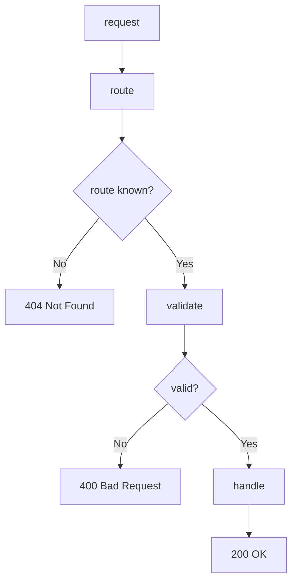

---
# MAM Metadata
id: template-interface-basic
name: Interface Template (Basic)
version: 2.0.0
type: interface

author: MAM Team
description: >
  A minimal public interface: routes, schema validation and a handler result,
  with no middleware, rate limiting or version negotiation.

license: MIT

runtime:
  language: python
  version: ">=3.12"

tags:
  - template
  - interface
  - basic
  - api

dependencies:
  - name: mam-runtime
    version: ">=1.0.0"

capabilities:
  - route
  - validate
  - handle

permissions:
  filesystem:
    - read
  python:
    - sandbox
---

# Interface Template (Basic)

## Purpose

The smallest contract a caller can program against: a route table, a schema
check on the request body, and a handler that returns a structured response.
Use [`interface.mam`](../interface.mam) for the full template with middleware,
rate limits and an agent decomposition, and
[`interface-advanced.mam`](./interface-advanced.mam) for versioned routes,
deprecation and compatibility guarantees.

## Inputs

| Name | Type | Required | Description |
|------|------|----------|-------------|
| method | string | Yes | HTTP method such as `GET` or `POST` |
| path | string | Yes | Request path |
| body | object | No | Request payload |

## Outputs

| Name | Type | Description |
|------|------|-------------|
| status | int | HTTP response status code |
| body | object | Response payload |
| errors | array | Validation messages, empty when the request is valid |

## Capabilities

### route

Resolve an incoming request to a registered endpoint.

### validate

Validate a request body against the endpoint schema.

### handle

Run the handler and return a structured response.

## Contract

| Method | Path | Request schema | Success |
|--------|------|----------------|---------|
| GET | /items | none | 200 with the item list |
| POST | /items | `name` required, string | 201 with the created item |

A caller only needs the table above. Everything else in this template is
implementation.

## Rules

- Every route declares a method and an exact path.
- A schema is optional, but a route without one accepts any body.
- An unknown route returns 404 and never reaches a handler.
- A failed validation returns 400 with the list of messages.
- A handler exception returns 500 with the standard error body.

## Workflow



## Python

```python
from dataclasses import dataclass, field
from typing import Any, Callable, Dict, List, Optional


@dataclass
class Endpoint:
    method: str
    path: str
    handler: str
    schema: Dict[str, Any] = field(default_factory=dict)


@dataclass
class Response:
    status: int
    body: Any
    errors: List[str] = field(default_factory=list)


class Interface:
    """A public contract: routes in, structured responses out."""

    def __init__(self):
        self.endpoints: List[Endpoint] = []
        self.handlers: Dict[str, Callable] = {}

    def route(self, method: str, path: str, handler: str, schema=None):
        self.endpoints.append(Endpoint(method, path, handler, schema or {}))
        return self

    def bind(self, name: str, fn: Callable):
        self.handlers[name] = fn
        return self

    def resolve(self, method: str, path: str) -> Optional[Endpoint]:
        for endpoint in self.endpoints:
            if endpoint.method == method and endpoint.path == path:
                return endpoint
        return None

    def validate(self, data, schema):
        errors = []
        for field in schema.get("required", []):
            if field not in (data or {}):
                errors.append(f"Missing required field: {field}")
        for field, spec in schema.get("properties", {}).items():
            if field in (data or {}):
                expected = spec.get("type")
                value = data[field]
                if expected == "string" and not isinstance(value, str):
                    errors.append(f"Field '{field}' must be string")
                elif expected == "integer" and isinstance(value, bool):
                    errors.append(f"Field '{field}' must be integer")
        return errors

    def handle(self, method: str, path: str, data=None):
        endpoint = self.resolve(method, path)
        if endpoint is None:
            return Response(404, {"error": "Not found"})
        errors = self.validate(data, endpoint.schema)
        if errors:
            return Response(400, {"error": "Invalid request"}, errors)
        handler = self.handlers.get(endpoint.handler)
        if handler is None:
            return Response(500, {"error": "Handler not bound"})
        try:
            return Response(200, handler(data))
        except Exception as error:
            return Response(500, {"error": str(error)})
```

## Tests

### Input

```yaml
method: POST
path: /items
body:
  name: widget
```

### Expected

```yaml
status: 201
body:
  name: widget
```

```python
def test_route_and_handle():
    api = Interface()
    api.bind("create_item", lambda data: data)
    api.route("POST", "/items", "create_item",
              schema={"required": ["name"], "properties": {"name": {"type": "string"}}})

    assert api.resolve("POST", "/items") is not None
    assert api.resolve("GET", "/items") is None

    response = api.handle("POST", "/items", {"name": "widget"})
    assert response.status == 200
    assert response.body == {"name": "widget"}
    assert response.errors == []


def test_unknown_route_and_validation_failure():
    api = Interface()
    response = api.handle("GET", "/missing")
    assert response.status == 404

    api.bind("create_item", lambda data: data)
    api.route("POST", "/items", "create_item", schema={"required": ["name"]})
    response = api.handle("POST", "/items", {})
    assert response.status == 400
    assert response.errors == ["Missing required field: name"]


def test_handler_exception_is_reported():
    def boom(data):
        raise ValueError("handler failed")

    api = Interface()
    api.bind("boom", boom)
    api.route("GET", "/boom", "boom")
    response = api.handle("GET", "/boom")
    assert response.status == 500
    assert response.body == {"error": "handler failed"}
```

## Examples

```python
api = Interface()
api.bind("list_items", lambda data: {"items": ["widget"]})
api.bind("create_item", lambda data: data)

api.route("GET", "/items", "list_items")
api.route("POST", "/items", "create_item",
          schema={"required": ["name"], "properties": {"name": {"type": "string"}}})

print(api.handle("GET", "/items").body)
print(api.handle("POST", "/items", {"name": "widget"}).status)
print(api.handle("POST", "/items", {}).errors)
```

## References

- [API Section Spec](../../spec/sections/)
- MAM Interface Module Conventions
- [CLI API](../../cli/src/)
