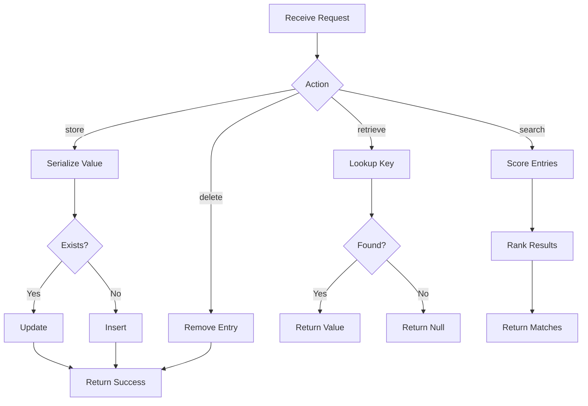

---
# MAM Metadata
id: template-memory
name: Memory Template
version: 1.0.0
type: memory
author: MAM Team
description: >
  Starter template for MAM memory modules. Defines the storage format, the
  backend, the scope, and the time to live behavior for agent memory.

license: MIT

runtime:
  language: python
  version: ">=3.12"

format: vector
backend: sqlite
scope: workspace
ttl: 24h

tags:
  - template
  - memory
  - starter

dependencies:
  - name: mam-state
    version: ">=1.0.0"

capabilities:
  - store
  - retrieve
  - search
  - delete

permissions:
  filesystem:
    - read
    - write
  memory:
    - local
---

# Memory Template

## Purpose

Starter template for a MAM memory module. Memory provides namespaced storage for agents with an explicit format, backend, scope, and time to live. Replace the format, backend, scope, and expiry values to match your deployment.

## Inputs

| Name | Type | Required | Description |
|------|------|----------|-------------|
| action | string | Yes | Operation: store, retrieve, search, delete |
| key | string | No | Entry key for store, retrieve, and delete |
| value | any | No | Value to persist for store |
| query | string | No | Search query for search |
| namespace | string | No | Isolation namespace, defaults to default |

## Outputs

| Name | Type | Description |
|------|------|-------------|
| result | any | Stored value, match list, or boolean |
| success | bool | Whether the operation succeeded |
| error | string | Error message if the operation failed |

## Capabilities

### store

Persist a value under a key within a namespace with an optional expiry.

### retrieve

Fetch a value by key while honoring expiry and namespace isolation.

### search

Rank entries by relevance to a query within a namespace.

### delete

Remove an entry by key from a namespace.

## Rules

- Entries must use a not empty key
- Expired entries are removed when they are read
- Search results are ordered by score from high to low
- Values must be serializable to JSON
- Each namespace is isolated from the others
- Deleted entries cannot be recovered

## Workflow



## Python

```python
import json
import time
from dataclasses import dataclass, field
from typing import Any, Dict, List, Optional


@dataclass
class MemoryEntry:
    key: str
    value: Any
    namespace: str = "default"
    created_at: float = field(default_factory=time.time)
    expires_at: Optional[float] = None


class MemoryStore:
    def __init__(self, max_entries: int = 10000) -> None:
        self._entries: Dict[str, MemoryEntry] = {}
        self.max_entries = max_entries

    def _full_key(self, key: str, namespace: str) -> str:
        return f"{namespace}::{key}"

    def store(self, key: str, value: Any, namespace: str = "default",
              ttl: Optional[int] = None) -> bool:
        if not key:
            raise ValueError("Key must be not empty")
        if len(self._entries) >= self.max_entries:
            raise ValueError("Memory limit reached")
        expires_at = time.time() + ttl if ttl else None
        self._entries[self._full_key(key, namespace)] = MemoryEntry(
            key=key, value=value, namespace=namespace, expires_at=expires_at,
        )
        return True

    def retrieve(self, key: str, namespace: str = "default") -> Optional[Any]:
        full_key = self._full_key(key, namespace)
        entry = self._entries.get(full_key)
        if entry is None:
            return None
        if entry.expires_at and time.time() > entry.expires_at:
            del self._entries[full_key]
            return None
        return entry.value

    def search(self, query: str, namespace: str = "default", top_k: int = 5) -> List[Dict[str, Any]]:
        needle = query.lower()
        matches: List[Dict[str, Any]] = []
        for entry in self._entries.values():
            if entry.namespace != namespace:
                continue
            if entry.expires_at and time.time() > entry.expires_at:
                continue
            text = entry.value if isinstance(entry.value, str) else json.dumps(entry.value)
            text = text.lower()
            if needle in text:
                score = text.count(needle) / max(len(text), 1)
                matches.append({"key": entry.key, "value": entry.value, "score": round(score, 4)})
        matches.sort(key=lambda item: item["score"], reverse=True)
        return matches[:top_k]

    def delete(self, key: str, namespace: str = "default") -> bool:
        full_key = self._full_key(key, namespace)
        if full_key in self._entries:
            del self._entries[full_key]
            return True
        return False
```

## Tests

### Input

```yaml
action: store
key: goal
value: build a parser
namespace: project
```

### Expected

```yaml
success: true
retrieve: build a parser
```

```python
def test_store_and_retrieve():
    mem = MemoryStore()
    mem.store("goal", "build a parser", namespace="project")
    assert mem.retrieve("goal", "project") == "build a parser"


def test_expiry():
    mem = MemoryStore()
    mem.store("temp", "value", ttl=-1)
    assert mem.retrieve("temp") is None


def test_delete():
    mem = MemoryStore()
    mem.store("k", "v")
    assert mem.delete("k") is True
    assert mem.retrieve("k") is None


def test_namespace_isolation():
    mem = MemoryStore()
    mem.store("k", "a", namespace="one")
    mem.store("k", "b", namespace="two")
    assert mem.retrieve("k", "one") == "a"
    assert mem.retrieve("k", "two") == "b"


def test_search():
    mem = MemoryStore()
    mem.store("topic", "machine learning", namespace="ai")
    results = mem.search("learning", "ai")
    assert len(results) == 1
    assert results[0]["key"] == "topic"
```

## Examples

### Basic Usage

```python
mem = MemoryStore()
mem.store("goal", "build a MAM parser", namespace="project")
mem.store("lang", "Python", namespace="project", ttl=3600)

print(mem.retrieve("goal", "project"))
print(mem.search("parser", "project"))
print(mem.delete("lang", "project"))
```

### Expected Flow

```text
Request -> Action -> Store, Retrieve, Search, Delete -> Result
```

## References

- [MAM Memory Specification](../../spec/sections/)
- [Memory Example](../examples/memory.mam.md)
