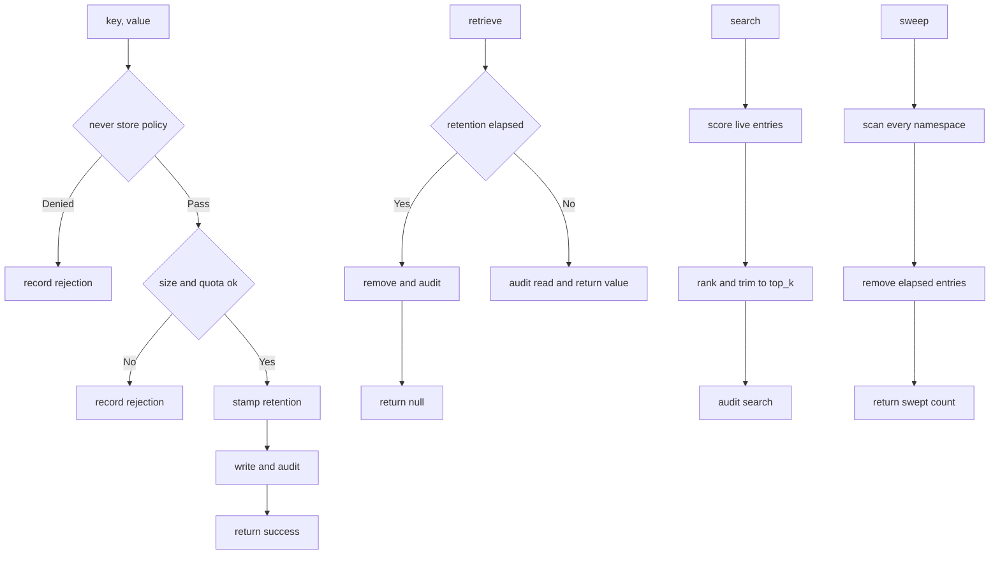

---
# MAM Metadata
id: template-memory-advanced
name: Memory Template (Advanced)
version: 2.0.0
type: memory

author: MAM Team
description: >
  A production memory with ranked search, retention classes, a quota sweeper,
  a never store policy and an audit log of every read and write.

license: MIT

runtime:
  language: python
  version: ">=3.12"

format: vector
backend: sqlite
scope: workspace

tags:
  - template
  - memory
  - advanced
  - retention
  - audit

dependencies:
  - name: mam-state
    version: ">=1.0.0"
  - name: mam-permissions
    version: ">=1.0.0"

capabilities:
  - store
  - retrieve
  - search
  - delete
  - sweep
  - audit

permissions:
  filesystem:
    - read
    - write
  memory:
    - local
---

# Memory Template (Advanced)

## Purpose

A memory that has to survive real traffic. Entries carry a retention class
rather than an ad hoc TTL, the store enforces a quota and a maximum value size,
an explicit never store policy rejects the things that must never be written,
search ranks by relevance, a sweeper reclaims what a read will not touch, and
every operation lands in an audit log so a surprising recall can be explained
afterwards.

## Inputs

| Name | Type | Required | Description |
|------|------|----------|-------------|
| key | string | Yes | Entry key |
| value | any | No | Value to persist. Required for `store` |
| namespace | string | No | Isolation namespace. Defaults to `default` |
| retention | string | No | `ephemeral`, `session` or `durable`. Defaults to `session` |
| query | string | No | Search query. Required for `search` |
| top_k | number | No | Maximum matches returned. Defaults to 5 |

## Outputs

| Name | Type | Description |
|------|------|-------------|
| value | any | From `retrieve`: the stored value, or `null` when absent or expired |
| matches | array | From `search`: `{ key, value, score }` ordered by score |
| success | boolean | Whether the operation completed |
| code | string | Stable code, empty on success |
| swept | number | From `sweep`: entries removed because their retention elapsed |
| entries | array | From `audit`: recent audit records |

## Capabilities

### store

Persist a value with a retention class, enforcing the quota, the value size
limit and the never store policy first.

### retrieve

Read a value by key inside a namespace, dropping it if its retention has
elapsed.

### search

Rank the live entries in a namespace against a query and return the top matches.

### delete

Remove a single entry by key, reporting whether anything was removed.

### sweep

Reclaim every entry whose retention has elapsed, whether or not it is read
again.

### audit

Return the recent record of reads, writes, rejections and removals.

## Storage

| Field | Value | Description |
|-------|-------|-------------|
| format | `vector` | Entries are text scored against a query |
| backend | `sqlite` | Survives a restart |
| scope | `workspace` | Shared by every agent in the workspace |
| key | non-empty string | Fully qualified as `namespace::key` |
| value size | 4096 bytes | Larger values are rejected, not truncated |
| quota | 1000 entries | Per namespace, enforced on write |
| default retention | `session` | The middle class |

## Retention

| Class | Lifetime | Used for |
|-------|----------|----------|
| `ephemeral` | 300 seconds | Scratch state inside one task |
| `session` | 3600 seconds | Working context for the current session |
| `durable` | no expiry | Facts that must survive every session |

Retention is stamped at write time from the class, not from a caller supplied
TTL. A write always resets the clock, so re-storing a key refreshes it.

## Never Store

| Pattern | Reason |
|---------|--------|
| Key or value containing a secret marker | A memory outlives the session that wrote it |
| Values above the size limit | Large blobs do not belong in a recall path |
| Anything in a `denied_namespaces` namespace | The caller has declared it out of scope |

A rejected write is recorded in the audit log with its code, so a caller can
tell a rejection from a silent drop.

## Rules

- A key must be a non-empty string.
- Namespaces are isolated and each one carries its own quota.
- Values must be JSON serializable and under the size limit.
- The never store policy is checked before the quota, and rejection is explicit.
- Expired entries are removed when they are read and by `sweep`.
- Search only ever sees live entries in the requested namespace.
- A purge is not recoverable; the audit log is the only history.
- Every read, write, rejection and removal is appended to the audit log.

## Workflow



## Python

```python
import json
import time
from dataclasses import dataclass, field
from typing import Any, Dict, List, Optional

RETENTION_SECONDS = {"ephemeral": 300, "session": 3600, "durable": None}
DEFAULT_RETENTION = "session"
MAX_VALUE_BYTES = 4096
QUOTA_PER_NAMESPACE = 1000
SECRET_MARKERS = ("password", "api_key", "token", "secret")
DEFAULT_DENIED_NAMESPACES = ("audit-log",)


@dataclass
class MemoryEntry:
    key: str
    value: Any
    namespace: str = "default"
    retention: str = DEFAULT_RETENTION
    expires_at: Optional[float] = None
    created_at: float = field(default_factory=time.time)

    def live(self, now: Optional[float] = None) -> bool:
        if self.expires_at is None:
            return True
        return (now if now is not None else time.time()) <= self.expires_at


class MemoryStore:
    """A retained, quota bound, audited memory with ranked search."""

    def __init__(self, quota: int = QUOTA_PER_NAMESPACE,
                 max_value_bytes: int = MAX_VALUE_BYTES,
                 denied_namespaces: List[str] = None) -> None:
        self._entries: Dict[str, MemoryEntry] = {}
        self.quota = quota
        self.max_value_bytes = max_value_bytes
        self.denied_namespaces = set(denied_namespaces or DEFAULT_DENIED_NAMESPACES)
        self.audit_log: List[Dict[str, Any]] = []

    def _record(self, action: str, key: str, namespace: str, code: str = "") -> None:
        self.audit_log.append({
            "action": action, "key": key, "namespace": namespace,
            "code": code, "at": round(time.time(), 3),
        })

    def _full_key(self, key: str, namespace: str) -> str:
        return f"{namespace}::{key}"

    def _live(self, full_key: str, now: Optional[float] = None) -> bool:
        entry = self._entries.get(full_key)
        if entry is None:
            return False
        if entry.live(now):
            return True
        del self._entries[full_key]
        return False

    def _check(self, key: str, value: Any, namespace: str) -> str:
        """Return a rejection code, or an empty string when the write is allowed."""
        if not isinstance(key, str) or not key:
            return "invalid_key"
        if namespace in self.denied_namespaces:
            return "namespace_denied"
        blob = json.dumps(value)
        if len(blob.encode("utf-8")) > self.max_value_bytes:
            return "value_too_large"
        haystack = f"{key} {blob}".lower()
        if any(marker in haystack for marker in SECRET_MARKERS):
            return "secret_detected"
        full_key = self._full_key(key, namespace)
        if full_key in self._entries:
            return ""                              # an overwrite never grows the namespace
        live = sum(1 for e in self._entries.values() if e.namespace == namespace)
        if live >= self.quota:
            return "quota_exceeded"
        return ""

    def store(self, key: str, value: Any, namespace: str = "default",
              retention: str = DEFAULT_RETENTION) -> Dict[str, Any]:
        if retention not in RETENTION_SECONDS:
            code = self._reject(key, namespace, "invalid_retention")
            return {"success": False, "code": code}
        try:
            code = self._check(key, value, namespace)
        except TypeError:
            code = "invalid_value"
        if code:
            self._reject(key, namespace, code)
            return {"success": False, "code": code}

        ttl = RETENTION_SECONDS[retention]
        self._entries[self._full_key(key, namespace)] = MemoryEntry(
            key=key, value=value, namespace=namespace, retention=retention,
            expires_at=(time.time() + ttl) if ttl else None,
        )
        self._record("store", key, namespace)
        return {"success": True, "code": ""}

    def _reject(self, key: str, namespace: str, code: str) -> str:
        self._record("reject", key, namespace, code)
        return code

    def retrieve(self, key: str, namespace: str = "default") -> Any:
        full_key = self._full_key(key, namespace)
        if not self._live(full_key):
            self._record("expire", key, namespace, "expired")
            return None
        self._record("retrieve", key, namespace)
        return self._entries[full_key].value

    def search(self, query: str, namespace: str = "default",
               top_k: int = 5) -> List[Dict[str, Any]]:
        needle = query.lower()
        now = time.time()
        matches: List[Dict[str, Any]] = []
        for full_key, entry in list(self._entries.items()):
            if entry.namespace != namespace:
                continue
            if not entry.live(now):
                del self._entries[full_key]
                continue
            text = entry.value if isinstance(entry.value, str) else json.dumps(entry.value)
            lowered = text.lower()
            if needle in lowered:
                score = lowered.count(needle) / max(len(lowered), 1)
                matches.append({"key": entry.key, "value": entry.value, "score": round(score, 4)})
        matches.sort(key=lambda item: item["score"], reverse=True)
        matches = matches[:top_k]
        self._record("search", needle, namespace)
        return matches

    def delete(self, key: str, namespace: str = "default") -> Dict[str, Any]:
        full_key = self._full_key(key, namespace)
        removed = self._entries.pop(full_key, None) is not None
        self._record("delete", key, namespace, "" if removed else "not_found")
        return {"success": removed, "code": "" if removed else "not_found"}

    def sweep(self) -> Dict[str, Any]:
        now = time.time()
        expired = [k for k, e in self._entries.items() if not e.live(now)]
        for full_key in expired:
            entry = self._entries.pop(full_key)
            self._record("sweep", entry.key, entry.namespace, "expired")
        return {"swept": len(expired), "code": ""}

    def audit(self, limit: int = 20) -> List[Dict[str, Any]]:
        return list(self.audit_log[-limit:])
```

## Tests

### Input

```yaml
key: goal
value: build a parser
namespace: project
retention: durable
```

### Expected

```yaml
success: true
code: ""
```

```python
def test_durable_entry_survives_reads():
    mem = MemoryStore()
    out = mem.store("goal", "build a parser", "project", retention="durable")
    assert out == {"success": True, "code": ""}
    assert mem.retrieve("goal", "project") == "build a parser"
    assert mem.sweep()["swept"] == 0


def test_ephemeral_entry_expires_and_is_swept():
    mem = MemoryStore()
    mem._entries["project::k"] = MemoryEntry(
        key="k", value="v", namespace="project", retention="ephemeral",
        expires_at=time.time() - 1,
    )
    out = mem.sweep()
    assert out["swept"] == 1
    assert mem.retrieve("k", "project") is None


def test_secrets_are_never_stored():
    mem = MemoryStore()
    out = mem.store("creds", "api_key: hunter2")
    assert out == {"success": False, "code": "secret_detected"}
    assert mem.retrieve("creds") is None


def test_oversized_value_is_rejected_not_truncated():
    mem = MemoryStore(max_value_bytes=32)
    assert mem.store("big", "x" * 200)["code"] == "value_too_large"


def test_denied_namespace_is_rejected():
    mem = MemoryStore()
    assert mem.store("k", "v", "audit-log")["code"] == "namespace_denied"


def test_quota_is_per_namespace():
    mem = MemoryStore(quota=1)
    assert mem.store("a", 1, "one")["success"] is True
    assert mem.store("b", 2, "one")["code"] == "quota_exceeded"
    assert mem.store("b", 2, "two")["success"] is True


def test_overwrite_does_not_consume_quota():
    mem = MemoryStore(quota=1)
    mem.store("a", 1, "ns")
    assert mem.store("a", 2, "ns")["success"] is True


def test_invalid_retention_is_rejected():
    mem = MemoryStore()
    assert mem.store("k", "v", "ns", retention="forever")["code"] == "invalid_retention"


def test_search_ranks_and_trims():
    mem = MemoryStore()
    mem.store("one", "learning is fun", "ai")
    mem.store("two", "learning", "ai")
    mem.store("three", "learning", "other")
    results = mem.search("learning", "ai")
    assert [item["key"] for item in results] == ["two", "one"]
    assert len(mem.search("learning", "ai", top_k=1)) == 1


def test_search_skips_expired_entries():
    mem = MemoryStore()
    mem._entries["ns::gone"] = MemoryEntry(
        key="gone", value="learning", namespace="ns", expires_at=time.time() - 1,
    )
    assert mem.search("learning", "ns") == []


def test_every_operation_is_audited():
    mem = MemoryStore()
    mem.store("k", "v")
    mem.retrieve("k")
    mem.delete("k")
    mem.store("bad", "api_key: x")
    actions = [record["action"] for record in mem.audit()]
    assert actions == ["store", "retrieve", "delete", "reject"]
    assert mem.audit()[-1]["code"] == "secret_detected"
```

## Examples

```python
mem = MemoryStore()
mem.store("goal", "build a MAM parser", "project", retention="durable")
mem.store("scratch", "temporary note", "project", retention="ephemeral")
mem.store("creds", "api_key: hunter2")          # rejected, never stored

print(mem.search("parser", "project"))           # [{'key': 'goal', ...}]
print(mem.sweep()["swept"])                      # 0, nothing has elapsed yet
print(mem.audit(2)[-1]["action"])                # search
```

### Expected Flow

```text
store -> never store policy -> quota -> stamp retention -> write -> audit
```

## References

- [MAM Memory Specification](../../spec/sections/)
- [Memory Template (full)](./memory.mam)
- [MAM Permission Model](../../spec/sections/)
- [MAM Specification](../../plan-doc/full-mam.md)
