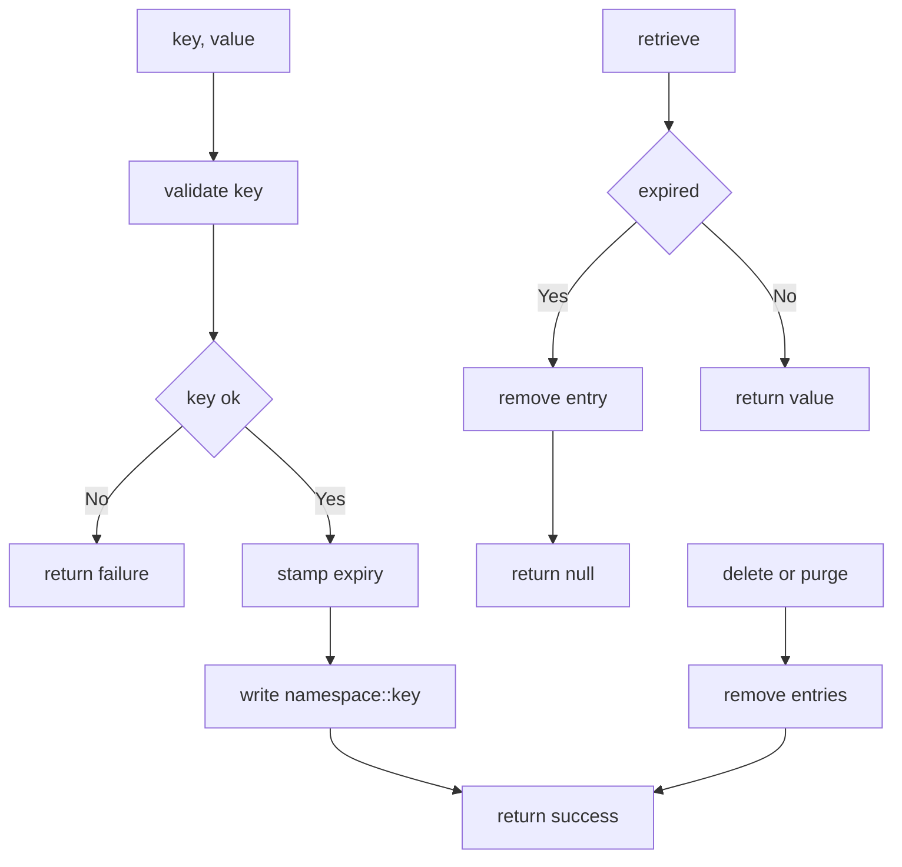

---
# MAM Metadata
id: template-memory-basic
name: Memory Template (Basic)
version: 2.0.0
type: memory

author: MAM Team
description: >
  A namespaced key value memory with an optional per entry time to live and
  exact key lookup. No ranking, no eviction, no backend beyond a process
  local map.

license: MIT

runtime:
  language: python
  version: ">=3.12"

format: keyvalue
backend: memory
scope: workspace

tags:
  - template
  - memory
  - basic
  - keyvalue

capabilities:
  - store
  - retrieve
  - delete
  - purge

permissions:
  filesystem:
    - read
  memory:
    - local
---

# Memory Template (Basic)

## Purpose

The memory an agent needs to remember one thing between two calls. Keys live
in a namespace, values are opaque, and an entry may carry a time to live. There
is no search and no ranking: this template answers "what did I store under this
key" and nothing else. Use [`memory.mam`](../memory.mam) for the full vector
store with search, and [`memory-advanced.mam`](./memory-advanced.mam) for
retention classes, redaction, quotas and audit.

## Inputs

| Name | Type | Required | Description |
|------|------|----------|-------------|
| key | string | Yes | Entry key |
| value | any | No | Value to persist. Required for `store` |
| namespace | string | No | Isolation namespace. Defaults to `default` |
| ttl | number | No | Seconds until the entry expires. Omit for no expiry |

## Outputs

| Name | Type | Description |
|------|------|-------------|
| value | any | From `retrieve`: the stored value, or `null` when absent or expired |
| success | boolean | From `store`, `delete` and `purge`: whether the write happened |
| error | string | From `store` and `delete`: a stable code, empty on success |
| keys | number | From `purge`: how many entries were removed |

## Capabilities

### store

Persist a value under a key within a namespace, replacing any previous value
and resetting the expiry.

### retrieve

Read a value by key, dropping the entry if it has expired.

### delete

Remove a single entry by key, reporting whether anything was removed.

### purge

Remove every entry in a namespace, or one namespace entirely.

## Storage

| Field | Value | Description |
|-------|-------|-------------|
| format | `keyvalue` | Exact key lookup, no embeddings |
| backend | `memory` | Process local, lost on restart |
| scope | `workspace` | Entries outlive a single call, not the process |
| key | non-empty string | Fully qualified as `namespace::key` |
| ttl | optional, seconds | Absolute expiry stamped at write time |
| default namespace | `default` | Used when the caller omits one |

## Expiry

| Case | Behaviour |
|------|-----------|
| Entry stored without a `ttl` | Never expires |
| Entry stored with a `ttl` | Expires `ttl` seconds after the write |
| Expired entry on `retrieve` | Removed and reported as `null` |
| Expired entry on `store` of the same key | Overwritten as a fresh write |

Expiry is checked on read, not on a timer, so an expired entry is only noticed
once something asks for it. That is enough for a workspace scoped memory; use
the advanced template when you need a sweeper.

## Rules

- A key must be a non-empty string.
- Namespaces are isolated: `one::k` and `two::k` are different entries.
- Values must be JSON serializable; anything else is rejected.
- A `store` on an existing key replaces the value and the expiry.
- Expired entries are removed when they are read.
- A purge cannot be undone; the memory does not keep a history.
- This memory never leaves the process it was created in.

## Workflow



## Python

```python
import json
import time
from dataclasses import dataclass
from typing import Any, Dict, List, Optional

DEFAULT_NAMESPACE = "default"


@dataclass
class MemoryEntry:
    key: str
    value: Any
    namespace: str = DEFAULT_NAMESPACE
    expires_at: Optional[float] = None


class MemoryStore:
    """A namespaced key value store with per entry expiry."""

    def __init__(self) -> None:
        self._entries: Dict[str, MemoryEntry] = {}

    def _full_key(self, key: str, namespace: str) -> str:
        return f"{namespace}::{key}"

    def store(self, key: str, value: Any, namespace: str = DEFAULT_NAMESPACE,
              ttl: Optional[float] = None) -> Dict[str, Any]:
        if not isinstance(key, str) or not key:
            return {"success": False, "error": "Key must be a non-empty string"}
        try:
            json.dumps(value)
        except TypeError:
            return {"success": False, "error": "Value must be JSON serializable"}
        expires_at = time.time() + ttl if ttl else None
        self._entries[self._full_key(key, namespace)] = MemoryEntry(
            key=key, value=value, namespace=namespace, expires_at=expires_at,
        )
        return {"success": True, "error": ""}

    def retrieve(self, key: str, namespace: str = DEFAULT_NAMESPACE) -> Any:
        full_key = self._full_key(key, namespace)
        entry = self._entries.get(full_key)
        if entry is None:
            return None
        if entry.expires_at is not None and time.time() > entry.expires_at:
            del self._entries[full_key]
            return None
        return entry.value

    def delete(self, key: str, namespace: str = DEFAULT_NAMESPACE) -> Dict[str, Any]:
        full_key = self._full_key(key, namespace)
        removed = self._entries.pop(full_key, None) is not None
        return {"success": removed, "error": "" if removed else "Key not found"}

    def purge(self, namespace: Optional[str] = None) -> Dict[str, Any]:
        if namespace is None:
            count = len(self._entries)
            self._entries.clear()
        else:
            prefix = f"{namespace}::"
            keys = [k for k in self._entries if k.startswith(prefix)]
            for key in keys:
                del self._entries[key]
            count = len(keys)
        return {"success": True, "keys": count}
```

## Tests

### Input

```yaml
key: goal
value: build a parser
namespace: project
```

### Expected

```yaml
value: build a parser
success: true
```

```python
def test_store_then_retrieve():
    mem = MemoryStore()
    assert mem.store("goal", "build a parser", namespace="project")["success"] is True
    assert mem.retrieve("goal", "project") == "build a parser"


def test_absent_key_returns_none():
    assert MemoryStore().retrieve("missing") is None


def test_empty_key_is_rejected():
    out = MemoryStore().store("", "value")
    assert out["success"] is False
    assert "non-empty" in out["error"]


def test_non_serializable_value_is_rejected():
    assert MemoryStore().store("k", object())["success"] is False


def test_ttl_expiry_is_enforced_on_read():
    mem = MemoryStore()
    mem.store("temp", "value", ttl=-1)
    assert mem.retrieve("temp") is None
    assert "default::temp" not in mem._entries


def test_store_resets_expiry():
    mem = MemoryStore()
    mem.store("k", "first", ttl=-1)
    mem.store("k", "second")
    assert mem.retrieve("k") == "second"


def test_namespaces_are_isolated():
    mem = MemoryStore()
    mem.store("k", "a", namespace="one")
    mem.store("k", "b", namespace="two")
    assert mem.retrieve("k", "one") == "a"
    assert mem.retrieve("k", "two") == "b"


def test_delete_reports_whether_it_removed_anything():
    mem = MemoryStore()
    mem.store("k", "v")
    assert mem.delete("k")["success"] is True
    assert mem.delete("k")["success"] is False


def test_purge_only_clears_the_named_namespace():
    mem = MemoryStore()
    mem.store("k", "a", namespace="one")
    mem.store("k", "b", namespace="two")
    assert mem.purge("one")["keys"] == 1
    assert mem.retrieve("k", "two") == "b"
    assert mem.purge()["keys"] == 1
    assert mem.retrieve("k", "two") is None
```

## Examples

```python
mem = MemoryStore()
mem.store("goal", "build a MAM parser", namespace="project")
mem.store("scratch", "temporary", namespace="project", ttl=60)

print(mem.retrieve("goal", "project"))   # build a MAM parser
print(mem.delete("scratch", "project"))  # {'success': True, 'error': ''}
print(mem.purge("project")["keys"])      # 1
```

### Expected Flow

```text
store -> stamp expiry -> write -> retrieve -> check expiry -> value
```

## References

- [MAM Memory Specification](../../spec/sections/)
- [Memory Template (full)](./memory.mam)
- [MAM Specification](../../plan-doc/full-mam.md)
