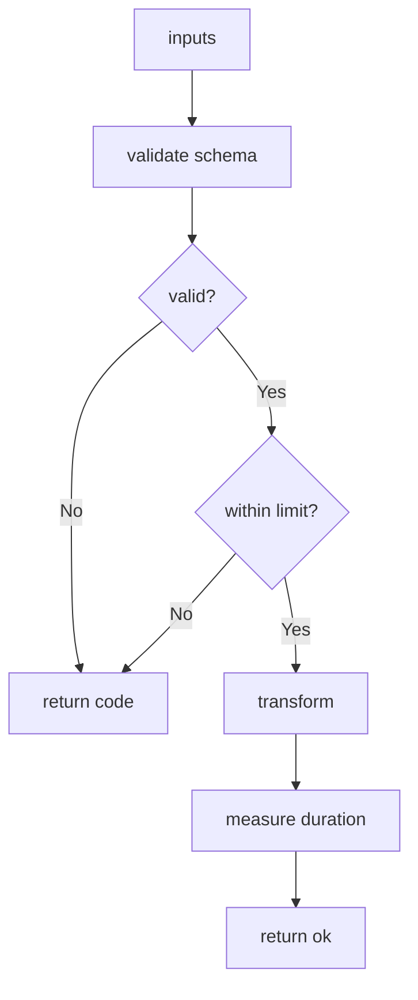

---
# MAM Metadata
id: template-module-advanced
name: Module Template (Advanced)
version: 2.0.0
type: module

author: MAM Team
description: >
  A production module with schema validation, error taxonomy, size limits,
  timing and a structured result envelope.

license: MIT

runtime:
  language: python
  version: ">=3.12"

tags:
  - template
  - module
  - advanced
  - validation
  - observability

dependencies:
  - name: mam-runtime
    version: ">=1.0.0"

capabilities:
  - validate
  - transform
  - limit
  - measure

permissions:
  filesystem:
    - read
---

# Module Template (Advanced)

## Purpose

A module that can survive production. It validates its input against a declared
schema, classifies every failure into a stable error code, enforces a size
limit before doing work, and returns a result envelope that carries timing and
the validation outcome. Use it as the base for any module that will be called
by something other than you.

## Inputs

| Name | Type | Required | Description |
|------|------|----------|-------------|
| text | string | Yes | Value to transform |
| mode | string | No | `trim`, `lower` or `slug`. Defaults to `trim` |
| max_length | number | No | Input size limit. Defaults to 10000 |

## Outputs

| Name | Type | Description |
|------|------|-------------|
| result | string | The transformed value, empty when validation failed |
| status | string | `ok` or `error` |
| code | string | Stable error code, empty on success |
| duration_ms | number | Wall-clock time spent in `run` |
| valid | boolean | Whether validation passed |

## Capabilities

### validate

Check the input against the declared schema and limits.

### transform

Apply the requested mode to the input.

### limit

Reject input larger than `max_length` before any work is done.

### measure

Record how long a run took.

## Rules

- Validation always runs before transformation.
- Every failure carries a stable machine-readable `code`.
- Input larger than `max_length` is rejected without being transformed.
- The module never raises to the caller; failures are returned in the envelope.
- `result` is always a string, even on failure.
- Timing excludes the caller's own overhead.

## Workflow



## Python

```python
import time
from typing import Any, Dict, Tuple

MODES = ("trim", "lower", "slug")


def _validate(text: Any, mode: Any, max_length: Any) -> Tuple[bool, str]:
    if not isinstance(text, str):
        return False, "invalid_type"
    if mode not in MODES:
        return False, "invalid_mode"
    if not isinstance(max_length, int) or max_length < 1:
        return False, "invalid_max_length"
    if len(text) > max_length:
        return False, "input_too_large"
    return True, ""


def _transform(text: str, mode: str) -> str:
    if mode == "lower":
        return text.strip().lower()
    if mode == "slug":
        return "-".join(text.strip().lower().split())
    return text.strip()


def run(text: Any, mode: str = "trim", max_length: int = 10000) -> Dict[str, Any]:
    started = time.perf_counter()

    valid, code = _validate(text, mode, max_length)
    if not valid:
        return {
            "result": "", "status": "error", "code": code,
            "duration_ms": round((time.perf_counter() - started) * 1000, 3),
            "valid": False,
        }

    return {
        "result": _transform(text, mode), "status": "ok", "code": "",
        "duration_ms": round((time.perf_counter() - started) * 1000, 3),
        "valid": True,
    }
```

## Tests

### Input

```yaml
text: "  Hello MAM  "
mode: slug
```

### Expected

```yaml
result: hello-mam
status: ok
valid: true
```

```python
def test_slug_mode():
    out = run("  Hello MAM  ", mode="slug")
    assert out["result"] == "hello-mam"
    assert out["status"] == "ok"
    assert out["valid"] is True


def test_rejects_wrong_type():
    out = run(42)
    assert out["code"] == "invalid_type"
    assert out["valid"] is False


def test_rejects_unknown_mode():
    assert run("x", mode="shout")["code"] == "invalid_mode"


def test_rejects_oversized_input():
    out = run("a" * 50, max_length=10)
    assert out["code"] == "input_too_large"
    assert out["result"] == ""


def test_always_returns_a_string_result():
    for bad in (None, 1, [], {}):
        assert isinstance(run(bad)["result"], str)


def test_reports_duration():
    assert run("x")["duration_ms"] >= 0
```

## Examples

```python
print(run("  Hello MAM  ", mode="slug"))
# {'result': 'hello-mam', 'status': 'ok', 'code': '', 'duration_ms': 0.02, 'valid': True}

print(run(42))
# {'result': '', 'status': 'error', 'code': 'invalid_type', 'duration_ms': 0.01, 'valid': False}
```

### Expected Flow

```text
validate -> limit -> transform -> measure -> envelope
```

## References

- [MAM Specification](../../plan-doc/full-mam.md)
