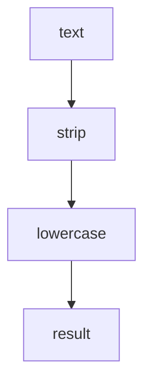

---
# MAM Metadata
id: template-module-basic
name: Module Template (Basic)
version: 2.0.0
type: module

author: MAM Team
description: >
  A single-function module that transforms one input into one output.

license: MIT

runtime:
  language: python
  version: ">=3.12"

tags:
  - template
  - module
  - basic
  - starter

capabilities:
  - transform

permissions:
  filesystem:
    - read
---

# Module Template (Basic)

## Purpose

The smallest module worth shipping: one input, one transform, one output, no
state and no I/O. Use [`module.mam`](../module.mam) when you need the full
section set with validation and status reporting, and
[`module-advanced.mam`](./module-advanced.mam) for error handling, limits and
observability.

## Inputs

| Name | Type | Required | Description |
|------|------|----------|-------------|
| text | string | Yes | Value to transform |

## Outputs

| Name | Type | Description |
|------|------|-------------|
| result | string | The transformed value |

## Capabilities

### transform

Normalize and return the input value.

## Rules

- The module is pure: the same input always produces the same output.
- No file, network or environment access.
- The output is always a string.
- Missing or empty input is not an error; it normalizes to an empty string.

## Workflow



## Python

```python
def transform(text: str) -> str:
    """Normalize a single value."""
    if not isinstance(text, str):
        raise TypeError("text must be a string")
    return text.strip().lower()


def run(text: str) -> dict:
    return {"result": transform(text)}
```

## Tests

### Input

```yaml
text: "  Hello MAM  "
```

### Expected

```yaml
result: hello mam
```

```python
def test_transform_strips_and_lowercases():
    assert run("  Hello MAM  ")["result"] == "hello mam"


def test_transform_is_idempotent():
    once = transform("Value")
    assert transform(once) == once
```

## Examples

```python
print(run("  Hello MAM  "))   # {'result': 'hello mam'}
```

### Expected Flow

```text
text -> strip -> lowercase -> result
```

## References

- [MAM Specification](../../plan-doc/full-mam.md)
