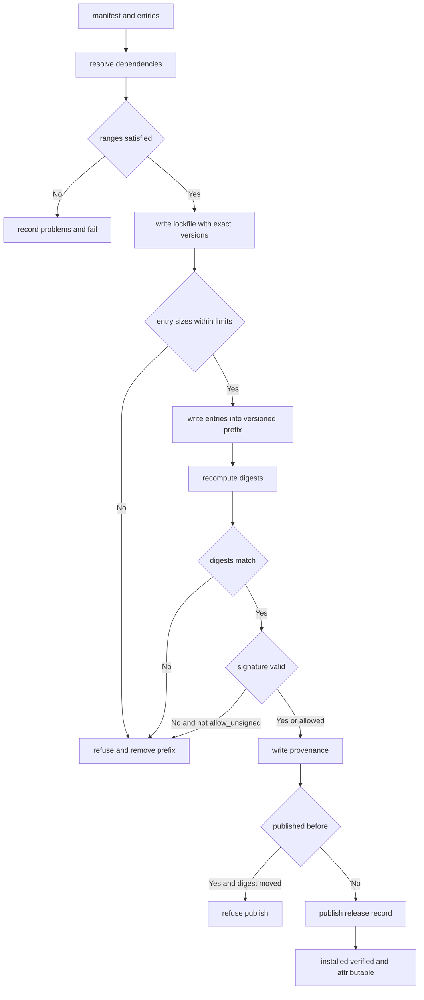

---
# MAM Metadata
id: template-package-advanced
name: Package Template (Advanced)
version: 2.0.0
type: package

author: MAM Team
description: >
  A reproducible distributable unit with a lockfile, per-entry digests, a
  detached signature, provenance metadata and install size ceilings.

license: MIT

runtime:
  language: python
  version: ">=3.12"

tags:
  - template
  - package
  - distribution
  - advanced
  - integrity
  - provenance

dependencies:
  - name: resolver
    version: "^1.0"
  - name: signing
    version: "^1.0"
  - name: telemetry
    version: "^2.0"

capabilities:
  - manifest
  - resolve
  - lock
  - install
  - verify
  - attest
  - publish

permissions:
  filesystem:
    - read
    - write
  network:
    - registry
  environment:
    - read
---

# Package Template (Advanced)

## Purpose

A package you can hand to someone else and prove where it came from. Beyond the
full template it resolves dependencies into a lockfile that pins exact
versions, records a digest, a size and a signature for every entry, records
provenance describing who built it and from which commit, and refuses to
install anything that breaks a size ceiling or fails a signature check.

## Inputs

| Name | Type | Required | Description |
|------|------|----------|-------------|
| manifest | object | Yes | Package metadata, e.g. `{ "name": "orders", "version": "3.0.0" }` |
| entries | array | Yes | Files that make up the package |
| available | object | No | Dependency name to resolved version, e.g. `{ "resolver": "1.4.0" }` |
| signature | string | No | Detached signature over the manifest digest |
| signing_key | string | No | Public key used to verify the signature |
| target | string | No | Install prefix. Defaults to `./dist` |

## Outputs

| Name | Type | Description |
|------|------|-------------|
| name | string | Package name |
| version | string | Resolved package version |
| installed | array | Paths written under the install prefix |
| resolved | array | Exact versions the lockfile pinned |
| problems | array | Unsatisfied or skipped dependencies |
| verified | boolean | Whether every entry, digest and signature matched |
| provenance | object | Build identity recorded with the release |

## Capabilities

### manifest

Declare the package's identity, entries, ranges and size ceilings.

### resolve

Pin every required dependency to an exact version and record skipped optionals.

### lock

Write the resolved set as a lockfile that a consumer can replay offline.

### install

Write the package's entries and lockfile under the versioned install prefix.

### verify

Recompute each digest and check the detached signature over the manifest.

### attest

Bind the release to its provenance and refuse an unsigned or moved build.

### publish

Record what was released, from where, and under which manifest digest.

## Contents

| Entry | Kind | Required | Description |
|-------|------|----------|-------------|
| `orders.mam` | module | Yes | The primary module |
| `orders.mam.md` | module | Yes | Byte-identical twin of `orders.mam` |
| `orders-basic.mam` | module | No | A reduced variant |
| `README.md` | documentation | Yes | Human-facing description of the unit |

Every entry is listed in the manifest with a digest and a size. A file that
ships but is not listed is a packaging error; a listed file that is missing or
whose size differs is an install error.

## Dependency Ranges

| Dependency | Range | Kind | Reason |
|------------|-------|------|--------|
| `resolver` | `^1.0` | required | Resolves ranges and writes the lockfile |
| `mam-runtime` | `>=2.0.0 <3.0.0` | required | Executes the modules in the package |
| `signing` | `^1.0` | required | Signs and verifies the manifest digest |
| `telemetry` | `^2.0` | optional | Only needed by the advanced variant |

A required dependency outside its range fails the install. An optional
dependency outside its range is recorded in `problems` as `skipped` and the
install continues.

## Layout

```
dist/orders/3.0.0/
  manifest.json
  lock.json
  provenance.json
  orders.mam
  orders.mam.md
  README.md
```

| Rule | Value |
|------|-------|
| prefix | `./dist/<name>/<version>` |
| manifest | `manifest.json` at the package root |
| lockfile | `lock.json`, written on every install |
| provenance | `provenance.json`, written once per release |
| twins | every `.mam` ships with a byte-identical `.mam.md` |
| outside the prefix | nothing is written |

The version directory is part of the path so two versions coexist and a
consumer can be rolled back by pointing at the older directory.

## Integrity

| Field | Algorithm | Purpose |
|-------|-----------|---------|
| `digest` | `sha256` | Digest of each entry's bytes |
| `size` | bytes | Exact size of each entry, checked before write |
| `manifest_digest` | `sha256` | Digest of the serialised manifest |
| `signature` | detached | Signature over `manifest_digest` |
| `key` | ed25519 public | Key the signature is verified against |

Verification order is fixed: sizes, then digests, then signature. The first
failure stops the install and the partially written prefix is removed, so a
consumer never sees a partly trusted package.

## Provenance

| Field | Value | Description |
|-------|-------|-------------|
| `builder` | `ci@example.com` | Identity that produced the release |
| `commit` | git SHA | Source revision the build came from |
| `built_at` | ISO 8601 | When the build ran |
| `source` | repository URL | Where the build read its inputs from |
| `manifest_digest` | sha256 | Binds provenance to exactly these bytes |

Provenance is written once. A release whose manifest digest no longer matches
its provenance record is not publishable, which is what stops a moved build from
reusing an old attestation.

## Size Limits

| Limit | Default | Behaviour when exceeded |
|-------|---------|-------------------------|
| `max_entry_bytes` | 5242880 | That entry is refused; install fails |
| `max_package_bytes` | 20971520 | The whole install is refused |
| `max_entries` | 256 | A manifest with more entries is refused |

## Rules

- Every file that ships is listed in the manifest with a digest and a size.
- Every `.mam` ships with a byte-identical `.mam.md` twin.
- A required dependency outside its range fails the install.
- An optional dependency outside its range is recorded, not fatal.
- The lockfile pins exact versions so an install can be replayed offline.
- Verification order is sizes, then digests, then signature.
- One failure removes the prefix; a partial install is never left behind.
- An unsigned release is installable only with an explicit `allow_unsigned`.
- Provenance is written once and never rewritten for the same version.
- Nothing is written outside the versioned install prefix.

## Workflow



## Python

```python
import hashlib
import json
import os
import shutil

CARET = "^"

DEFAULT_LIMITS = {
    "max_entry_bytes": 5242880,
    "max_package_bytes": 20971520,
    "max_entries": 256,
}


def parse_version(text, components=3):
    parts = str(text).strip().lstrip("v").split(".")
    if len(parts) != components:
        raise ValueError(f"expected {components} version components: {text}")
    try:
        return tuple(int(part) for part in parts)
    except ValueError as error:
        raise ValueError(f"non-numeric version: {text}") from error


def format_version(version):
    return ".".join(str(part) for part in version)


def compare(target, operator, bound):
    return {">=": target >= bound, "<=": target <= bound, "==": target == bound,
            ">": target > bound, "<": target < bound}[operator]


def in_range(version, spec):
    target = parse_version(version)
    spec = str(spec).strip()
    if spec.startswith(CARET):
        base = parse_version(spec[1:], 2)
        if base[0] != 0:
            upper = (base[0] + 1, 0, 0)
        elif base[1] != 0:
            upper = (0, base[1] + 1, 0)
        else:
            upper = (0, 0, base[2] + 1)
        return base <= target < upper
    for clause in spec.replace(",", " ").split():
        for operator in (">=", "<=", "==", ">", "<"):
            if clause.startswith(operator):
                bound = parse_version(clause[len(operator):])
                if not compare(target, operator, bound):
                    return False
                break
    return True


def digest_of(payload):
    """Return the hex sha256 digest of a payload's bytes."""
    if isinstance(payload, str):
        payload = payload.encode("utf-8")
    return hashlib.sha256(payload).hexdigest()


class Package:
    def __init__(self, name, version, entries, dependencies=None,
                 provenance=None, target="./dist", limits=None,
                 allow_unsigned=False):
        self.name = name
        self.version = parse_version(version)
        self.entries = list(entries)
        self.dependencies = list(dependencies or [])
        self.provenance = dict(provenance or {})
        self.target = target
        self.limits = dict(DEFAULT_LIMITS)
        self.limits.update(limits or {})
        self.allow_unsigned = allow_unsigned
        self.prefix = f"{target}/{name}/{format_version(self.version)}"
        self.resolved = {}
        self.verified = False
        self.published = {}

    def manifest(self):
        return {
            "name": self.name,
            "version": format_version(self.version),
            "entries": [{"name": entry, "size": len(entry.encode("utf-8")),
                         "digest": digest_of(entry)} for entry in self.entries],
            "dependencies": self.dependencies,
            "limits": dict(self.limits),
            "manifest_digest": self.manifest_digest(),
        }

    def manifest_digest(self):
        body = json.dumps({"name": self.name,
                           "version": format_version(self.version),
                           "entries": sorted(self.entries)}, sort_keys=True)
        return digest_of(body)

    def resolve(self, available):
        """Pin exact versions; return the problems that make install fail."""
        problems = []
        self.resolved = {}
        if len(self.entries) > self.limits["max_entries"]:
            problems.append(f"too many entries: {len(self.entries)}")
        for entry in self.entries:
            size = len(entry.encode("utf-8"))
            if size > self.limits["max_entry_bytes"]:
                problems.append(f"entry too large: {entry}")
        if sum(len(e.encode("utf-8")) for e in self.entries) > \
                self.limits["max_package_bytes"]:
            problems.append("package exceeds max_package_bytes")
        for dependency in self.dependencies:
            name = dependency["name"]
            optional = dependency.get("optional", False)
            have = available.get(name)
            if have is None:
                if not optional:
                    problems.append(f"missing: {name}")
                continue
            if not in_range(have, dependency["range"]):
                message = f"{name} {have} outside {dependency['range']}"
                problems.append("skipped: " + message if optional else message)
                continue
            self.resolved[name] = have
        return problems

    def write_lockfile(self):
        path = os.path.join(self.prefix, "lock.json")
        with open(path, "w", encoding="utf-8") as handle:
            json.dump({"name": self.name,
                       "version": format_version(self.version),
                       "resolved": self.resolved}, handle, indent=2, sort_keys=True)
        return path

    def write_provenance(self):
        record = dict(self.provenance)
        record["manifest_digest"] = self.manifest_digest()
        path = os.path.join(self.prefix, "provenance.json")
        with open(path, "w", encoding="utf-8") as handle:
            json.dump(record, handle, indent=2, sort_keys=True)
        return record

    def verify(self, signature=None, signing_key=None):
        """Sizes, then digests, then signature — the first failure stops."""
        for index, entry in enumerate(self.entries):
            path = os.path.join(self.prefix, f"entry-{index}")
            if not os.path.exists(path):
                return False
            with open(path, "rb") as handle:
                payload = handle.read()
            if len(payload) != len(entry.encode("utf-8")):
                return False
            if digest_of(payload) != digest_of(entry):
                return False
        if signature is None:
            return bool(self.allow_unsigned)
        return signature == digest_of(self.manifest_digest() + str(signing_key))

    def install(self, available=None, signature=None, signing_key=None):
        problems = self.resolve(available or {})
        if problems:
            return {"installed": [], "verified": False, "problems": problems,
                    "resolved": dict(self.resolved)}
        os.makedirs(self.prefix, exist_ok=True)
        for index, entry in enumerate(self.entries):
            with open(os.path.join(self.prefix, f"entry-{index}"), "wb") as handle:
                handle.write(entry.encode("utf-8"))
        self.write_lockfile()
        self.verified = self.verify(signature, signing_key)
        if not self.verified:
            shutil.rmtree(self.prefix, ignore_errors=True)
            return {"installed": [], "verified": False,
                    "problems": ["verification failed"],
                    "resolved": dict(self.resolved)}
        self.published = self.write_provenance()
        return {
            "installed": sorted(os.listdir(self.prefix)),
            "verified": True,
            "problems": [],
            "resolved": dict(self.resolved),
            "provenance": self.published,
        }

    def publish(self, signature=None, signing_key=None):
        """Record the release, refusing a release whose bytes have moved."""
        digest = self.manifest_digest()
        if self.published and self.published.get("manifest_digest") != digest:
            return {"published": False, "reason": "manifest digest moved"}
        self.published = dict(self.provenance, manifest_digest=digest)
        self.published["signature"] = signature
        self.published["verified"] = self.verify(signature, signing_key)
        return {"published": True, "reason": "",
                "manifest_digest": digest}
```

## Tests

### Input

```yaml
manifest:
  name: orders
  version: 3.0.0
  entries:
    - orders.mam
    - README.md
available:
  resolver: 1.4.0
  mam-runtime: 2.5.0
  signing: 1.1.0
```

### Expected

```yaml
verified: true
problems: []
resolved:
  resolver: 1.4.0
  mam-runtime: 2.5.0
  signing: 1.1.0
```

```python
import tempfile

DEPENDENCIES = [
    {"name": "resolver", "range": "^1.0"},
    {"name": "mam-runtime", "range": ">=2.0.0 <3.0.0"},
    {"name": "signing", "range": "^1.0"},
]

AVAILABLE = {"resolver": "1.4.0", "mam-runtime": "2.5.0", "signing": "1.1.0"}


def make_package(target, entries=("orders.mam", "README.md"), **kwargs):
    return Package("orders", "3.0.0", list(entries), DEPENDENCIES,
                   target=target, **kwargs)


def test_locked_install_is_verified():
    package = make_package(tempfile.mkdtemp(), allow_unsigned=True,
                           provenance={"builder": "ci@example.com",
                                       "commit": "0f1e2d3"})
    report = package.install(AVAILABLE)
    assert report["verified"] is True
    assert report["problems"] == []
    assert report["resolved"] == AVAILABLE
    assert "entry-0" in report["installed"]
    assert "lock.json" in report["installed"]
    assert report["provenance"]["commit"] == "0f1e2d3"


def test_size_ceiling_refuses_the_entry():
    package = make_package(tempfile.mkdtemp(), entries=("orders.mam",),
                           limits={"max_entry_bytes": 4})
    report = package.install(AVAILABLE)
    assert report["verified"] is False
    assert report["problems"] == ["entry too large: orders.mam"]
    assert report["installed"] == []


def test_unsigned_release_needs_an_explicit_opt_in():
    package = make_package(tempfile.mkdtemp())
    report = package.install(AVAILABLE)
    assert report["verified"] is False
    assert report["problems"] == ["verification failed"]


def test_publish_refuses_a_moved_build():
    package = make_package(tempfile.mkdtemp(),
                           provenance={"builder": "ci@example.com"})
    assert package.publish()["published"] is True
    package.entries.append("orders.mam.md")
    moved = package.publish()
    assert moved["published"] is False
    assert moved["reason"] == "manifest digest moved"
```

## Examples

```python
package = Package("orders", "3.0.0", ["orders.mam", "README.md"],
                  DEPENDENCIES,
                  provenance={"builder": "ci@example.com",
                              "commit": "0f1e2d3", "built_at": "2026-01-01"},
                  target="./dist")

signature = digest_of(package.manifest_digest() + "ed25519:public")
report = package.install(AVAILABLE, signature=signature, signing_key="ed25519:public")
print(report["verified"], report["resolved"])
print(package.publish(signature, "ed25519:public"))
print(sorted(os.listdir(package.prefix)))
```

## References

- MAM Package Format
- MAM Dependency Range Syntax
- MAM Integrity Verification
- MAM Provenance and Attestation
- [Package template](./package.mam)
- [Repository templates](../repository/)
