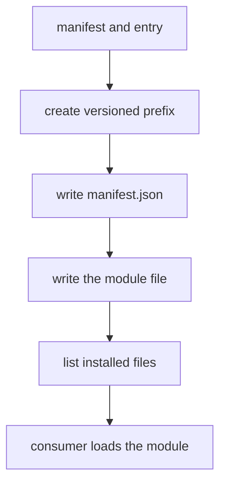

---
# MAM Metadata
id: template-package-basic
name: Package Template (Basic)
version: 2.0.0
type: package

author: MAM Team
description: >
  A single-module distributable unit with a manifest and a fixed install path.

license: MIT

runtime:
  language: python
  version: ">=3.12"

tags:
  - template
  - package
  - distribution
  - basic

capabilities:
  - manifest
  - install

permissions:
  filesystem:
    - read
    - write
---

# Package Template (Basic)

## Purpose

The smallest distributable unit: one module, one manifest, one install
directory. Use [`package.mam`](../package.mam) when you need dependency ranges
and digest verification, and
[`package-advanced.mam`](./package-advanced.mam) for a lockfile, signatures,
provenance and size ceilings.

## Inputs

| Name | Type | Required | Description |
|------|------|----------|-------------|
| manifest | object | Yes | Package metadata, e.g. `{ "name": "orders", "version": "1.0.0" }` |
| entry | string | Yes | The single module file that ships |
| target | string | No | Install prefix. Defaults to `./dist/<name>` |

## Outputs

| Name | Type | Description |
|------|------|-------------|
| name | string | Package name |
| version | string | Package version |
| prefix | string | Directory the package was installed to |
| installed | array | Files written under the install prefix |

## Capabilities

### manifest

Declare the package's identity and the single file it ships.

### install

Write the entry into a versioned directory under the install prefix.

## Contents

| Entry | Kind | Required | Description |
|-------|------|----------|-------------|
| `orders.mam` | module | Yes | The only module in the package |

A basic package ships exactly one file. The manifest describes that file and
nothing else; there is no dependency list to resolve.

## Layout

```
dist/orders/1.0.0/
  manifest.json
  orders.mam
```

| Rule | Value |
|------|-------|
| prefix | `./dist/<name>/<version>` |
| manifest | `manifest.json` at the package root |
| outside the prefix | nothing is written |

The version directory is part of the path so a consumer can be rolled back by
pointing at an older directory.

## Rules

- A basic package ships exactly one module file.
- Nothing is written outside the versioned install prefix.
- Install is idempotent: installing twice leaves the same tree.
- The version directory is never reused by a different version.
- The manifest always records the name and version actually installed.

## Workflow



## Python

```python
import json
import os


class Package:
    def __init__(self, name, version, entry, target="./dist"):
        self.name = name
        self.version = version
        self.entry = entry
        self.target = target
        self.prefix = f"{target}/{name}/{version}"

    def manifest(self):
        return {"name": self.name, "version": self.version, "entry": self.entry}

    def install(self):
        os.makedirs(self.prefix, exist_ok=True)
        manifest_path = os.path.join(self.prefix, "manifest.json")
        with open(manifest_path, "w", encoding="utf-8") as handle:
            json.dump(self.manifest(), handle, indent=2)
        entry_path = os.path.join(self.prefix, self.entry)
        with open(entry_path, "w", encoding="utf-8") as handle:
            handle.write(f"---\nid: {self.name}\nversion: {self.version}\n---\n")
        return {
            "name": self.name,
            "version": self.version,
            "prefix": self.prefix,
            "installed": sorted(os.listdir(self.prefix)),
        }
```

## Tests

### Input

```yaml
manifest:
  name: orders
  version: 2.0.0
  entry: orders.mam
```

### Expected

```yaml
name: orders
version: 2.0.0
installed:
  - manifest.json
  - orders.mam
```

```python
import tempfile


def test_install_writes_both_files():
    package = Package("orders", "1.0.0", "orders.mam", target=tempfile.mkdtemp())
    report = package.install()
    assert report["installed"] == ["manifest.json", "orders.mam"]
    assert report["prefix"].endswith("orders/1.0.0")


def test_install_is_idempotent():
    package = Package("orders", "1.0.0", "orders.mam", target=tempfile.mkdtemp())
    first = package.install()
    second = package.install()
    assert first["installed"] == second["installed"]
```

## Examples

```python
package = Package("orders", "1.0.0", "orders.mam", target="./dist")
print(package.manifest())
print(package.install())
```

## References

- MAM Package Format
- [Package template](./package.mam)
- [Package template (advanced)](./package-advanced.mam)
