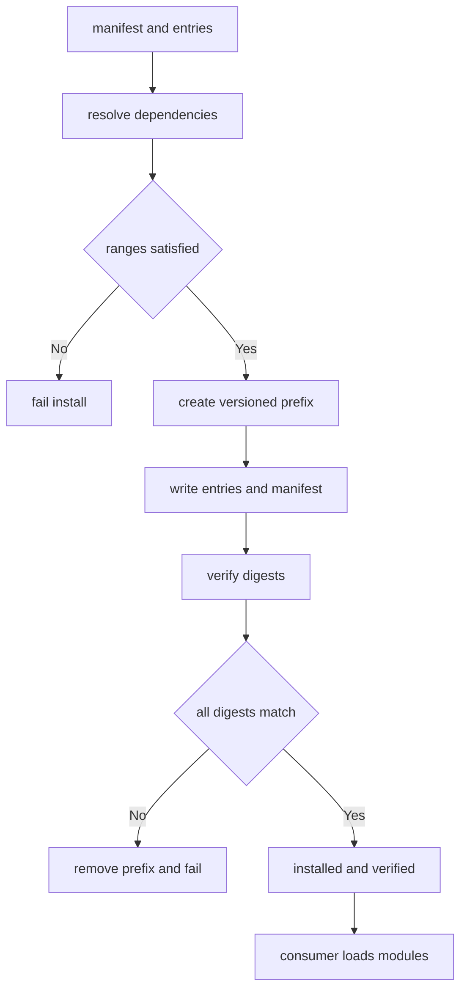

---
# MAM Metadata
id: template-package
name: Package Template
version: 2.0.0
type: package
author: MAM Team
description: >
  Starter template for a distributable unit, declaring its contents, version
  and dependency ranges, install layout and integrity verification.
license: MIT
runtime:
  language: python
  version: ">=3.12"
tags:
  - template
  - package
  - distribution
  - manifest
dependencies:
  - name: resolver
    version: "^1.0"
capabilities:
  - manifest
  - resolve
  - install
  - verify
permissions:
  filesystem:
    - read
    - write
  network:
    - registry
---

# Package Template

## Purpose

Describe one distributable unit: the exact set of files that ship, the version
those files carry, the ranges of everything the unit needs, where those files
land on disk after install, and how a consumer proves the bytes it received are
the bytes the publisher produced. A package is a promise about a directory.

## Inputs

| Name | Type | Required | Description |
|------|------|----------|-------------|
| manifest | object | Yes | Package metadata, e.g. `{ "name": "orders", "version": "2.1.0" }` |
| entries | array | Yes | Files that make up the package |
| target | string | No | Install prefix. Defaults to `./dist/<name>` |

## Outputs

| Name | Type | Description |
|------|------|-------------|
| name | string | Package name |
| version | string | Resolved package version |
| installed | array | Paths written under the install prefix |
| dependencies | array | Dependency ranges this package requires |
| verified | boolean | Whether every entry matched its declared digest |

## Capabilities

### manifest

Declare the package's identity, entries and dependency ranges.

### resolve

Check that every required dependency is present and inside its allowed range.

### install

Write the package's entries under the install prefix in a fixed layout.

### verify

Recompute each entry's digest and compare it with the manifest.

## Contents

| Entry | Kind | Required | Description |
|-------|------|----------|-------------|
| `orders.mam` | module | Yes | The primary module |
| `orders-basic.mam` | module | No | A reduced variant |
| `README.md` | documentation | Yes | Human-facing description of the unit |

Every entry is listed in the manifest. A file that ships but is not listed is a
packaging error; a listed file that is missing is an install error.

## Dependency Ranges

| Dependency | Range | Kind | Reason |
|------------|-------|------|--------|
| `resolver` | `^1.0` | required | Reads the manifest and checks ranges |
| `mam-runtime` | `>=2.0.0 <3.0.0` | required | Executes the modules in the package |
| `telemetry` | `^2.0` | optional | Only needed by the advanced variant |

Ranges are caret or comparator form. A required dependency outside its range
fails the install; an optional dependency outside its range is recorded and the
install continues.

## Layout

```
dist/orders/2.1.0/
  manifest.json
  orders.mam
  orders.mam.md
  README.md
```

| Rule | Value |
|------|-------|
| prefix | `./dist/<name>/<version>` |
| manifest | `manifest.json` at the package root |
| twins | every `.mam` ships with a byte-identical `.mam.md` |
| outside the prefix | nothing is written |

The version directory is part of the path so two versions can be installed side
by side and a consumer can be rolled back by pointing at the older directory.

## Integrity

| Field | Algorithm | Purpose |
|-------|-----------|---------|
| `digest` | `sha256` | Digest of each entry's bytes |
| `size` | bytes | Exact size of each entry |
| `manifest_digest` | `sha256` | Digest of the serialised manifest |

Verification happens after install and before any module is loaded. A single
mismatch fails the whole install rather than leaving a partly trusted package
on disk.

## Rules

- Every file that ships is listed in the manifest, and vice versa.
- Every `.mam` ships with a byte-identical `.mam.md` twin.
- A required dependency outside its range fails the install.
- An optional dependency outside its range is recorded, not fatal.
- Nothing is written outside the versioned install prefix.
- Install is idempotent: installing twice leaves the same tree.
- Verification runs before any module in the package is loaded.
- One digest mismatch fails the whole install.
- The version directory is never reused by a different version.

## Workflow



## Python

```python
import hashlib
import os

CARET = "^"


def parse_version(text, components=3):
    parts = str(text).strip().lstrip("v").split(".")
    if len(parts) != components:
        raise ValueError(f"expected {components} version components: {text}")
    try:
        return tuple(int(part) for part in parts)
    except ValueError as error:
        raise ValueError(f"non-numeric version: {text}") from error


def format_version(version):
    return ".".join(str(part) for part in version)


def compare(target, operator, bound):
    return {">=": target >= bound, "<=": target <= bound, "==": target == bound,
            ">": target > bound, "<": target < bound}[operator]


def in_range(version, spec):
    """Check `version` against a caret or comparator range spec."""
    target = parse_version(version)
    spec = str(spec).strip()
    if spec.startswith(CARET):
        base = parse_version(spec[1:], 2)
        if base[0] != 0:
            upper = (base[0] + 1, 0, 0)
        elif base[1] != 0:
            upper = (0, base[1] + 1, 0)
        else:
            upper = (0, 0, base[2] + 1)
        return base <= target < upper
    for clause in spec.replace(",", " ").split():
        for operator in (">=", "<=", "==", ">", "<"):
            if clause.startswith(operator):
                bound = parse_version(clause[len(operator):])
                if not compare(target, operator, bound):
                    return False
                break
    return True


def digest_of(payload):
    """Return the hex sha256 digest of a payload's bytes."""
    if isinstance(payload, str):
        payload = payload.encode("utf-8")
    return hashlib.sha256(payload).hexdigest()


class Package:
    def __init__(self, name, version, entries, dependencies=None,
                 target="./dist"):
        self.name = name
        self.version = parse_version(version)
        self.entries = list(entries)
        self.dependencies = list(dependencies or [])
        self.target = target
        self.prefix = f"{target}/{name}/{format_version(self.version)}"
        self.verified = False

    def manifest(self):
        return {
            "name": self.name,
            "version": format_version(self.version),
            "prefix": self.prefix,
            "entries": [digest_of(entry) for entry in self.entries],
            "dependencies": [
                {"name": d["name"], "range": d["range"],
                 "optional": d.get("optional", False)}
                for d in self.dependencies
            ],
            "manifest_digest": digest_of(repr(sorted(self.entries))),
        }

    def resolve(self, available):
        """Return the unsatisfied requirements; empty means resolvable."""
        problems = []
        for dependency in self.dependencies:
            have = available.get(dependency["name"])
            if have is None:
                if not dependency.get("optional", False):
                    problems.append(f"missing: {dependency['name']}")
                continue
            if not in_range(have, dependency["range"]):
                message = f"{dependency['name']} {have} outside {dependency['range']}"
                problems.append("skipped: " + message
                                if dependency.get("optional") else message)
        return problems

    def install(self, available=None):
        problems = self.resolve(available or {})
        if problems:
            return {"installed": [], "verified": False, "problems": problems}
        os.makedirs(self.prefix, exist_ok=True)
        for index, entry in enumerate(self.entries):
            with open(os.path.join(self.prefix, f"entry-{index}"), "w",
                      encoding="utf-8") as handle:
                handle.write(entry)
        self.verified = self.verify()
        return {
            "installed": sorted(os.listdir(self.prefix)),
            "verified": self.verified,
            "problems": [],
        }

    def verify(self):
        """Recompute every digest on disk; one mismatch fails the package."""
        for index, entry in enumerate(self.entries):
            path = os.path.join(self.prefix, f"entry-{index}")
            if not os.path.exists(path):
                return False
            with open(path, "r", encoding="utf-8") as handle:
                if digest_of(handle.read()) != digest_of(entry):
                    return False
        return True
```

## Tests

### Input

```yaml
manifest:
  name: orders
  version: 2.1.0
  entries:
    - orders.mam
    - README.md
dependencies:
  - name: resolver
    range: ^1.0
```

### Expected

```yaml
installed:
  - entry-0
  - entry-1
verified: true
problems: []
```

```python
import tempfile


def make_package(target, version="2.1.0", entries=("orders.mam", "README.md"),
                 dependencies=None):
    return Package("orders", version, list(entries),
                   dependencies or [{"name": "resolver", "range": "^1.0"}],
                   target=target)


def test_install_and_verify():
    package = make_package(tempfile.mkdtemp())
    report = package.install({"resolver": "1.4.0"})
    assert report["verified"] is True
    assert report["installed"] == ["entry-0", "entry-1"]
    assert package.install({"resolver": "1.4.0"})["verified"] is True


def test_dependency_out_of_range_fails_install():
    package = make_package(
        tempfile.mkdtemp(),
        entries=("orders.mam",),
        dependencies=[{"name": "mam-runtime", "range": ">=2.0.0 <3.0.0"}],
    )
    report = package.install({"mam-runtime": "1.9.0"})
    assert report["installed"] == []
    assert report["verified"] is False
    assert report["problems"] == ["mam-runtime 1.9.0 outside >=2.0.0 <3.0.0"]


def test_range_forms():
    assert in_range("1.4.0", "^1.0") is True
    assert in_range("2.0.0", "^1.0") is False
    assert in_range("2.5.0", ">=2.0.0 <3.0.0") is True
    assert in_range("3.0.0", ">=2.0.0 <3.0.0") is False


def test_manifest_digests_are_stable():
    manifest = make_package(tempfile.mkdtemp()).manifest()
    assert manifest["name"] == "orders"
    assert manifest["version"] == "2.1.0"
    assert len(manifest["entries"]) == 2
    assert manifest["manifest_digest"] == digest_of(repr(["README.md", "orders.mam"]))
```

## Examples

```python
package = Package("orders", "2.1.0", ["orders.mam", "README.md"],
                  [{"name": "resolver", "range": "^1.0"},
                   {"name": "telemetry", "range": "^2.0", "optional": True}],
                  target="./dist")

print(package.resolve({"resolver": "1.4.0"}))          # telemetry is optional
print(package.resolve({"resolver": "0.9.0"}))          # resolver is required
print(package.install({"resolver": "1.4.0"})["verified"])
print(package.prefix)                                   # ./dist/orders/2.1.0
```

## References

- MAM Package Format
- MAM Dependency Range Syntax
- MAM Integrity Verification
- [Repository templates](../repository/)
- [Runtime templates](../runtime/)
