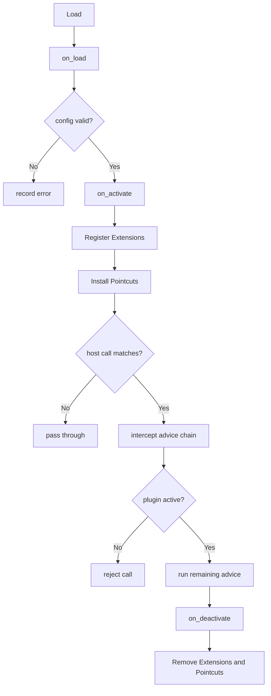

---
# MAM Metadata
id: template-plugin-advanced
name: Plugin Template (Advanced)
version: 2.0.0
type: plugin

author: MAM Team
description: >
  A production plugin with ordered pointcut advice, per-extension failure
  isolation, configuration validation, declared limits, and a health check
  over the registration table.

license: MIT

runtime:
  language: python
  version: ">=3.12"

tags:
  - template
  - plugin
  - advanced
  - pointcuts
  - isolation

dependencies:
  - name: plugin-host
    version: "^1.0"
  - name: telemetry
    version: "^2.0"

capabilities:
  - register
  - activate
  - intercept
  - health
  - deactivate

permissions:
  filesystem:
    - read
  network:
    - internet
  environment:
    - read
---

# Plugin Template (Advanced)

## Purpose

A plugin that shares a host with other plugins cannot afford to be the reason
something breaks. This template isolates each extension behind its own
failure boundary, orders pointcut advice by priority so the chain is
predictable, validates configuration before the first hook runs, enforces
declared limits, and exposes a health check that reports a pointcut left
installed after deactivation or a handler bound to nothing.

## Inputs

| Name | Type | Required | Description |
|------|------|----------|-------------|
| host | object | Yes | Host handle that exposes the registration API |
| config | object | No | Plugin configuration values |
| limits | object | No | Overrides for the declared limits |

## Outputs

| Name | Type | Description |
|------|------|-------------|
| status | string | Current plugin state |
| extensions | array | Extensions registered by this plugin |
| pointcuts | array | Pointcuts installed by this plugin, in advice order |
| results | array | Per-call results of an intercepted host call |
| health | object | `ok` flag plus every outstanding problem |
| errors | array | Failures from the most recent operation, with their cause |

## Capabilities

### register

Register an extension against a named host contract, with a priority.

### activate

Validate configuration, register extensions and install pointcuts.

### intercept

Run the advice chain for a host call that matches an installed pointcut.

### health

Report whether the plugin's registrations are still consistent.

### deactivate

Release resources and remove every extension and pointcut.

## Lifecycle

| Hook | When | Purpose |
|------|------|---------|
| on_load | Plugin is imported | Read configuration and prepare state |
| on_activate | Host starts the plugin | Validate config, register extensions, install pointcuts |
| on_event | Host emits an event | Route the event to subscribers, one failure at a time |
| on_deactivate | Host stops the plugin | Release resources and unregister everything |
| on_health | Host polls the plugin | Report consistency of the registration table |

## Extensions

| Name | Contract | Priority | Description |
|------|----------|----------|-------------|
| ExampleExtension | processor | 100 | Sample extension, runs first |
| AuditExtension | audit | 50 | Runs last, records what the others did |

## Pointcuts

| Name | Target | Advice | Order |
|------|--------|--------|-------|
| example_pointcut | host.execute | Observe the call and record the arguments | 10 |
| guard_pointcut | host.execute | Reject the call when the plugin is not active | 100 |

Lower priority runs first. The guard is last so advice has already been
recorded by the time the call is allowed through.

## Isolation

| Concern | Rule |
|---------|------|
| Failure | An extension that raises is recorded in `errors` and skipped; the remaining extensions still run |
| Order | Advice runs in ascending priority, then in registration order |
| State | A plugin only touches state reachable from its own registration |
| Re-entry | A pointcut advice is not re-entered while it is running |

## Limits

| Limit | Value | On breach |
|-------|-------|-----------|
| max_extensions | 32 | `PluginError`, reason `extension limit reached` |
| max_pointcuts | 16 | `PluginError`, reason `pointcut limit reached` |
| max_config_bytes | 4096 | `PluginError`, reason `config too large` |
| max_dispatch_ms | 50 | Dispatch stops and records a timeout |

## Rules

- The plugin must not mutate host state outside declared pointcuts.
- Registration happens only while the plugin is active.
- Every activation has a matching deactivation.
- Failures in one hook must not stop other plugins.
- Configuration values are validated before the first hook runs.
- One failing extension never prevents the others from running.
- Advice order is declared, never incidental.
- Every failure is recorded in `errors` with its cause.
- Deactivation leaves no extension and no pointcut behind.

## Workflow



## Python

```python
LIMITS = {
    "max_extensions": 32,
    "max_pointcuts": 16,
    "max_config_bytes": 4096,
    "max_dispatch_ms": 50,
}

REQUIRED_CONFIG = ("name",)


class PluginError(Exception):
    """Raised when a plugin declaration violates a declared plugin rule."""


class Plugin:
    """A plugin with ordered advice, failure isolation and a health check."""

    def __init__(self, config=None, limits=None):
        self.config = config or {}
        self.limits = dict(LIMITS)
        if limits:
            self.limits.update(limits)
        self.status = "loaded"
        self.host = None
        self.extensions = []
        self.pointcuts = []
        self.results = []
        self.errors = []

    def _fail(self, reason):
        self.errors.append(reason)
        raise PluginError(reason)

    def validate_config(self):
        for key in REQUIRED_CONFIG:
            if key not in self.config:
                self._fail(f"missing configuration key: {key}")
        if len(repr(self.config).encode("utf-8")) > self.limits["max_config_bytes"]:
            self._fail("config too large")
        return True

    def on_load(self, host=None):
        self.host = host
        return self

    def register_extension(self, name, contract, handler, priority=100):
        if self.status not in ("loaded", "active"):
            self._fail("registration requires a loaded plugin")
        if len(self.extensions) >= self.limits["max_extensions"]:
            self._fail("extension limit reached")
        self.extensions.append(
            {"name": name, "contract": contract, "handler": handler, "priority": priority}
        )
        return self

    def add_pointcut(self, name, target, advice, priority=10):
        if self.status not in ("loaded", "active"):
            self._fail("pointcut installation requires a loaded plugin")
        if len(self.pointcuts) >= self.limits["max_pointcuts"]:
            self._fail("pointcut limit reached")
        self.pointcuts.append(
            {"name": name, "target": target, "advice": advice, "priority": priority}
        )
        return self

    def on_activate(self):
        self.validate_config()
        self.status = "active"
        self.results = []
        return self.status

    def ordered(self, key="priority"):
        """Return the registrations in advice order: priority, then insertion."""
        return sorted(self.extensions, key=lambda item: item[key])

    def dispatch(self, event, payload=None):
        if self.status != "active":
            return []
        results = []
        for extension in self.ordered():
            if extension["contract"] != event:
                continue
            try:
                results.append(extension["handler"](payload))
            except Exception as error:            # isolated, never propagates
                self.errors.append(f"{extension['name']}: {error}")
        return results

    def intercept(self, target, args=None, call=None):
        """Run the advice chain for a host call, in declared order."""
        if self.status != "active":
            return {"allowed": False, "reason": "plugin is not active", "advice": []}
        args = args or {}
        call = call or (lambda: None)
        ran = []
        for pointcut in sorted(self.pointcuts, key=lambda item: item["priority"]):
            if pointcut["target"] != target:
                continue
            try:
                pointcut["advice"](args)
                ran.append(pointcut["name"])
            except PermissionError as error:
                self.errors.append(f"{pointcut['name']}: {error}")
                return {"allowed": False, "reason": str(error), "advice": ran}
            except Exception as error:
                self.errors.append(f"{pointcut['name']}: {error}")
        return {"allowed": True, "reason": None, "advice": ran, "result": call()}

    def health(self):
        orphan_pointcuts = [p["name"] for p in self.pointcuts if self.status != "active"]
        no_handler = [e["name"] for e in self.extensions if not callable(e["handler"])]
        return {
            "ok": not orphan_pointcuts and not no_handler,
            "status": self.status,
            "extensions": len(self.extensions),
            "pointcuts": len(self.pointcuts),
            "orphan_pointcuts": orphan_pointcuts,
            "missing_handlers": no_handler,
            "errors": list(self.errors),
        }

    def on_deactivate(self):
        self.status = "inactive"
        self.extensions = []
        self.pointcuts = []
        self.results = []
        return self.status
```

## Tests

### Input

```yaml
config:
  name: example
event: processor
```

### Expected

```yaml
status: inactive
health:
  ok: true
  orphan_pointcuts: []
```

```python
def test_ordered_dispatch_and_isolation():
    plugin = Plugin({"name": "example"})
    plugin.on_load(host=None)
    plugin.register_extension("LateExtension", "processor", lambda p: "late", priority=10)
    plugin.register_extension("EarlyExtension", "processor", lambda p: "early", priority=1)

    def boom(payload):
        raise RuntimeError("extension failed")

    plugin.register_extension("BrokenExtension", "processor", boom, priority=5)
    plugin.on_activate()

    assert plugin.dispatch("processor", "data") == ["early", "late"]
    assert "BrokenExtension: extension failed" in plugin.errors

    assert plugin.on_deactivate() == "inactive"
    assert plugin.extensions == []
    assert plugin.dispatch("processor", "data") == []
    assert plugin.health()["ok"] is True


def test_pointcut_order_and_guard():
    plugin = Plugin({"name": "example"})
    plugin.on_load(host=None)
    seen = []

    plugin.add_pointcut("example_pointcut", "host.execute", seen.append, priority=10)
    plugin.add_pointcut("guard_pointcut", "host.execute", seen.append, priority=100)
    plugin.on_activate()

    result = plugin.intercept("host.execute", args={"id": 1}, call=lambda: "handled")
    assert result["allowed"] is True
    assert result["advice"] == ["example_pointcut", "guard_pointcut"]
    assert result["result"] == "handled"
    assert len(seen) == 2

    plugin.on_deactivate()
    assert plugin.intercept("host.execute")["reason"] == "plugin is not active"


def test_config_validation_and_limits():
    plugin = Plugin({})
    plugin.on_load(host=None)
    try:
        plugin.on_activate()
    except PluginError:
        pass
    else:
        raise AssertionError("expected PluginError for an incomplete config")
    assert plugin.status == "loaded"
    assert plugin.errors[-1].startswith("missing configuration key")

    small = Plugin({"name": "example"}, limits={"max_extensions": 1})
    small.on_load(host=None)
    small.register_extension("First", "processor", lambda p: p)
    try:
        small.register_extension("Second", "processor", lambda p: p)
    except PluginError:
        pass
    else:
        raise AssertionError("expected PluginError for the extension limit")
    assert len(small.extensions) == 1
```

## Examples

```python
class Host:
    def __init__(self):
        self.calls = []

    def execute(self, *args, **kwargs):
        self.calls.append((args, kwargs))
        return "host handled"


host = Host()


def handle(payload):
    return f"extension saw {payload}"


def observe(*args, **kwargs):
    return "observed"


def guard(*args, **kwargs):
    return True


plugin = Plugin({"name": "example", "level": "info"})
plugin.on_load(host)
plugin.register_extension("ExampleExtension", "processor", handle, priority=100)
plugin.add_pointcut("example_pointcut", "host.execute", observe, priority=10)
plugin.add_pointcut("guard_pointcut", "host.execute", guard, priority=100)
plugin.on_activate()

print(plugin.dispatch("processor", "data"))   # extension saw data
print(plugin.intercept("host.execute", args={"id": 1}, call=lambda: "ok"))
print(plugin.health())

plugin.on_deactivate()
```

## References

- MAM Plugin API
- MAM Extension Contracts
- MAM Pointcut Ordering Rules
- MAM Plugin Isolation Model
