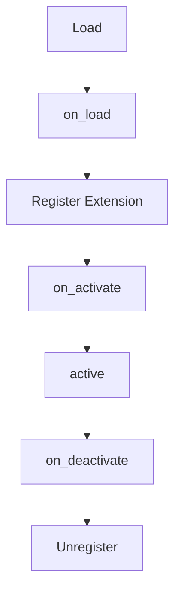

---
# MAM Metadata
id: template-plugin-basic
name: Plugin Template (Basic)
version: 2.0.0
type: plugin

author: MAM Team
description: >
  A small plugin: load, register one extension, activate, and deactivate. The
  pointcut table is present but empty, ready for a plugin that needs to
  observe a host call.

license: MIT

runtime:
  language: python
  version: ">=3.12"

tags:
  - template
  - plugin
  - basic
  - extension

dependencies:
  - name: plugin-host
    version: "^1.0"

capabilities:
  - register
  - activate
  - deactivate

permissions:
  filesystem:
    - read
---

# Plugin Template (Basic)

## Purpose

The smallest plugin the host can load: it reads its configuration on load,
registers one extension against a named contract, and releases everything on
deactivate. Use [`plugin.mam`](../plugin.mam) for the full template with an
event hook and a pointcut, and
[`plugin-advanced.mam`](./plugin-advanced.mam) for failure isolation, ordered
advice, isolation rules and a health check.

## Inputs

| Name | Type | Required | Description |
|------|------|----------|-------------|
| config | object | No | Plugin configuration values |
| host | object | No | Host handle that exposes the registration API |

## Outputs

| Name | Type | Description |
|------|------|-------------|
| status | string | Current plugin state |
| extensions | array | Extensions registered by this plugin |
| pointcuts | array | Pointcuts installed by this plugin |

## Capabilities

### register

Register an extension against a named host contract.

### activate

Run the startup hook and mark the plugin active.

### deactivate

Run the shutdown hook and remove everything the plugin registered.

## Lifecycle

| Hook | When | Purpose |
|------|------|---------|
| on_load | Plugin is imported | Read configuration and prepare state |
| on_activate | Host starts the plugin | Register extensions |
| on_deactivate | Host stops the plugin | Release state and unregister |

## Extensions

| Name | Contract | Description |
|------|----------|-------------|
| ExampleExtension | processor | Sample extension registered by this plugin |

## Pointcuts

| Name | Target | Advice |
|------|--------|--------|
| none | none | This variant installs no pointcut |

## Rules

- Registration happens only while the plugin is loaded.
- Every activation has a matching deactivation.
- Deactivation clears the extension table.
- Configuration values are read once, on load.

## Workflow



## Python

```python
class Plugin:
    """A plugin that registers extensions and releases them on shutdown."""

    def __init__(self, config=None):
        self.config = config or {}
        self.status = "loaded"
        self.host = None
        self.loaded = False
        self.extensions = []
        self.pointcuts = []

    def on_load(self, host=None):
        self.host = host
        self.loaded = True
        return self

    def register_extension(self, name, contract, handler):
        if not self.loaded:
            raise RuntimeError("plugin must be loaded before registering")
        self.extensions.append({"name": name, "contract": contract, "handler": handler})
        return self

    def on_activate(self):
        self.status = "active"
        return self.status

    def dispatch(self, event, payload=None):
        return [ext["handler"](payload) for ext in self.extensions
                if ext["contract"] == event]

    def on_deactivate(self):
        self.status = "inactive"
        self.extensions = []
        self.pointcuts = []
        return self.status
```

## Tests

### Input

```yaml
config:
  name: example
```

### Expected

```yaml
status: inactive
extensions: 0
```

```python
def test_lifecycle():
    plugin = Plugin({"name": "example"})
    plugin.on_load(host=None)
    plugin.register_extension("ExampleExtension", "processor", lambda payload: payload)

    assert plugin.status == "loaded"
    assert plugin.on_activate() == "active"
    assert plugin.dispatch("processor", "data") == ["data"]

    assert plugin.on_deactivate() == "inactive"
    assert plugin.extensions == []
    assert plugin.dispatch("processor", "data") == []


def test_register_requires_load():
    plugin = Plugin()
    try:
        plugin.register_extension("ExampleExtension", "processor", lambda p: p)
    except RuntimeError:
        pass
    else:
        raise AssertionError("expected RuntimeError before the plugin is loaded")
    assert plugin.extensions == []
```

## Examples

```python
host = {"loaded": True}


def handle(payload):
    return f"extension saw {payload}"


plugin = Plugin({"name": "example"})
plugin.on_load(host)
plugin.register_extension("ExampleExtension", "processor", handle)
plugin.on_activate()

print(plugin.dispatch("processor", "data"))   # extension saw data

plugin.on_deactivate()
```

## References

- MAM Plugin API
- MAM Extension Contracts
