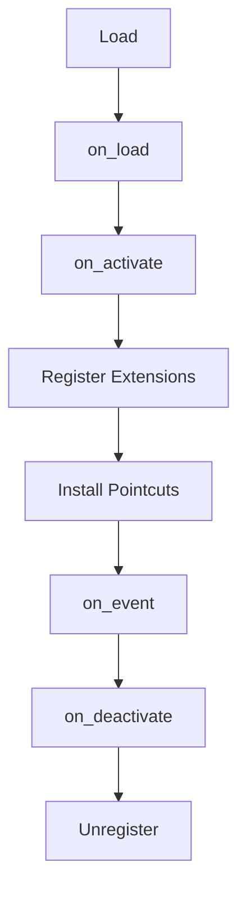

---
# MAM Metadata
id: template-plugin
name: Plugin Template
version: 2.0.0
type: plugin
author: MAM Team
description: >
  Starter template for building a MAM plugin with lifecycle hooks, registered
  extensions, and interception pointcuts.
license: MIT
runtime:
  language: python
  version: ">=3.12"
tags:
  - template
  - plugin
  - extension
  - hooks
dependencies:
  - name: plugin-host
    version: "^1.0"
capabilities:
  - register
  - activate
  - deactivate
  - intercept
permissions:
  filesystem:
    - read
  network:
    - internet
---

# Plugin Template

## Purpose

Define a plugin that the host loads at runtime. The plugin declares lifecycle hooks, registers extensions against known contracts, and installs pointcuts that observe or modify host behavior. Copy this file and replace the sample hooks with your own logic.

## Inputs

| Name | Type | Required | Description |
|------|------|----------|-------------|
| host | object | Yes | Host handle that exposes the registration API |
| config | object | No | Plugin configuration values |

## Outputs

| Name | Type | Description |
|------|------|-------------|
| status | string | Current plugin state |
| extensions | array | Extensions registered by this plugin |
| pointcuts | array | Pointcuts installed by this plugin |

## Capabilities

### register

Register an extension against a named host contract.

### activate

Run the startup hook and install pointcuts.

### deactivate

Run the shutdown hook and remove registered extensions.

### intercept

Observe or modify a host call that matches an installed pointcut.

## Lifecycle

| Hook | When | Purpose |
|------|------|---------|
| on_load | Plugin is imported | Read configuration and prepare state |
| on_activate | Host starts the plugin | Register extensions and pointcuts |
| on_event | Host emits an event | Route the event to subscribers |
| on_deactivate | Host stops the plugin | Release resources and unregister |

## Extensions

| Name | Contract | Description |
|------|----------|-------------|
| ExampleExtension | processor | Sample extension registered by this plugin |

## Pointcuts

| Name | Target | Advice |
|------|--------|--------|
| example_pointcut | host.execute | Observe the call and record the arguments |

## Rules

- The plugin must not mutate host state outside declared pointcuts.
- Registration happens only while the plugin is active.
- Every activation has a matching deactivation.
- Failures in one hook must not stop other plugins.
- Configuration values are validated before use.
- Secrets are never written to logs.

## Workflow



## Python

```python
class Plugin:
    def __init__(self, config=None):
        self.config = config or {}
        self.status = "loaded"
        self.extensions = []
        self.pointcuts = []

    def on_load(self, host):
        self.host = host
        return self

    def register_extension(self, name, contract, handler):
        self.extensions.append({"name": name, "contract": contract, "handler": handler})
        return self

    def add_pointcut(self, name, target, advice):
        self.pointcuts.append({"name": name, "target": target, "advice": advice})
        return self

    def on_activate(self):
        self.status = "active"
        return self.status

    def on_event(self, event, payload=None):
        results = []
        for ext in self.extensions:
            if ext["contract"] == event:
                results.append(ext["handler"](payload))
        return results

    def on_deactivate(self):
        self.status = "inactive"
        self.extensions = []
        self.pointcuts = []
        return self.status
```

## Tests

### Input

```yaml
event: processor
```

### Expected

```yaml
status: inactive
extensions: 0
```

```python
def test_lifecycle():
    plugin = Plugin({"name": "example"})
    plugin.on_load(host=None)
    plugin.register_extension("ExampleExtension", "processor", lambda payload: payload)
    assert plugin.on_activate() == "active"
    assert plugin.on_event("processor", "data") == ["data"]
    assert plugin.on_deactivate() == "inactive"
    assert plugin.extensions == []
```

## Examples

```python
# A minimal host: on_load only needs something to record itself against.
class Host:
    def __init__(self):
        self.loaded = []

    def execute(self, *args, **kwargs):
        return "host handled"


host = Host()


def handle(payload):
    return f"extension saw {payload}"


def observe(*args, **kwargs):
    return "observed"


plugin = Plugin({"name": "example"})
plugin.on_load(host)
plugin.register_extension("ExampleExtension", "processor", handle)
plugin.add_pointcut("example_pointcut", "host.execute", observe)
plugin.on_activate()

print(plugin.on_event("processor", "data"))   # extension saw data

plugin.on_deactivate()
```

## References

- MAM Plugin API
- MAM Extension Contracts
