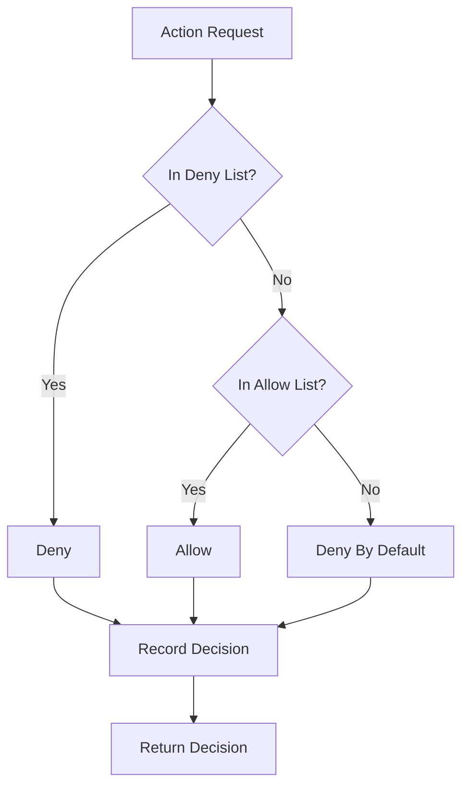

---
# MAM Metadata
id: template-policy
name: Policy Template
version: 1.0.0
type: policy
author: MAM Team
description: >
  Starter template for MAM policies. Defines the allow list, the deny list,
  and the permission scopes that are enforced at runtime.

license: MIT

runtime:
  language: python
  version: ">=3.12"

tags:
  - template
  - policy
  - starter

dependencies:
  - name: mam-permissions
    version: ">=1.0.0"

capabilities:
  - evaluate
  - enforce
  - audit

permissions:
  filesystem:
    - read
  network:
    - internet
  python:
    - sandbox
---

# Policy Template

## Purpose

Starter template for a MAM policy. A policy states what is allowed and what is denied, then enforces the result through the declared permission scopes. Replace the allow list, the deny list, and the permission scopes for your environment.

## Inputs

| Name | Type | Required | Description |
|------|------|----------|-------------|
| action | string | Yes | Action requested by a module |
| resource | string | No | Target resource for the action |
| context | object | No | Extra context used by the decision |

## Outputs

| Name | Type | Description |
|------|------|-------------|
| allowed | bool | Whether the action is permitted |
| reason | string | Reason for the decision |
| policy | string | Name of the policy that decided |

## Allow

- python
- planner
- search

## Deny

- shell.rm
- network.internal
- filesystem.write

## Capabilities

### evaluate

Decide whether a requested action is allowed by the policy.

### enforce

Apply the decision and block any denied action.

### audit

Record every decision for later inspection.

## Rules

- A deny rule always wins over an allow rule
- Unknown actions are denied by default
- Every decision must record a reason
- Permission scopes must match the declared policy
- Denied actions must never reach the provider
- Audit records are append only

## Workflow



## Python

```python
from dataclasses import dataclass, field
from typing import Dict, List


@dataclass
class Decision:
    allowed: bool
    reason: str
    policy: str
    action: str


class Policy:
    def __init__(self, name: str = "Policy", allow: List[str] = None,
                 deny: List[str] = None) -> None:
        self.name = name
        self.allow = set(allow or [])
        self.deny = set(deny or [])
        self.audit_log: List[Decision] = []

    def evaluate(self, action: str) -> Decision:
        if action in self.deny:
            decision = Decision(False, f"denied by rule: {action}", self.name, action)
        elif action in self.allow:
            decision = Decision(True, f"allowed by rule: {action}", self.name, action)
        else:
            decision = Decision(False, "denied by default", self.name, action)
        self.audit_log.append(decision)
        return decision

    def enforce(self, action: str) -> bool:
        return self.evaluate(action).allowed

    def audit(self) -> List[Dict[str, object]]:
        return [
            {"action": d.action, "allowed": d.allowed, "reason": d.reason}
            for d in self.audit_log
        ]
```

## Tests

### Input

```yaml
action: python
```

### Expected

```yaml
allowed: true
reason: allowed by rule
```

```python
def test_allow():
    policy = Policy("Test", allow=["python"], deny=["shell.rm"])
    decision = policy.evaluate("python")
    assert decision.allowed is True


def test_deny_wins():
    policy = Policy("Test", allow=["python"], deny=["python"])
    decision = policy.evaluate("python")
    assert decision.allowed is False
    assert "denied by rule" in decision.reason


def test_deny_by_default():
    policy = Policy("Test", allow=["python"], deny=["shell.rm"])
    decision = policy.evaluate("unknown")
    assert decision.allowed is False
    assert decision.reason == "denied by default"


def test_audit():
    policy = Policy("Test", allow=["python"])
    policy.evaluate("python")
    policy.evaluate("shell.rm")
    assert len(policy.audit()) == 2
```

## Examples

### Basic Usage

```python
policy = Policy("SafeExecution", allow=["python", "search"], deny=["shell.rm"])

print(policy.evaluate("python").allowed)
print(policy.evaluate("shell.rm").reason)
print(policy.enforce("network.internal"))
print(policy.audit())
```

### Expected Flow

```text
Action Request -> Deny Check -> Allow Check -> Record Decision -> Return Decision
```

## References

- [MAM Policy Specification](../../spec/sections/)
- [Safe Execution Example](../examples/bug-hunter.mam.md)
