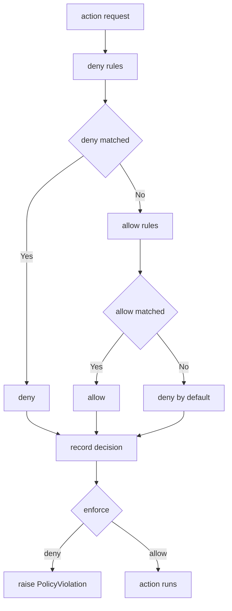

---
# MAM Metadata
id: template-policy-advanced
name: Policy Template (Advanced)
version: 2.0.0
type: policy

author: MAM Team
description: >
  A scoped policy evaluator with wildcards, deny precedence, a default deny
  fallback, retries-free enforcement that raises on violation, and an audit
  trail that names the rule that decided.

license: MIT

runtime:
  language: python
  version: ">=3.12"

tags:
  - template
  - policy
  - advanced
  - scopes
  - audit

dependencies:
  - name: mam-permissions
    version: ">=1.0.0"
  - name: telemetry
    version: "^2.0"

capabilities:
  - evaluate
  - enforce
  - audit
  - scope
  - explain

permissions:
  filesystem:
    - read
  network:
    - internet
  python:
    - sandbox
---

# Policy Template (Advanced)

## Purpose

A policy evaluator that survives real environments. Rules carry a scope, so
`filesystem.write` and `shell.write` can be denied independently; rules can be
wildcards; deny is always evaluated first; and anything unmatched falls through
to a default deny. `enforce` raises a `PolicyViolation` rather than returning a
boolean, and every decision names the rule that produced it. Use
[`policy-basic.mam`](./policy-basic.mam) when a flat allow list is enough.

## Inputs

| Name | Type | Required | Description |
|------|------|----------|-------------|
| action | string | Yes | Action requested by a module, e.g. `filesystem.write` |
| resource | string | No | Target resource, e.g. `/etc/motd` |
| context | object | No | Extra context used by the decision |

## Outputs

| Name | Type | Description |
|------|------|-------------|
| allowed | boolean | Whether the action is permitted |
| reason | string | Human readable reason for the decision |
| rule | string | Pattern of the rule that decided, or `*` for the default |
| policy | string | Name of the policy that decided |
| audit | array | Append only record of every decision |
| stats | object | How many decisions the policy has made |

## Capabilities

### evaluate

Decide a request by scanning the deny rules first, then the allow rules, then
falling through to a default deny.

### enforce

Evaluate the request and raise a `PolicyViolation` when the decision is deny, so
a denied action can never reach the provider.

### audit

Return the append only record of decisions, including the rule and the resource
each decision was made against.

### scope

Constrain a rule to one namespace so the same verb can be allowed in one scope
and denied in another.

### explain

Return the rule, the reason and the scope behind a decision so a caller can
report it without re-deriving the logic.

## Allow

- python
- planner
- search
- read
- *

## Deny

- shell.rm
- shell.write
- network.internal
- write
- secret.*

## Scopes

| Scope | Action form | Example rule | Meaning |
|-------|-------------|--------------|---------|
| `*` | any | `*` | Matches every action |
| filesystem | `filesystem.<verb>` | `write` | Denied under this scope, allowed elsewhere |
| network | `network.<host>` | `internal` | Internal hosts are not reachable |
| shell | `shell.<verb>` | `rm` | Destructive shell verbs are refused |
| secret | `secret.<name>` | `secret.*` | Any secret is refused |

## Evaluation Order

| Step | Rule set | Outcome when matched |
|------|----------|----------------------|
| 1 | Deny rules | deny, wins over everything |
| 2 | Allow rules | allow |
| 3 | Neither | deny by default |

## Rules

- A deny rule always wins over an allow rule, including over a wildcard
- Unknown actions are denied by default
- Rules are shell patterns, so `secret.*` matches every action in the secret
  namespace
- A scoped rule only matches actions inside its scope
- Every decision records a reason and the rule that produced it
- `enforce` raises `PolicyViolation` on deny and never returns a false verdict
- Audit records are append only and never rewritten
- Denied actions must never reach the provider

## Workflow



## Python

```python
from dataclasses import dataclass
from fnmatch import fnmatchcase
from typing import List

ALLOW = "allow"
DENY = "deny"


class PolicyViolation(Exception):
    pass


@dataclass
class Rule:
    pattern: str
    effect: str
    scope: str = "*"
    reason: str = ""

    def __post_init__(self):
        if not self.reason:
            self.reason = f"{self.effect} {self.pattern}"

    def matches(self, action, resource=""):
        if self.scope == "*":
            target = action
        elif action.startswith(self.scope + "."):
            target = action[len(self.scope) + 1:]
        else:
            return False
        if self.pattern == "*":
            return True
        return fnmatchcase(target, self.pattern) or fnmatchcase(resource, self.pattern)


@dataclass
class Decision:
    action: str
    resource: str
    allowed: bool
    reason: str
    rule: str
    scope: str
    policy: str


class Policy:
    def __init__(self, name="Policy", allow=None, deny=None):
        self.name = name
        self.allow = [Rule(pattern, ALLOW) for pattern in (allow or [])]
        self.deny = [Rule(pattern, DENY) for pattern in (deny or [])]
        self.audit_log: List[Decision] = []
        self.evaluated = 0

    def add(self, pattern, effect, scope="*", reason=""):
        rule = Rule(pattern, effect, scope, reason)
        (self.deny if effect == DENY else self.allow).append(rule)
        return rule

    def _match(self, rules, action, resource):
        for rule in rules:
            if rule.matches(action, resource):
                return rule
        return None

    def _record(self, decision):
        self.audit_log.append(decision)
        return decision

    def evaluate(self, action, resource="", context=None):
        self.evaluated += 1
        rule = self._match(self.deny, action, resource)
        if rule is not None:
            return self._record(
                Decision(action, resource, False, rule.reason, rule.pattern, rule.scope, self.name)
            )
        rule = self._match(self.allow, action, resource)
        if rule is not None:
            return self._record(
                Decision(action, resource, True, rule.reason, rule.pattern, rule.scope, self.name)
            )
        return self._record(
            Decision(action, resource, False, "denied by default", "*", "*", self.name)
        )

    def enforce(self, action, resource="", context=None):
        decision = self.evaluate(action, resource, context)
        if not decision.allowed:
            raise PolicyViolation(f"{action}: {decision.reason}")
        return decision

    def explain(self, decision):
        return {"rule": decision.rule, "scope": decision.scope, "reason": decision.reason}

    def audit(self):
        return [
            {
                "action": d.action,
                "resource": d.resource,
                "allowed": d.allowed,
                "rule": d.rule,
            }
            for d in self.audit_log
        ]

    def stats(self):
        return {"policy": self.name, "evaluated": self.evaluated, "deny_rules": len(self.deny)}
```

## Tests

### Input

```yaml
action: filesystem.write
resource: /etc/motd
```

### Expected

```yaml
allowed: false
reason: deny write
```

```python
def test_deny_wins_over_wildcard_allow():
    policy = Policy("Test", allow=["*"], deny=["shell.rm"])
    assert policy.evaluate("python").allowed is True
    denied = policy.evaluate("shell.rm")
    assert denied.allowed is False
    assert denied.rule == "shell.rm"


def test_scoped_rule_only_matches_its_scope():
    policy = Policy("Test", allow=["read"], deny=["write"])
    policy.add("read", ALLOW, scope="filesystem", reason="filesystem reads are permitted")
    policy.add("write", DENY, scope="filesystem", reason="filesystem writes are forbidden")

    allowed = policy.evaluate("filesystem.read", "/etc/motd")
    assert allowed.allowed is True
    assert allowed.scope == "filesystem"

    denied = policy.evaluate("filesystem.write", "/etc/motd")
    assert denied.allowed is False
    assert denied.rule == "write"

    # the same verb outside the scope falls through to the default deny
    assert policy.evaluate("shell.write", "/etc/motd").reason == "denied by default"


def test_default_deny_names_the_wildcard_rule():
    policy = Policy("Test", allow=["python"])
    decision = policy.evaluate("network.internal")
    assert decision.allowed is False
    assert decision.rule == "*"


def test_enforce_raises_on_deny():
    policy = Policy("Test", allow=["python"], deny=["shell.rm"])
    assert policy.enforce("python").allowed is True
    try:
        policy.enforce("shell.rm")
    except PolicyViolation as error:
        assert "shell.rm" in str(error)
    else:
        raise AssertionError("expected a PolicyViolation")


def test_explain_and_audit():
    policy = Policy("Test", allow=["python"], deny=["secret.*"])
    decision = policy.evaluate("secret.token", "api-key")
    assert policy.explain(decision) == {
        "rule": "secret.*",
        "scope": "*",
        "reason": "deny secret.*",
    }
    assert len(policy.audit()) == 1
    assert policy.stats()["evaluated"] == 1
```

## Examples

```python
policy = Policy("SafeExecution", allow=["python", "search"], deny=["shell.rm"])
policy.add("read", ALLOW, scope="filesystem", reason="filesystem reads are permitted")
policy.add("write", DENY, scope="filesystem", reason="filesystem writes are forbidden")

print(policy.evaluate("python").allowed)
print(policy.evaluate("shell.rm").reason)
print(policy.evaluate("filesystem.read", "/etc/motd").allowed)
print(policy.audit())
```

## References

- [MAM Policy Specification](../../spec/sections/)
- [MAM Policy Template](./policy.mam)
- [MAM Permission Model](../../spec/sections/)
- [MAM Scoped Rules](../../spec/sections/)
- [Safe Execution Example](../examples/bug-hunter.mam.md)
