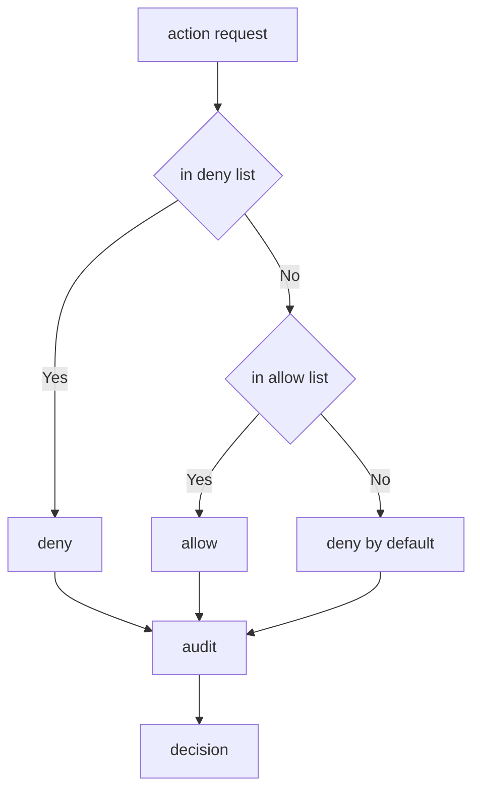

---
# MAM Metadata
id: template-policy-basic
name: Policy Template (Basic)
version: 2.0.0
type: policy

author: MAM Team
description: >
  A flat allow list and deny list evaluated before execution, with an append
  only audit log of every decision.

license: MIT

runtime:
  language: python
  version: ">=3.12"

tags:
  - template
  - policy
  - basic
  - allow-deny

dependencies:
  - name: mam-permissions
    version: ">=1.0.0"

capabilities:
  - evaluate
  - enforce
  - audit

permissions:
  filesystem:
    - read
  network:
    - internet
  python:
    - sandbox
---

# Policy Template (Basic)

## Purpose

The smallest policy that actually decides: an allow list, a deny list, and a
default of deny. Every decision is written to an audit log so a caller can show
why an action was blocked. Use [`policy.mam`](../policy.mam) for the documented
version of the same shape, and
[`policy-advanced.mam`](./policy-advanced.mam) when rules need scopes,
wildcards and a stable explanation.

## Inputs

| Name | Type | Required | Description |
|------|------|----------|-------------|
| action | string | Yes | Action requested by a module |
| resource | string | No | Target resource for the action |
| context | object | No | Extra context used by the decision |

## Outputs

| Name | Type | Description |
|------|------|-------------|
| allowed | boolean | Whether the action is permitted |
| reason | string | Reason for the decision |
| policy | string | Name of the policy that decided |
| action | string | Action the decision was made for |

## Capabilities

### evaluate

Decide whether a requested action is allowed, checking the deny list before
the allow list and defaulting to deny.

### enforce

Evaluate the action and report the boolean verdict to the caller.

### audit

Return the append only record of every decision the policy has made.

## Allow

- python
- planner
- search

## Deny

- shell.rm
- network.internal
- filesystem.write

## Rules

- A deny rule always wins over an allow rule
- Unknown actions are denied by default
- Every decision must record a reason
- Permission scopes must match the declared policy
- Denied actions must never reach the provider
- Audit records are append only

## Workflow



## Python

```python
from dataclasses import dataclass
from typing import List


@dataclass
class Decision:
    action: str
    allowed: bool
    reason: str
    policy: str
    resource: str = ""


class Policy:
    def __init__(self, name="Policy", allow=None, deny=None):
        self.name = name
        self.allow = set(allow or [])
        self.deny = set(deny or [])
        self.audit_log: List[Decision] = []

    def evaluate(self, action, resource=""):
        if action in self.deny or resource in self.deny:
            decision = Decision(action, False, f"denied by rule: {action}", self.name, resource)
        elif action in self.allow:
            decision = Decision(action, True, f"allowed by rule: {action}", self.name, resource)
        else:
            decision = Decision(action, False, "denied by default", self.name, resource)
        self.audit_log.append(decision)
        return decision

    def enforce(self, action, resource=""):
        return self.evaluate(action, resource).allowed

    def audit(self):
        return [
            {"action": d.action, "allowed": d.allowed, "reason": d.reason}
            for d in self.audit_log
        ]
```

## Tests

### Input

```yaml
action: python
```

### Expected

```yaml
allowed: true
reason: allowed by rule: python
```

```python
def test_allow():
    policy = Policy("Test", allow=["python", "search"], deny=["shell.rm"])
    decision = policy.evaluate("python")
    assert decision.allowed is True
    assert decision.reason == "allowed by rule: python"


def test_deny_wins_over_allow():
    policy = Policy("Test", allow=["python"], deny=["python"])
    assert policy.evaluate("python").allowed is False


def test_deny_by_default():
    policy = Policy("Test", allow=["python"])
    decision = policy.evaluate("network.internal")
    assert decision.allowed is False
    assert decision.reason == "denied by default"


def test_resource_can_trigger_deny():
    policy = Policy("Test", allow=["filesystem.read"], deny=["filesystem.write"])
    assert policy.evaluate("filesystem.read", "/etc/motd").allowed is True
    assert policy.evaluate("filesystem.read", "filesystem.write").allowed is False


def test_audit_is_append_only():
    policy = Policy("Test", allow=["python"])
    policy.evaluate("python")
    policy.evaluate("shell.rm")
    assert [e["action"] for e in policy.audit()] == ["python", "shell.rm"]
    assert len(policy.audit_log) == 2
```

## Examples

```python
policy = Policy("SafeExecution", allow=["python", "search"], deny=["shell.rm"])

print(policy.evaluate("python").allowed)
print(policy.evaluate("shell.rm").reason)
print(policy.enforce("network.internal"))
print(policy.audit())
```

## References

- [MAM Policy Specification](../../spec/sections/)
- [MAM Policy Template](./policy.mam)
- [MAM Permission Model](../../spec/sections/)
- [Safe Execution Example](../examples/bug-hunter.mam.md)
